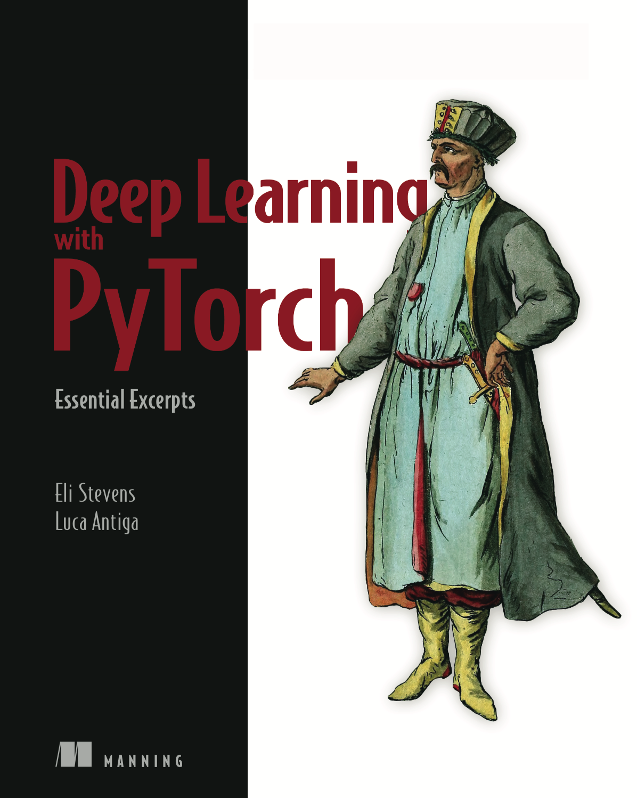
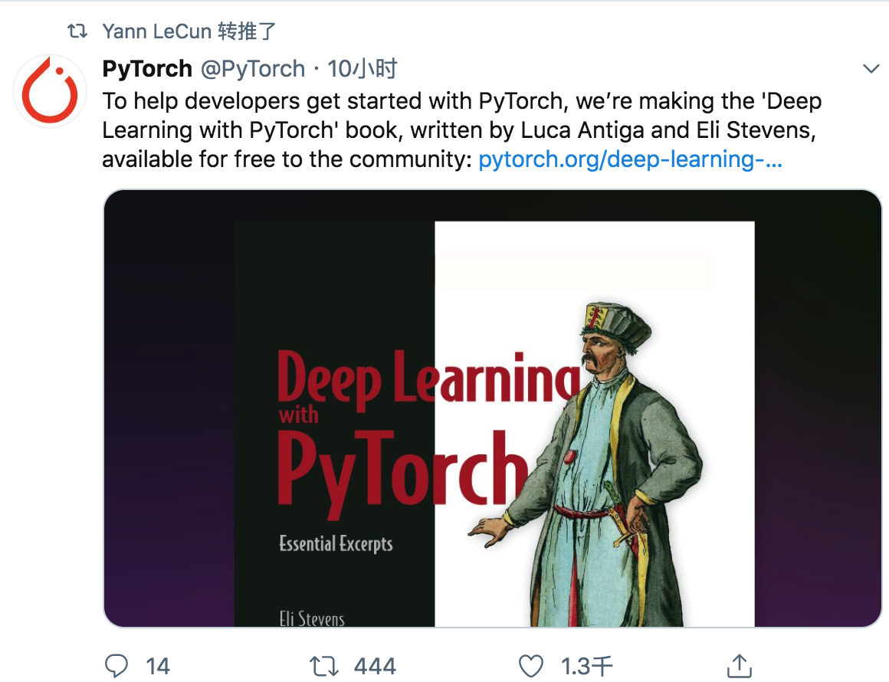

# Deep-Learning-with-PyTorch-Chinese

本项目（[网页版传送门](https://tangshusen.me/Deep-Learning-with-PyTorch-Chinese)）将PyTorch官方书籍[《Deep learning with PyTorch》（基本摘录版）](https://pytorch.org/deep-learning-with-pytorch)翻译成中文并给出全书可运行的相关代码。持续更新中...

[This project](https://tangshusen.me/Deep-Learning-with-PyTorch-Chinese) translates the PyTorch official book "Deep learning with PyTorch" (essential excerpt version) into Chinese.

## 1. 书籍简介
自 2016 年诞生以来，PyTorch 已经成为当今最火热的深度学习框架之一。最近，官方权威的 PyTorch 教程书《Deep learning with PyTorch》终于问世了，消息一出就获得巨佬 Yann LeCun 力荐，是入门PyTorch及深度学习的绝佳教材。

需要注意的是，[PyTorch官网提供的PDF](https://pytorch.org/deep-learning-with-pytorch)是基本摘录版（Essential Excerpts），共141页，内容包括以下五个部分：
1. 深度学习与PyTorch简介
2. 从一个张量开始
3. 使用张量表示真实数据
4. 学习机制
5. 使用神经网络拟合数据

因此可作为快速入门PyTorch的教程。此书完整版目前也可免费预览，[传送门](https://www.manning.com/books/deep-learning-with-pytorch)。

## 2. 项目简介
本项目将原书翻译成中文并且给出可运行的相关代码。

本[仓库](https://github.com/ShusenTang/Deep-Learning-with-PyTorch-Chinese)主要包含code和docs两个文件夹（外加一些数据存放在data中）。其中code文件夹就是每章相关jupyter notebook代码；docs文件夹就是markdown格式的《Deep learning with PyTorch》（基本摘录版）书中的相关内容的中文翻译，然后利用[docsify](https://docsify.js.org/#/zh-cn/)将网页文档部署到[GitHub Pages](https://tangshusen.me/Deep-Learning-with-PyTorch-Chinese)上。欢迎对本项目做出贡献或提出issue。

## 3. 使用方法

本项目面向对PyTorch感兴趣，尤其是想快速入门PyTorch的童鞋。本项目并不要求你有任何深度学习或者机器学习的背景知识，你只需了解基础的数学和编程，如基础的线性代数、微分和概率，以及基础的Python编程。

本仓库的文档包含一些latex公式，但github的markdown原生是不支持公式显示的，而docs文件夹已经利用[docsify](https://docsify.js.org/#/zh-cn/)被部署到了GitHub Pages上，所以你可以方便地访问[本项目网页版](https://tangshusen.me/Deep-Learning-with-PyTorch-Chinese)。如果你想跑一下相关代码的话需要把本项目clone下来，然后运行code文件夹下相关代码。

由于本项目所翻译的是基本摘录版，仅141页，所以适合快速入门PyTorch。如果你想对PyTorch以及深度学习（例如计算机视觉、自然语言处理等）有更深入的学习，可能还需要更多的资料，感兴趣的可以参考我的另一个项目[Dive-into-DL-PyTorch](http://tangshusen.me/Dive-into-DL-PyTorch/)。

## 4. 目录
* [简介]()
* [1. 深度学习与PyTorch简介](chapter1/1.0.md)
    * [1.1 什么是PyTorch](chapter1/1.1.md)
    * [1.2 这本书讲了什么](chapter1/1.2.md)
    * [1.3 为什么使用PyTorch](chapter1/1.3.md)
    * [1.4 PyTorch包含的组件](chapter1/1.4.md)
* [2. 从张量开始](chapter2/2.0.md)
    * [2.1 张量基础](chapter2/2.1.md)
    * [2.2 张量与存储](chapter2/2.2.md)
    * [2.3 尺寸、存储偏移与步长](chapter2/2.3.md)
    * [2.4 数据类型](chapter2/2.4.md)
    * [2.5 索引张量](chapter2/2.5.md)
    * 持续更新中...
    

* 3. 使用张量表示真实数据
* 4. 学习机制
* 5. 使用神经网络拟合数据

## 5. 声明

* 译者纯粹出于学习目的与个人兴趣而进行翻译，不追求任何经济利益；
* 本项目仅限于学习研究目的的使用，译者保留对此项目的署名权，任何转载必须注明出处，但不得用于任何商业用途；
* 使用本项目对原著的侵权行为或者违反知识产权保护法的任何行为，与译者无关；
* 有能力阅读英文书籍者请阅读原版或购买完整版书籍。

## LICENSE
CC BY-NC（署名-非商业性使用）4.0

