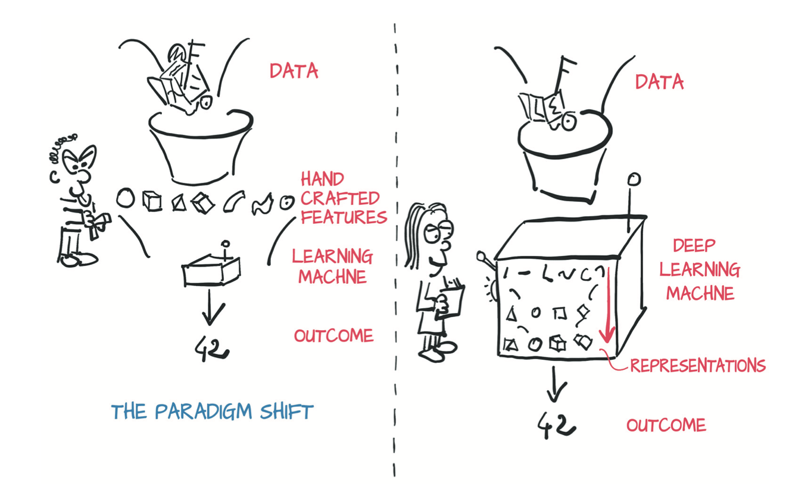
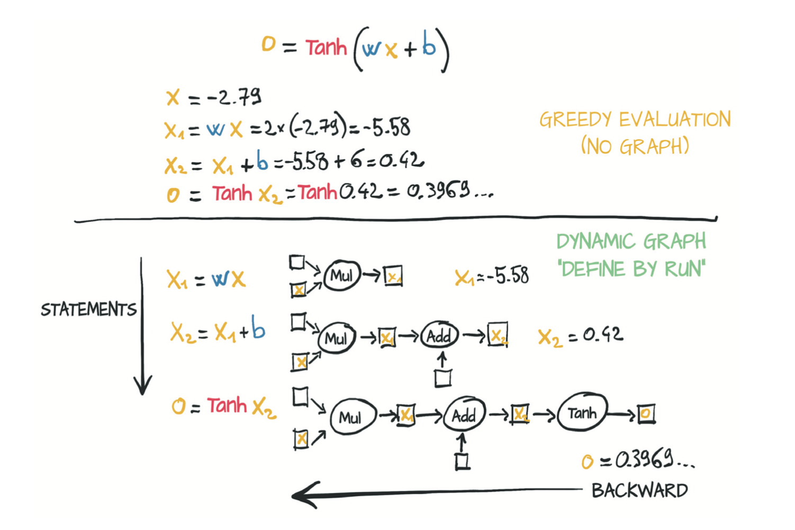

## 1.3 为什么是PyTorch

正如我们之前所说，通过给模型输送数据的方式,深度学习可以执行各种复杂的任务，例如机器翻译，玩策略游戏以及识别混乱场景中的目标物。但是想要将这些实践应用落地就需要一个灵活地工具以便于可以应对各种不同的场景和尽可能提高效率，可在较短时间内完成对大量数据的训练。你也许需要用训练好的网络对未知的输入数据顺利执行。在这部分，我们来看看我们决定使用PyTorch的一些原因。

PyTorch很容易被推荐因为其非常简单。许多研究员和从业者都认为PyTorch易于学习、使用、扩展功能和调试。Python化的风格，尽管（像任何复杂的领域一样）它有一些警告和最佳实践，但是对于任何有过Python编程经验的研发者来说，使用PyTorch会有种非常熟悉的感觉。

对于那些熟悉NumPy数组的使用者，PyTorch中的Tensor类会变得非常相似。PyTorch感觉就像是能够在GPU上运行并且带有自动求导功能的NumPy，非常适合于深度学习中的反向传播。

Tensor API使得与深度学习相关的类的其他功能不引人注目；直到需要用到这些功能时，用户可以认为这些功能不存在。

PyTorch的设计理念是强大的表达能力，允许开发人员在实现复杂模型的同时避免增加不必要的复杂性（这个库并不是框架！）。在深度学习领域，PyTorch可以说是最容易将想法无缝翻译为Python代码的深度学习库。因此，PyTorch已经广泛应用于各种研究，国际会议的高引用率证明了这一点。

PyTorch也能很好的完成从研发到生产这一过程。尽管PyTorch最初专注于研究，但它也配备了高性能的C++运行引擎以至于用户可以不必依赖Python来部署模型，并且可以在摆脱Python运行机制的限制下保留PyTorch的大部分灵活性。

当然，声称易用性和高性能是微不足道的。我们相信当你精读完这本书，你一定会认同我们的观点。

### 1.3.1 深度学习的革命

在这一节中，我们将回顾一下为PyTorch适合深度学习工具的当前和历史环境提供一些背景信息。

直到2000年代末，广泛使用“机器学习”系统还是非常依赖于特征工程。特征是由输入的数据转换而来，其产生的数值特征有助于后续算法（例如分类器）在面对新数据时获得正确的结果。特征工程的目的是获取原始数据，并且输入给某个算法以解决某个问题。例如，要在手写数字图像中把0和1区分开，你可能需要使用一组过滤器来预估图像上边缘的方向并训练一个分类器，之后给定一个边缘方向的分布，分类器就可以预测出准确的数字。另外的有用的特征也可能是零、八或两个环中的两个封闭圆的数量。

深度学习在另一方面，从原始数据中自动学习特征，进而成功地执行任务。在区分1和0的例子中，在训练过程中，通过反复对比示例和目标标签对，可以优化过滤条件。这并不是说特性工程在深度学习中不重要，开发人员通常需要将某种形式的知识（特征）注入到学习系统中。神经网络能够根据示例提取数据并取出有价值的特征，这正是深层学习如此强大的原因。深度学习实践者的重点不是如何手工提取这些特征，而是思考数学模型架构，以使得该模型能够从训练数据中自动地提取特征。通常，这些自动提取的特征比手工提取的特征要更具有好！正如其他许多颠覆性技术一样，这项技术也导致了观念的改变。

在下图1.1左侧，研发者忙于定义特征工程并提供学习的算法，模型最终的效果取决于研发者所提取特征的表征能力。右侧采用深度学习，直接将原始数据输入给算法，基于优化算法自动提取特征，模型最终的效果取决于研发者根据目标所用的算法性能。

<div align=center>
  
</div>
<div align=center>图1.1 深度学习中的视角差异</div>

### 1.3.2 立即执行和延迟执行

深度学习库的一个关键区别在于是即时执行还是延迟执行。PyTorch的易用性很大程度上取决于它如何实现即时执行，因此我们在这里简要介绍一下。

首先看一个例子$(a ** 2 + b ** 2) ** 0.5$，表示勾股定理，如果需要执行此表达式，你需要定义两个变量a和b，Python实现过程如下：

``` python
a = 3
b = 4
c = (a ** 2 + b ** 2) ** 0.5
c
```
输出：
```
5.0
```

像这样获取输入值后得到输出值(c)的过程就是即时执行。PyTorch就像普通的Python程序一样，默认执行方式为即时执行（在PyTorch文档中称为Eager Mode）。即时执行非常有用，因为如果在执行某个表达式时出现错误，Python的解释器、调试器或者其他类似的工具都能够直接访问到相关的Python对象，并且在执行出错的地方会直接抛出异常。

或者第二种情况，您甚至可以在知道输入是什么之前定义勾股表达式，并在输入可用时使用该定义生成输出。您定义的可调用函数可以稍后与各种输入重复使用。比如像这样：

```python
p = lambda a,b: (a**2 + b**2) ** 0.5
p(1,2)
```
输出：
```
2.23606797749979
```
```python
p(3,4)
```
输出：
```
5.0
```
在第二个例子中，你定义了一系列需要执行的操作，并返回一个输出函数(p)。然而直到你给定了具体的输入，这些操作才会执行--延迟执行的示例。延迟执行意味着在调用函数时会引发大多数异常，而不是在函数定义时。对于普通的Python程序（正如你看到的这样）来说，这种实现方式很不错。这是因为在程序发生错误时，解释器和调试器能够完全访问到Python的状态。

然而，如果我们使用具有大量运算符重载的专用类，并且允许那些即时执行的操作推迟到后台运行，情况就会变得复杂棘手。

这些专用类看上去可能长这个样子：

```python
a = InputParameterPlaceholder()
b = InputParameterPlaceholder()
c = (a**2 + b**2) ** 0.5
callable(c)
```
输出：
```
True
```
```python
>>> c(3, 4)
```
输出：
```
5.0
```

通常，在采用上述这种函数定义形式的库中，对a和b求平方、相加再取平方根的操作不会被记录为高级的Python字节码。相反，这些库更倾向于将表达式编译成静态计算图（包含基本操作的图），这种方式相比于纯Python代码的形式可能会有一些优势（例如将数学公式直接编译为机器代码为了性能）。

有一个事实就是计算图在某处定义，却在别处执行，这会使得调试变得更加困难。因为异常通常会缺失关于错误的具体信息，并且Python的调试工具也看不到数据的中间状态。另外，静态图通常不能与标准Python控制流很好的融合：它们是事实上的特定于域的语言，是在宿主语言之上实现的（本例是Python）。

接下来，我们将更具体地研究即时执行和延迟执行之间的区别，特别是在与神经网络相关的情况下。在这里我们不会深入地探索这些概念，而是在宏观角度上给读者介绍一下这些概念中的术语及其关系。理解这些概念及其关系可以帮助我们理解像PyTorch这种使用即时执行的框架与使用延迟执行的框架之间的区别，尽管这两种类型框架的底层数学原理是相同的。

神经网络的基本组成单元是神经元。大量的神经元串在一起构成神经网络。你可以在图1.2看到单个神经元典型的数学表达式：

$$
o = \tanh(wx + b)
$$

在我们解释下图中的运行模式前，请注意以下几点：

* x 是单个神经元计算的输入。

* w 和 b 是神经元的参数或者说是权重，根据需求它们的值可以被更新。

* 为了更新参数（生成更接近我们所期望的输出），我们通过反向传播将误差分配给每个权重，然后相应地对每个权重进行调整。

* 反向传播需要计算输出相对于权重的梯度。

* 我们使用自动微分来自动计算梯度，节省了手工编写微分计算的麻烦。

在图1.2中，神经元被编译进一个符号图，其中每个节点表示一个独立的操作（第二行），并对输入和输出使用占位符。然后，在将具体数字放入占位符中后（在本例中，放入占位符中的数字是存储在变量w、x和b中的值），该计算图便进行数值运算（第三行）。输出结果相对于权重的梯度是通过自动微分构造的，该自动微分反向遍历计算图并在各个节点处乘以梯度（第四行）。第五行展示了相应的数学表达式。

<div align=center>
  
</div>
<div align=center>图1.2 用于单个神经元简单计算的静态图</div>

在深度学习框架中主要的竞争对手之一就是TensorFlow，其采用类似延迟执行的静态图模式。静态图模式是TensorFlow 1.0中的默认执行模式。相比之下，PyTorch使用了一个按运行定义的动态图引擎，其中计算图是逐节点构建的，同时代码是即时执行的。

图1.3中的上半部分展示了在动态图引擎下的相同的计算操作。计算操作被分解成独立的表达式，当执行到这些表达式时，它们会立刻运算。该程序对这些计算之间的内在联系没有预先的概念。图1.3下半部分展示了相同表达式的动态计算图的后台运行场景。该表达式仍然被分解为几个独立的操作，但是这些操作会立即运算求值，进而动态图渐渐地建立。自动微分是通过反向遍历运算结果图来实现的，类似于静态计算图。注意这并不意味着动态图自身就比静态图更有能力，只是动态图通常更容易完成循环或条件判断这些操作。

<div align=center>
  
</div>
<div align=center>图1.3 对应于单个神经单元简单计算的动态图</div>

动态图在连续的前向传递过程中可能会发生变化。例如，可以根据先前节点的输出上的条件下调用不同的节点，而无需在图本身中表示出这些情况，这与静态图模式相比有明显的优势。

目前主要的一些框架都趋向于支持以上两种操作模式。PyTorch 1.0能够在静态计算图中记录模型的执行情况，或通过预编译的脚本语言对其进行定义，从而提高了性能并易于将模型部署到工业生产。TensorFlow也增加了"eager mode"，一种新的按运行定义的API，它增加了TensorFlow库的灵活性。

### 1.3.3 深度学习的竞争领域

尽管所有分析都会有瑕疵，但2017年1月发布的PyTorch 0.1似乎标志着从寒武纪爆炸式增长--如深度学习库，包装器和数据交换格式的扩散，过渡到整合和统一的时代

请注意：

近几年深度学习领域发展得非常迅猛，以至于你在阅读本书时，某些方面的介绍可能已经过时了。即使你对下面提到的某些库不太熟悉，也不必在意。

在PyTorch第一个beta版本发布的时候：

* Theano和TensorFlow是主要的更偏向于底层的采用延迟执行方式的库。

* Lasagne和Keras是Theano的高级封装库，而Keras同时也对TensorFlow和CNTK进行了高级封装。

* Caffe、Chainer、Dynet、Torch（基于Lua的PyTorch的前身）、mxnet、CNTK和DL4J等库填补了深度学习生态系统中的各个领域。

随后大约两年中，该领域便发生了巨大的变化。PyTorch和TensorFlow背后的社区已经基本巩固完善，与之伴随的是其他库的使用量逐渐减少，或者只能退居某一特定领域：

* Theano是最早的深度学习框架之一，现已停止发展。

* TensorFlow
  * 使用Keras作为核心API
  * 提供即时执行模式----eager mode
  * 宣布eager mode为TF2.0的默认执行模式

* PyTorch
  * 使用Caffe2作为后端
  * 替换了基于Lua的Torch项目中重复使用的大多数低级代码
  * 增加了对ONNX的支持，定义了一种与深度学习库无关的模型描述和转换格式
  * 增加了称为TorchScript的延迟执行图模式运行引擎
  * 发布了1.0版本

TensorFlow拥有强大的生产渠道，广泛的行业社区和广泛的分量占比。另一方面，由于PyTorch的易用性，它已在研究和教学社区中取得了巨大进展，并且随着研究人员和毕业生培训学生不断进入行业而不断发展壮大。有趣的是，随着TorchScript和eager mode的出现，这两个框架的功能集开始融合。