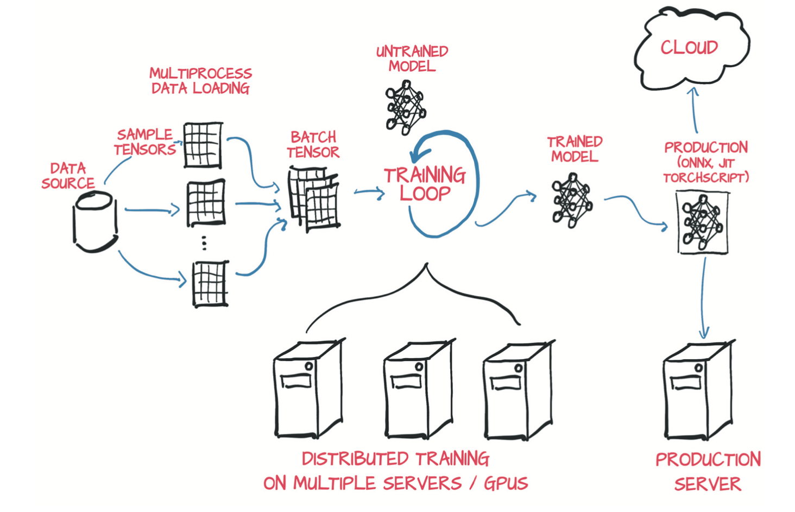

## 1.4 PyTorch包含的加速组件

在之前的表述中我们已经透露出PyTorch的一些组件。现在，我们将花费一些时间来正式介绍PyTorch的主要组件之间的高级映射关系。

首先，PyTorch有Python中的Py格式代码，但其中又有很多非Python代码。由于性能原因，大多数PyTorch都是用C++和CUDA语言编写的，CUDA是NVIDIA提供的类似C ++的语言，可以将其编译为在NVIDIA GPU上以大规模并行运行。有多种方法可以直接从C运行PyTorch。此功能的主要动机之一是为在生产中部署模型提供可靠的策略。然而大多数情况下，你将基于Python来运行PyTorch，构建和训练模型，并使用训练后的模型来解决问题。根据给定用例的性能和规模要求，纯Python代码的方案足以将模型投入生产。例如，使用Flask web服务器来封装一个基于Python实现的PyTorch模型是完全切实可行的。

实际上，就可用性和与广泛的Python生态系统的集成性而言，Python API就是PyTorch的亮点。接下来，我们来探究下PyTorch的内置模块。

PyTorch的核心是提供多维数组的库，在PyTorch术语中这些多维数组称为张量，而torch模块则提供了可对其进行扩展操作的库。张量和相关操作都可以在CPU或GPU上运行。在GPU上运行可以显著的提高速度相比于CPU（如果你愿意为高端GPU付费的话），而使用PyTorch来将调用GPU的话，最多需要一到两个额外的函数。PyTorch提供的第二个核心功能是允许张量跟踪对其所执行的操作，并通过反向传播来计算输出相对于其任何输入的导数。此功能由张量自身提供，并通过`torch.autograd`进一步扩展完善。

我们可以认为基于张量和可使用自动求导的张量标准库，PyTorch不仅可以用于神经网络，并且正确：PyTorch还可以用于物理、渲染、优化、仿真和建模等。我们很可能会看到PyTorch将以创造性的方式在各种科学应用中得到使用。

但是PyTorch首先是第一个并且是最重要的深度学习库。因此，它提供了构建和训练神经网络所需的所有模块。图1.4展示了一个标准流程：加载数据，训练模型，然后将该模型部署到生产环境中。

PyTorch中用于构建神经网络的核心模块位于`torch.nn`中，该模块提供了常见的神经网络层和其他架构组件。全连接层、卷积层、激活函数和损失函数都能在该模块找到。这些组件可用于构建和初始化图1.4中心部分所展示的未训练模型。

  

图1.4 PyTorch项目的基本高层结构，包括数据加载，训练和部署到生产

为了训练该模型，你需要以下几件事：（除了循环本身以外，循环可直接采用标准的Python for循环）：训练数据的资源，使模型能够适应训练数据的优化器，以及将模型和数据导入硬件中的方法，该硬件将执行训练模型所需的计算。

`torch.util.data`模块能够找到适用于数据加载和处理的工具。需要用到的两个主要的类是Dataset和DataLoader。Dataset承担了开发者自定义的数据（该数据可能是任何一种格式）与标准PyTorch张量之间的转换任务。DataLoader可以在后台生成子进程来从Dataset中加载数据，使数据提前准备就绪，并在循环使用后立即等待进入训练循环中。

在最简单的情况下，模型将在本地CPU或单个GPU上运行所需的计算。因此，当训练循环获取到数据时就能够立即开始运算。然而更常见的情形是使用专用的硬件（例如多个GPU）或利用多台计算机的资源来训练模型。在这些情况下，可以通过`torch.nn.DataParallel`和`torch.distributed`来使用其他的可用硬件。

当模型根据训练数据得到输出结果后，`torch.optim`提供了更新模型的标准方法，从而使输出更接近于训练数据中的标签。

如前所述，PyTorch的默认运行方式为即时执行(eager mode)。每当Python解释器执行到包含PyTorch的指令时，相应的操作就会立即通过底层的C++或CUDA来执行。

为了避开Python解释器所带来的成本，以及使模型能够独立于Python而运行，PyTorch还提供了一个名为TorchScript的延迟执行模块。借助TorchScript，PyTorch可以序列化一组独立于Python而被调用的指令。你可以将这个模型看作是虚拟的机器，它具有针对张量操作的有限指令集。除了不产生调用Python的开销外，这种执行模式还使得PyTorch能够实时(JIT)将已知操作序列转换为更有效的混合操作。这些功能是PyTorch生产部署能力的基础。

### 1.4.1 深度学习所需要的硬件

使用预训练网络预测新的数据对于任何新款笔记本电脑或私人计算机来说都是力所能及的事情。即使是对一个预训练网络的一小部分进行再训练，以使其拟合到一个新的数据集上，也不一定需要专门的硬件。你可以在标准个人电脑或笔记本上练习本书中的示例。不过我们预计，对于一些更复杂的示例，进行一次完整的训练可能会需要一个具有CUDA功能的图形处理单元（GPU），例如一个具有8GB RAM的GPU（我们建议使用NVIDIA GTX 1070及以上级别的GPU）。当然，如果你的硬件中可用的RAM较少，也可以适当调整这些参数。

需要注意的是：如果你愿意等待程序运行的话那么硬件就不是强制性的。但是在GPU上运行会将训练时间降低至少一个数量级（通常会快40到50倍）。以单步执行来看，计算参数更新所需的操作在现代硬件如典型的笔记本电脑的CPU上的执行速度是很快的（几毫秒到几秒不等）。他的问题是培训涉及一次又一次地运行这些操作，逐步更新网络参数，从而将训练误差降到最低。

适当的大中规模的网络在配备了良好GPU的工作站上从头开始训练大型的真实世界中的数据集，可能需要花费数小时乃至数天的时间。在同一个机器上使用多个GPU，或者更进一步使用配备了多个GPU的机器集群，能够有效地降低训练时间。

由于云计算提供商的提供，这些设置对访问的限制比听起来要少。DAWNBench是斯坦福大学的一项有趣的计划，旨在为完成常见的深度学习任务提供一个关于模型训练时间和云计算成本的参考基准，并且这些常见的深度学习任务所对应的数据集也都是公开的。

如果你拥有GPU那就再好不过了。否则的话，我们建议查看各种云平台的服务，其中许多服务都内置了支持GPU且预安装PyTorch的Jupyter notebooks，并且这些服务通常都会有一定的免费额度。

最后需要考虑的是：操作系统（OS）。PyTorch从第一个版本开始就支持Linux和macOS，并于2018年期间增加了对Windows的支持。由于目前的苹果笔记本电脑不支持具有CUDA功能的GPU，所以macOS系统上的PyTorch预编译包也仅支持CPU。我们尽量避免假设你是在某个特定的操作系统上运行的情况；脚本命令行应该能很容易地转换成Windows兼容的格式。为了方便起见，只要有可能，我们就会列出代码，就像它在Jupyter Notebook上运行一样

有关安装的信息，请参阅官方网站上的入门指南。我们建议Windows用户使用Anaconda或Miniconda进行安装。其他操作系统的用户，如Linux用户，通常会有更多的可用选项，其中Pip是最常见的安装程序的工具之一。当然，有经验的用户可以自由地以与其首选的开发环境最兼容的方式安装软件包。

### 1.4.2 使用Jupyter Notebooks

我们假设你已经安装了PyTorch和其他依赖项，并且已经确认了它们可以工作。我们将经常使用Jupyter Notebooks，例如展示代码。Jupyter Notebook在浏览器中以页面的形式来展示，提供代码交互式运行的体验。代码由内核计算，该内核是指一个运行在服务器上的进程，它随时准备接收并执行代码，之后返回结果并将它显示在页面上。Notebook将持续维护内存中的内核状态，如代码求值期间定义的变量，直到Notebook被终止或重新启动。你与Notebook进行交互的基本单元是一个单元格，即页面上的一个编辑框，你可以在其中键入代码并让内核对其进行求值（通过在菜单项中选择或按Shift+Enter键）。你可以将多个单元格添加到Notebook中，新单元格会包含在焦躁单元格中创建的变量。执行后，单元格最后一行返回的值将打印在该单元格下方，绘图也一样。通过混合源代码，评估结果和Markdown格式的文本单元，你可以生成漂亮的交互式文档。 你可以在项目网站上阅读有关Jupyter Notebooks的所有信息。

现在，读者需要从GitHub上获得代码，并在其根目录启动notebook服务器。服务器的启动方式取决于操作系统以及Jupyter的安装方式和位置。如果你有任何问题，随时在我们的论坛上提问。当notebook服务器启动时，会弹出默认浏览器，显示本地的notebook文件列表。

Jupyter Notebooks是借助代码来表达和调研思路的强大工具。尽管我们认为它们很适合我们用力，但它们并不适合所有情况。我们认为，本书中重要的是集中精力克服障碍并最大程度地降低认知负担，但这对每个人都是不同的。你在体验PyTorch的时候完全可以选择自己喜欢的方式。

你可以在GitHub上的存储库中找到本书清单中的完整工作代码。

## 练习

- 启动Python来获取交互式体验：

- - 读者使用Python哪个版本？2.x还是3.x？
  - 读者会导入torch包吗？配好的PyTorch的版本号是什么？
  - 执行`torch.cuda.is_available()`的返回结果是什么？可依据你所使用的硬件判断它是否符合你的期望？

- 启动Jupyter Notebook服务器：

- - Jupyter使用的Python版本号是什么？
  - Jupyter使用的torch库的位置与你从交互式Python中导入的torch库的位置相同吗？

## 总结

- 深度学习模型会自动地学习将示例中的输入和期望的输出建立联系。
- PyTorch等深度学习库可以使你有效地构建和训练神经网络模型。
- PyTorch在专注于灵活性和速度的同时最大程度地降低了认知负担。它默认使用即时执行模式。
- TorchScript是一种可以在C++中调用的预编译的延迟执行模型。
- 自2017年初PyTorch问世以来，深度学习工具的生态系统已显着巩固完善。
- PyTorch提供了多个实用的功能库来帮助深度学习项目开发。