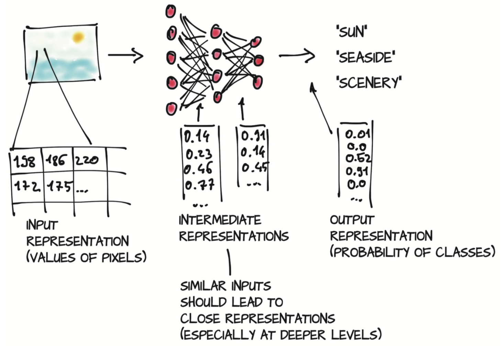

# 2 从张量开始

本章将介绍
* PyTorch最基本的数据结构张量（tensor）
* 索引和操作张量以探索和处理数据
* 与NumPy多维数组相互操作
* 将运算移至GPU以提高速度

-----------

深度学习有许多应用，这些应用往往包括以某种形式获取数据（例如图像或文本），并以另一种形式生成数据（例如标签，数字或更多文本）。从这个角度来看，深度学习包括构建一个将数据从一种表示转换为另一种表示的系统。这种转换是通过从一系列样本中提取的共性来驱动的，这些共性能够反映期望的映射关系。例如，该系统可能会记录狗的一般形状和金毛的典型颜色，通过组合这两个图像属性，该系统可以正确地将具有给定形状和颜色的图像映射到金毛猎犬标签，而不是黑色实验室（或黄褐色的雄猫）。最终的系统可以消耗大量类似输入，并为这些输入产生有意义的输出。

这个过程的第一步是将输入转换为浮点数，如图2.1所示的第一步（也可以是其他类型的数据）。因为网络使用浮点数来处理信息，所以我们需要对真实世界的数据进行编码，使其成为网络可理解的形式，然后再将输出解码回我们可以理解并用于某种用途的形式。

图2.1 深度神经网络学习如何将输入转换为输出（注：神经元和输出的数量不成比例）

从一种数据形式到另一种数据形式的转换通常是由深度神经网络分层次学习的，这意味着我们可以将层次之间转换得到的数据视为一系列中间表示（intermediate representation）。以图像识别为例，浅层的表示可以是特征（例如边缘检测）或纹理（例如毛发），较深层次的表征可以捕获更复杂的结构（例如耳朵、鼻子或眼睛）。

通常，这种中间表示形式是浮点数的集合，这些浮点数表征输入并捕获数据中的结构，从而有助于描述输入如何映射到神经网络的输出。这种表征是特定于当前任务的，可以从相关示例中学习。这些浮点数的集合及其操作是现代AI的核心。请务必牢记，这些中间表示（例如图2.1第二步所示）是将输入与前一层神经元权重相结合的结果，每个中间表示对于之前的输入都是唯一的。

在开始将数据转换为浮点输入之前，我们必须对PyTorch如何处理和存储数据（输入、中间表示以及输出）有深刻的了解。本章就帮助读者准确地理解这些原理。

为此，PyTorch引入了一个基本的数据结构：张量（tensor）。对于来自数学、物理学或工程学的人来说，张量一词是与空间、参考系以及它们之间的转换的概念是捆绑在一起的。对于其他人来说，张量是指将向量（vector）和矩阵（matrix）推广到任意维度，如图2.2所示。与张量相同概念的另一个名称是多维数组（multidimensional array）。张量的维数与用来索引张量中某个标量值的索引数一致。

图2.2 张量被用来表示数据

PyTorch并不是唯一能处理多维数组的库。NumPy是迄今为止最受欢迎的多维数组处理库，以至于它可以被当做数据科学的通用语言。事实上，PyTorch可以与NumPy无缝衔接，从而使得PyTorch能够与Python中的其他科学库（如[SciPy](https://www.scipy.org)、[Scikit-learn](https://scikit-learn.org/stable)和[Pandas](https://pandas.pydata.org)）进行高度的整合。

与NumPy数组相比，PyTorch的张量具有一些更强大功能，例如能够在GPU进行快速运算、在多个设备或机器上进行分布式操作以及跟踪所创建的计算图。所有这些功能对于实现现代深度学习库都很重要。

我们通过介绍PyTorch张量来开启本章，涵盖了基础入门的知识。然后将展示如何使用PyTorch张量库来操作张量，例如数据如何存储在内存中以及如何在常数时间内对任意大张量执行某些操作之类的内容。然后我们将深入探讨前面提到的与NumPy的相互操作性和GPU加速。

要想张量成为编程工具，了解张量的功能和API是很重要的。