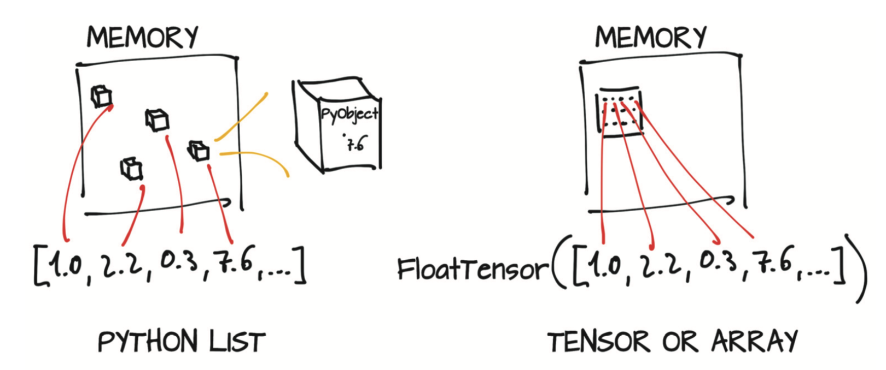

## 2.1 张量基础

我们已经了解到张量是PyTorch中基本的数据结构。张量是一个数组，即一种存储数字集合的数据结构，这些数字可通过索引单独访问，也可通过多个索引进行索引。

我们来实际观察一下python的列表（list）索引，以便将其与张量索引进行比较。以下代码展示了Python中三个数字的列表。
``` python
a = [1.0, 2.0, 1.0]
```
你可以使用相应的索引（从0开始的）来访问列表的第一个元素：
``` python
a[0]
```
输出:
```
1.0
```

``` python
a[2] = 3.0
a
```
输出:
```
[1.0, 2.0, 3.0]
```

使用列表来存储并处理向量（例如2D线的坐标）在简单的Python程序中是很常见的。但是，由于以下几个原因，这种做法可能不是最佳的：
* *Python中的数是完整（ full-fledged）的对象。* 浮点数只需要32位就可以在计算机上表示，而Python将它们封装（boxes）在具有引用计数等功能的完整Python对象中。如果只需要存储少量数字，这种做法就没问题，但是要想分配数百万个这样的数字效率就太低了。
* *Python中的列表用于对象的有序集合。* 没有定义高效计算两个向量点积或向量求和的操作。此外，Python列表无法优化其在内存中的布局，因为它们是指向Python对象（任何类型，而不仅仅是数字）的可索引指针集合。最后，Python列表是一维的，尽管我们可以创建列表的列表，但这种做法仍然效率很低。
* *与经过优化和编译的代码相比，Python解释器速度较慢。* 使用可编译的低层语言（例如C）编写的优化代码可以更快地对大量数据进行数学运算。

由于这些原因，数据科学库依赖于NumPy或引入专用数据结构（例如PyTorch张量），这些结构提供了高效的数值数据结构的底层实现以及相关运算，并被封装成高级API。

从图像到时间序列、音频甚至文本，张量可以表示许多类型的数据。通过定义在张量上的操作（本章将探讨其中的一些操作），即使使用不是特别快高级语言（例如Python），也可以高效地进行切片（slice）和操作数据。

现在，你可以构建第一个PyTorch张量来观察其特性。这个张量包含三个1，没有特别的意义：
``` python
import torch
a = torch.ones(3)
a
```
输出:
```
tensor([1., 1., 1.])
```

``` python
a[1]
```
输出:
```
tensor(1.)
```

``` python
float(a[1])
```
输出:
```
1.0
```

``` python
a[2] = 2.0
a
```
输出:
```
tensor([1., 1., 2.])
```


现在我们来看看刚刚做了什么。导入`torch`模块后，我们调用了一个函数，该函数创建了大小为3的（一维）张量，并填充值为1.0。你可以使用从0开始的索引来访问元素，也可以为其分配新的值。

尽管从表面上看，此示例与Python列表并没有太大区别，但实际上情况完全不同。Python列表或数字元组（tuple）是在内存中单独分配的Python对象的集合，如图2.3左侧所示。然而，PyTorch张量或NumPy数组（通常）是连续内存块上的视图（view），这些内存块存有未封装（unboxed）的C数值类型，在本例中，如图2.3右侧所示，就是32位的浮点数（4字节），而不是Python对象。因此，包含100万个浮点数的一维张量需要400万个连续字节存储空间，再加上存放元数据（尺寸、数据类型等）的少量开销。

<div align=center>

</div>
<div align=center>图2.3 Python中封装（boxed）的数值对象与张量（未封装数组）数据</div>

假设你要管理一个2D坐标列表来表示一个几何对象，例如三角形。虽然这个例子与深度学习不是很相关，但是很容易理解。你可以用一个一维张量将横坐标`x`存储在偶数索引中然后将纵坐标`y`存储在奇数索引中，而不是用Python列表存放坐标数字，如下所示：

``` python
# 使用.zeros是获取适当大小的数组的一种方法
points = torch.zeros(6)
# 用所需的值覆盖这些0
points[0] = 1.0
points[1] = 4.0
points[2] = 2.0
points[3] = 1.0
points[4] = 3.0
points[5] = 5.0
```

还可以传入Python列表以达到相同的效果：
``` python
points = torch.tensor([1.0, 4.0, 2.0, 1.0, 3.0, 5.0])
points
```
输出:
```
tensor([1., 4., 2., 1., 3., 5.])
```

获取第一个点的坐标：
``` python
float(points[0]), float(points[1])
```
输出:
```
(1.0, 4.0)
```

以上做法是可以的，虽然实际上往往让第一个索引直接索引一个二维点而不是点坐标。为此，可以使用二维张量：

``` python
points = torch.tensor([[1.0, 4.0], [2.0, 1.0], [3.0, 5.0]])
points
```
输出:
```
tensor([[1., 4.],
        [2., 1.],
        [3., 5.]])
```

上例将列表的列表传递给了张量构造函数。你可以获取一个张量的形状,

``` python
points.shape
```
输出:
```
torch.Size([3, 2])
```
它会告诉你沿每个维度的张量的大小。你还可以使用`zeros`或`ones`来初始化张量，同时用元组指定大小：

``` python
points = torch.zeros(3, 2)
points
```
输出:
```
tensor([[0., 0.],
        [0., 0.],
        [0., 0.]])
```

现在，你可以使用两个索引访问张量中的单个元素：

``` python
points = torch.FloatTensor([[1.0, 4.0], [2.0, 1.0], [3.0, 5.0]])
points
```
输出:
```
tensor([[1., 4.],
        [2., 1.],
        [3., 5.]])
```

``` python
points[0, 1]
```
输出:
```
tensor(4.)
```

此代码返回数据集中第0个点的y坐标。你还可以像以前一样访问张量中的第一个元素，以获取第一个点的二维坐标：

``` python
points[0]
```
输出:
```
tensor([1., 4.])
```

请注意，输出结果是另一个张量，它是大小为2的一维张量，包含了`points`的第一行中的值。上述输出是否将值复制到了新分配的内存块并将新的内存封装在新的张量对象中？答案是不，因为这样效率不高，尤其是如果有数百万个点数据。与之相反，上述输出是相同数据块的仅限于第一行的视图（view）。


