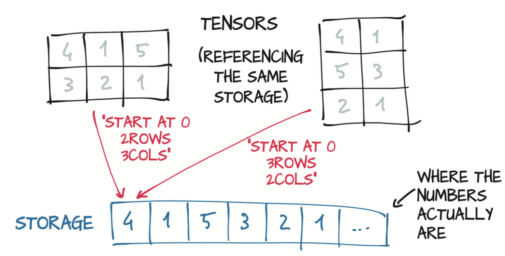

# 2.2 张量与存储

在本节中，我们将开始了解关于内部实现的信息。数值分配在连续的内存块中，由`torch.Storage`实例管理。存储（`Storage`）是一个一维的数值数据数组，例如一块包含了指定类型（可能是float或int32）数字的连续内存块。PyTorch的张量（`Tensor`）就是这种存储（`Storage`）的视图（view），我们可以使用偏移量和每一维的跨度索引到该存储中。

多个张量可以索引同一存储，即使它们的索引方式可能不同，如图2.4所示。 实际上，当你在上节最后一个代码片段中获取`points[0]`时，你得到的是另一个张量，该张量与`points`索引相同的存储，只是不是索引该存储的全部并且具有不同的维数（一维与二维）。由于基础内存仅分配一次，所以无论`Storage`实例管理的数据大小如何，都可以快速地在该数据上创建不同的张量视图。

<div align=center>

</div>
<div align=center>图2.4 张量是一个存储实例的视图（view）</div>

接下来，你将看到在二维坐标点的例子中索引到存储是如何工作的。我们可以使用`storage`属性访问给定张量的存储：

``` python
import torch
points = torch.tensor([[1.0, 4.0], [2.0, 1.0], [3.0, 5.0]])
points.storage()
```
输出:
```
 1.0
 4.0
 2.0
 1.0
 3.0
 5.0
[torch.FloatStorage of size 6]
```

即使张量具有三行两列，但内部的存储却是大小为6的连续数组。从这个意义上讲，张量知道如何将一对索引转换为存储中的某个位置。

还可以手动索引到存储中：
``` python
points_storage = points.storage()
points_storage[0]
```
输出:
```
1.0
```

``` python
points.storage()[1]
```
输出:
```
4.0
```

无法使用两个索引来索引二维张量的存储，因为存储始终是一维的，与引用它的任何张量的维数无关。

因此，更改存储的值当然也会更改引用它的张量的内容：

``` python
points = torch.tensor([[1.0, 4.0], [2.0, 1.0], [3.0, 5.0]])
points_storage = points.storage()
points_storage[0] = 2.0
points
```
输出:
```
tensor([[2., 4.],
        [2., 1.],
        [3., 5.]])
```

我们几乎很少会直接使用存储实例，但是了解张量与存储之间的关系对于以后了解某些操作的代价很有帮助。当你要编写高效的PyTorch代码时，请牢记这一思维模型。