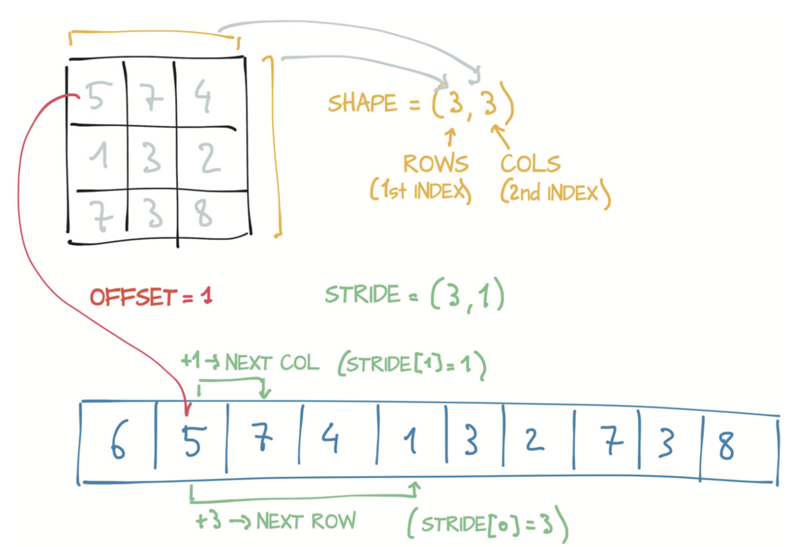
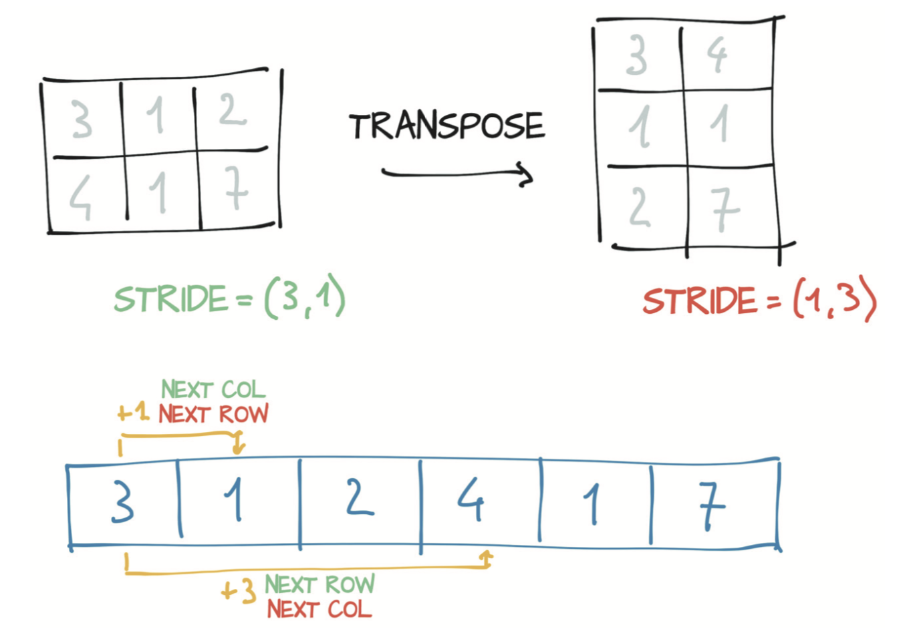

# 2.3 尺寸、存储偏移与步长
除了存放存储外，为了索引存储，张量依赖于几条明确定义它们的信息：尺寸（size）、存储偏移（storage offset）和步长（stride），如图2.5所示。尺寸（或按照NumPy中的说法：形状shape）是一个元组，表示张量每个维度上有多少个元素。存储偏移是存储中与张量中的第一个元素相对应的索引。步长是在存储中为了沿每个维度获取下一个元素而需要跳过的元素数量。

<div align=center>

</div>
<div align=center>图2.5 张量的尺寸、偏移与步长之间的关系</div>

您可以通过提供相应的索引来获得张量中的第二个点：
``` python
points = torch.tensor([[1.0, 4.0], [2.0, 1.0], [3.0, 5.0]])
second_point = points[1]
second_point.storage_offset()
```
输出:
```
2
```

``` python
second_point.size()
```
输出:
```
torch.Size([2])
```

结果张量在存储中的偏移为2（因为我们需要跳过第一个点，该点有两个元素），并且尺寸是包含一个元素的`Size`类的实例，因为结果张量是一维的。需要注意的是，张量尺寸信息与张量对象的`shape`属性中包含的信息相同：

``` python
second_point.shape
```
输出:
```
torch.Size([2])
```

最后，步长是一个元组，表示当索引在每个维度上增加1时必须跳过的存储中元素的数量。例如，上例`points`张量的步长：

``` python
points.stride()
```
输出:
```
(2, 1)
```

用下标`i`和`j`访问二维张量等价于访问存储中的`storage_offset + stride[0] * i + stride[1] * j`元素。偏移通常为零，但如果此张量是一个可容纳更大张量的存储的视图，则偏移可能为正值。

张量`Tensor`和和存储`Storage`之间的这种间接操作会使某些操作（例如转置或提取子张量）的代价很小，因为它们不会导致内存重新分配；相反，它们（仅仅）分配一个新的张量对象，该对象具有不同的尺寸、存储偏移或步长。

刚刚我们已经看到了通过索引特定点来提取子张量，并且也看到了存储偏移增加了。现在来看看尺寸和步长发生了什么：

``` python
points = torch.tensor([[1.0, 4.0], [2.0, 1.0], [3.0, 5.0]])
second_point = points[1]
second_point.size()
```
输出:
```
torch.Size([2])
```

``` python
second_point.storage_offset()
```
输出:
```
2
```

``` python
second_point.stride()
```
输出:
```
(1,)
```

结果是，子张量减少了一个维度（正如我们期望的那样），同时索引的是与原始点张量相同的存储。更改子张量同时也会对原始张量产生影响：

``` python
points = torch.tensor([[1.0, 4.0], [2.0, 1.0], [3.0, 5.0]])
second_point = points[1]
second_point[0] = 10.0
points
```
输出:
```
tensor([[ 1.,  4.],
        [10.,  1.],
        [ 3.,  5.]])
```

这种影响可能不总是我们想要的，所以我们可以克隆子张量得到新的张量（以避免这种影响）：

``` python
points = torch.tensor([[1.0, 4.0], [2.0, 1.0], [3.0, 5.0]])
second_point = points[1].clone()
second_point[0] = 10.0
points
```
输出:
```
tensor([[1., 4.],
        [2., 1.],
        [3., 5.]])
```

我们现在试试转置操作。`points`张量沿每一行就是单个点坐标，沿每一列分别是（所有点的）x和y坐标，现在我们将其旋转以使沿每一列是单个点坐标：

``` python
points = torch.tensor([[1.0, 4.0], [2.0, 1.0], [3.0, 5.0]])
points
```
输出:
```
tensor([[1., 4.],
        [2., 1.],
        [3., 5.]])
```

``` python
points_t = points.t()
points_t
```
输出:
```
tensor([[1., 2., 3.],
        [4., 1., 5.]])
```

你可以轻松地验证两个张量共享同一存储：

``` python
id(points.storage()) == id(points_t.storage())
```
输出:
```
True
```

并且它们的仅仅是尺寸和步长不同：

``` python
points.stride()
```
输出:
```
(2, 1)
```

``` python
points_t.stride()
```
输出:
```
(1, 2)
```

上述结果告诉我们，在`points`中将第一个索引增加1（即，从`points[0,0]`到`points[1,0]`）会沿着存储跳过两个元素，将第二个索引从`points[0,0]`到点`points[0,1]`会沿存储跳过一个元素。换句话说，存储将`points`张量中的元素逐行保存着。

你可以按照图2.6那样将`points`转置为`points_t`。你更改了步长中元素的顺序。这样一来，增加行（张量的第一个索引）就会沿着存储跳过1个元素，就像`points`沿着列移动一样，这就是转置的定义。（这个过程）没有分配新的内存：仅通过创建一个步长顺序与原始张量不同的新的张量实例来实现转置。

<div align=center>

</div>
<div align=center>图2.6 张量的转置</div>

在PyTorch中进行转置不仅限于矩阵（即二维数组）。以翻转三维数组的步长和尺寸为例，你可以通过指定应需要转置的两个维度来转置多维数组：

``` python
some_tensor = torch.ones(3, 4, 5)
some_tensor.shape, some_tensor.stride()
```
输出:
```
(torch.Size([3, 4, 5]), (20, 5, 1))
```

``` python
some_tensor_t = some_tensor.transpose(0, 2)
some_tensor_t.shape, some_tensor_t.stride()
```
输出:
```
(torch.Size([5, 4, 3]), (1, 5, 20))
```

从最右边的维开始将其值存放在存储中的张量（例如沿着行存放在存储中的二维张量）定义为连续（Contiguous）张量。连续张量很方便，因为你可以高效且有序地访问它们的元素而不是在存储中四处跳跃访问。（由于现代CPU中内存访问的工作原理，改善数据局部性可提高性能。译者注：即连续张量满足局部性原理）

在前例中，`points`是连续的，但其转置不是：

``` python
points.is_contiguous(), points_t.is_contiguous()
```
输出:
```
(True, False)
```

你可以使用`contiguous`方法从非连续张量获得新的连续张量。 张量的内容保持不变，但步长发生变化，存储也是如此：

``` python
points = torch.tensor([[1.0, 4.0], [2.0, 1.0], [3.0, 5.0]])
points_t = points.t()
points_t
```
输出:
```
tensor([[1., 2., 3.],
        [4., 1., 5.]])
```

``` python
points_t.storage()
```
输出:
```
 1.0
 4.0
 2.0
 1.0
 3.0
 5.0
[torch.FloatStorage of size 6]
```

``` python
points_t.stride()
```
输出:
```
(1, 2)
```

``` python
points_t_cont = points_t.contiguous()
points_t_cont
```
输出:
```
tensor([[1., 2., 3.],
        [4., 1., 5.]])
```

``` python
points_t_cont.stride()
```
输出:
```
(3, 1)
```

``` python
points_t_cont.storage()
```
输出:
```
 1.0
 2.0
 3.0
 4.0
 1.0
 5.0
[torch.FloatStorage of size 6]
```

请注意，新的存储对元素进行了重组以便逐行存放张量元素。步长也已改变以反映新的布局。


