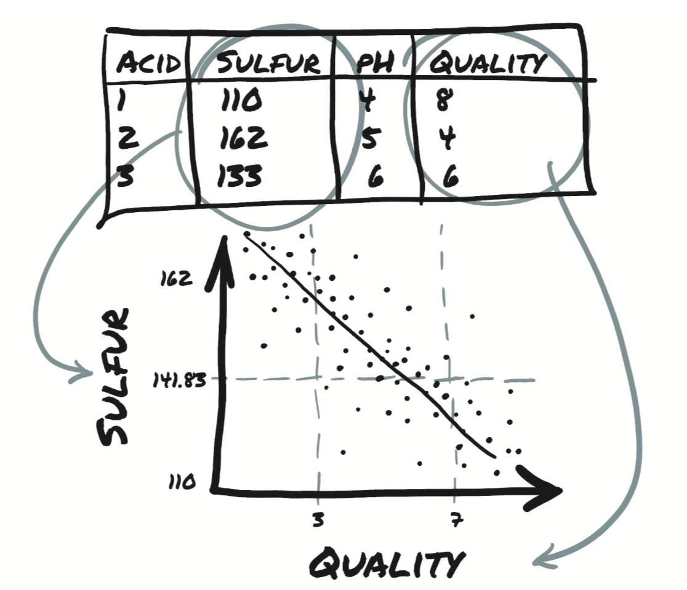

# 3.1 表格数据

你在机器学习工作中遇到的最简单的数据形式是位于电子表格、CSV（以逗号分隔值）文件或数据库中的。无论使用哪种介质，此数据都是一个表格，每个样本（或记录）包含一行，其中的列包含这个样本的一条信息。

首先，我们假设样本在表格中的显示顺序是没有意义的。这与时间序列不同，这里的表是独立样本的集合，而在时间序列中，样本是在时间维度上相关的。

列可以包含数值型数据（例如特定位置的温度）或标签（例如表示样品属性的字符串，比如“蓝色”）。因此，表格数据通常不是同质的（homogeneous），不同的列有不同的类型。你可能有一列显示苹果的重量，另一列则用标签编码其颜色。

然而，PyTorch张量是同质的。其他数据科学软件包，例如Pandas，具有`dataframe`的概念，`dataframe`即用异构（heterogenous）的列来表示数据的对象。相比之下，PyTorch中的信息被编码为数字，通常为浮点数（尽管也支持整数类型）。（PyTorch中的）数值编码是有意为之的，因为神经网络是将实数作为输入并通过连续应用矩阵乘法和非线性函数产生实数作为输出的数学实体。

因此，作为深度学习从业人员，你的第一项工作是将异构的现实世界数据编码成浮点数张量以供神经网络使用。

互联网上提供大量免费的表格数据集，例如[awesome-public-data仓库](https://github.com/awesomedata/awesome-public-datasets)。

我们从有趣的东西开始：葡萄酒。葡萄酒质量数据集是可免费获得的表格数据，其中包含vinho verde（葡萄牙北部的葡萄酒）样品的化学表征以及感官质量评分。您可以从[此处](https://archive.ics.uci.edu/ml/machine-learning-databases/wine-quality/winequality-white.csv)下载白葡萄酒的数据集。

该文件包含用逗号分隔的值的集合，总共12列，第一行是包含列名称的标题行。前11列包含化学变量的值。最后一列包含从0（最差）到10（优秀）的感官质量得分。以下是列名在数据集中显示的顺序：
```
fixed acidity
volatile acidity
citric acid
residual sugar
chlorides
free sulfur dioxide
total sulfur dioxide
density
pH
sulphates
alcohol
quality
```

针对此数据集可能的机器学习任务是通过化学表征来预测质量得分。不过，请放心，机器学习不会在短期内杀死葡萄酒品尝者，因为我们必须从某个地方获取训练数据！

如图3.1所示，你希望找到数据中的某一化学列与质量之间的关系。例如在此图中，你将看到质量随着硫含量减少而提高。

<div align=center>

</div>
<div align=center>图3.1 葡萄酒中硫（sulfur）与品质的关系</div>

但是，在进行该观察之前，你需要一种比在文本编辑器中打开文件更有用的方式检查数据。我们将向您展示如何使用Python加载数据，然后将其转换为PyTorch张量。

Python提供了多个选项来快速加载CSV文件。三种常用的选择是
* Python自带的`csv`模块
* NumPy 
* Pandas

第三个选项是最省时和最省内存的方法，但是我们将避免仅仅是加载文件就将的额外的库引入学习曲线。因为我们已经介绍了NumPy，并且PyTorch具有出色的NumPy互操作性，所以您将继续使用NumPy来加载文件并将生成的NumPy数组转换为PyTorch张量，如下面的代码所示。

``` python
import csv
import numpy as np
wine_path = "../../data/chapter3/winequality-white.csv"
wineq_numpy = np.loadtxt(wine_path, dtype=np.float32, delimiter=";",
     skiprows=1)
wineq_numpy
```
输出:
```
array([[  7.        ,   0.27000001,   0.36000001, ...,   0.44999999,
          8.80000019,   6.        ],
       [  6.30000019,   0.30000001,   0.34      , ...,   0.49000001,
          9.5       ,   6.        ],
       [  8.10000038,   0.28      ,   0.40000001, ...,   0.44      ,
         10.10000038,   6.        ],
       ..., 
       [  6.5       ,   0.23999999,   0.19      , ...,   0.46000001,
          9.39999962,   6.        ],
       [  5.5       ,   0.28999999,   0.30000001, ...,   0.38      ,
         12.80000019,   7.        ],
       [  6.        ,   0.20999999,   0.38      , ...,   0.31999999,
         11.80000019,   6.        ]], dtype=float32)
```

在这里，你指定了二维数组的类型（32位浮点数）和用于分隔每一行各值的分隔符，并指出不应读取第一行，因为它包含列名。接下来，检查是否已读取所有数据，

``` python
col_list = next(csv.reader(open(wine_path), delimiter=';'))
wineq_numpy.shape, col_list
```
输出:
```
((4898, 12),
 ['fixed acidity',
  'volatile acidity',
  'citric acid',
  'residual sugar',
  'chlorides',
  'free sulfur dioxide',
  'total sulfur dioxide',
  'density',
  'pH',
  'sulphates',
  'alcohol',
  'quality'])
```
然后进一步将NumPy数组转成PyTorch张量：

``` python
import torch
wineq = torch.from_numpy(wineq_numpy)
wineq.shape, wineq.type()
```
输出:
```
(torch.Size([4898, 12]), 'torch.FloatTensor')
```

此时，你将拥有一个包含所有列的`torch.FloatTensor`，包括表示质量得分的最后一列。

> 在尝试理解数据时，应注意三种数值。
>
> 第一种是连续（continuous）值。当以数字表示时，这些值是最直观的。它们是严格可排序的，各个值之间的差异具有严格的含义。例如，包裹A比包裹B重2公斤，或者包裹B的来源地比包裹A远100英里，这是有固定含义的，无论包裹A重3公斤还是10公斤，或者包裹B是来源于200英里还是2000英里之外。如果你要以单位进行计数或测量，那么得到的值可能就是连续值。
> 
> 接下来是序数（ordinal）值。连续值的严格可排序性仍然保留，但是值之间的固定关系不再适用。一个很好的例子是订购小、中或大型饮料，将小号映射为值1，将中号映射为2，将大号映射为3。大号饮料大于中号，相同方式是3大于2，但它并没有告诉你大多少。如果要将1、2和3转换为实际体积（例如8、12和24盎司），则这些值就变成了连续值。一定要要记住，你不能对它们进行除了排序之外任何数学运算，尝试平均大和小杯不会得到中杯！
> 
> 最后，类别（categorical）值既没有顺序也没有数值含义。这些值通常是可能性的枚举，并分配有任意数字。例如，将水分配给1，将咖啡分配给2，将苏打分配给3，将牛奶分配给4。水在前牛奶在后没有逻辑。你仅仅是需要不同的值来区分它们而已。你可以将咖啡分配给10，将牛奶分配给 –3，这不会带来明显变化（尽管当我们讨论独热（one-hot）编码时将分配值的范围设置成0..N-1会很有优势）。

你可以将（葡萄酒质量分数）分数视为连续变量，视为实数，然后进行回归任务；或者将其视为标签，作为分类任务尝试从化学分析猜出该标签。在这两种方法中，往往都将分数从输入数据的张量中删除，并将其保存在单独的张量中，以便将分数用作ground truth而不将其输入到模型中。

``` python
data = wineq[:, :-1] # 除最后一列外所有列
data, data.shape
```
输出:
```
(tensor([[ 7.0000,  0.2700,  0.3600,  ...,  3.0000,  0.4500,  8.8000],
         [ 6.3000,  0.3000,  0.3400,  ...,  3.3000,  0.4900,  9.5000],
         [ 8.1000,  0.2800,  0.4000,  ...,  3.2600,  0.4400, 10.1000],
         ...,
         [ 6.5000,  0.2400,  0.1900,  ...,  2.9900,  0.4600,  9.4000],
         [ 5.5000,  0.2900,  0.3000,  ...,  3.3400,  0.3800, 12.8000],
         [ 6.0000,  0.2100,  0.3800,  ...,  3.2600,  0.3200, 11.8000]]),
 torch.Size([4898, 11]))
```

``` python
target = wineq[:, -1] # 最后一列
target, target.shape
```
输出:
```
(tensor([6., 6., 6.,  ..., 6., 7., 6.]), torch.Size([4898]))
```

如果你想将`target`张量转换成标签张量，那么你有两个选择，具体取决于策略或使用分类数据的方式。第一种选择是将标签视为整数向量：

``` python
target = wineq[:, -1].long()
target
```
输出:
```
tensor([6, 6, 6,  ..., 6, 7, 6])
```

如果目标是字符串标签（例如颜色），则可以采用相同的方法为每个字符串分配一个整数。

另一种选择是构建独热（one-hot）编码，即将10个分数编码成10个向量，每个向量除了一个元素为1外其他所有元素都设置为0。此时，分数1可以映射到向量（1,0,0,0,0,0,0,0,0,0），分数5映射到（0,0,0,0,1,0,0,0,0,0），等等。分数值与非零元素的索引相对应的事实纯属偶然；你可以打乱上述分配，从分类的角度来看，什么都不会改变。

上述两种方法有明显的区别。将葡萄酒质量分数编码成分数的整数向量中会引入了分数的可排序性，在这个例子下可能是适当的，因为分数1低于分数4。这还会在分数之间产生一定的距离（例如1和3之间的距离与2和4之间的距离相同。）如果这符合你的定量关系，那就太好了。否则，如果分数纯粹是定性的（例如颜色），则独热编码更适合，因为它不涉及隐含的顺序或距离关系。当整数之间的分数值（例如2.4）对应用没有意义时（即要么是这个值要么是那个值），单热编码才适用。

您可以使用`scatter_`方法来实现独热编码，该方法将源张量中的值沿作为参数提供的索引进行填充。

``` python
target_onehot = torch.zeros(target.shape[0], 10)
target_onehot.scatter_(1, target.unsqueeze(1), 1.0)
```
输出:
```
tensor([[0., 0., 0.,  ..., 0., 0., 0.],
        [0., 0., 0.,  ..., 0., 0., 0.],
        [0., 0., 0.,  ..., 0., 0., 0.],
        ...,
        [0., 0., 0.,  ..., 0., 0., 0.],
        [0., 0., 0.,  ..., 1., 0., 0.],
        [0., 0., 0.,  ..., 0., 0., 0.]])
```

现在看一下`scatter_`的作用。 首先请注意，其名称下划线结尾。PyTorch中，此约定表示该方法不会返回新的张量，而是就地修改源张量。 `scatter_`的参数是
* 指定后面两个参数所处理的维度
* 列张量，指示要填充的索引
* 包含填充元素的张量或者单个标量（上例中即1.0）

换句话说，前面的调用可以这样理解：“对于每一行，获取目标标签的索引（在本例中即葡萄酒质量分数），并将其用作列索引以设置值为1.0。结果就是得到了一个编码分类信息的张量。”

`scatter_`的第二个参数，即索引张量，必须具有与待填充张量相同的维数。由于`target_onehot`是二维（4898x10）的，因此你需要使用`unsqueeze`为`target`添加一个额外的维：

``` python
target_unsqueezed = target.unsqueeze(1)
target_unsqueezed
```
输出:
```
tensor([[6],
        [6],
        [6],
        ...,
        [6],
        [7],
        [6]])
```

调用`unsqueeze`增加了一个单例的维度，从包含4898个元素的一维张量到尺寸为(4898x1)的二维张量，其内容并未改变。没有添加新元素；你决定使用额外的索引来访问元素。也就是说，你用`target[0]`访问`target`的第一个元素，并用`target_unsqueezed[0,0]`访问其未压缩（unsqueezed）对象的第一个元素。

PyTorch允许你在训练神经网络时直接将类别索引用作目标。但是，如果要用作网络的分类输入，则必须将其转换为独热编码张量。

现在回到`data`张量，其中包含与化学分析关联的11个变量。你可以使用PyTorch张量API中的函数以张量形式处理数据。首先，获取每列的均值和标准差：

``` python
data_mean = torch.mean(data, dim=0)
data_mean
```
输出:
```
tensor([6.8548e+00, 2.7824e-01, 3.3419e-01, 6.3914e+00, 4.5772e-02, 3.5308e+01,
        1.3836e+02, 9.9403e-01, 3.1883e+00, 4.8985e-01, 1.0514e+01])
```

``` python
data_var = torch.var(data, dim=0)
data_var
```
输出:
```
tensor([7.1211e-01, 1.0160e-02, 1.4646e-02, 2.5726e+01, 4.7733e-04, 2.8924e+02,
        1.8061e+03, 8.9455e-06, 2.2801e-02, 1.3025e-02, 1.5144e+00])
```

在此例中，`dim = 0`表示沿维数0进行计算。此时，你可以通过减去平均值并除以标准偏差来对数据进行归一化，这有助于学习过程。

``` python
data_normalized = (data - data_mean) / torch.sqrt(data_var)
data_normalized
```
输出:
```
tensor([[ 1.7209e-01, -8.1764e-02,  2.1325e-01,  ..., -1.2468e+00,
         -3.4914e-01, -1.3930e+00],
        [-6.5743e-01,  2.1587e-01,  4.7991e-02,  ...,  7.3992e-01,
          1.3467e-03, -8.2418e-01],
        [ 1.4756e+00,  1.7448e-02,  5.4378e-01,  ...,  4.7502e-01,
         -4.3677e-01, -3.3662e-01],
        ...,
        [-4.2042e-01, -3.7940e-01, -1.1915e+00,  ..., -1.3131e+00,
         -2.6152e-01, -9.0544e-01],
        [-1.6054e+00,  1.1666e-01, -2.8253e-01,  ...,  1.0048e+00,
         -9.6250e-01,  1.8574e+00],
        [-1.0129e+00, -6.7703e-01,  3.7852e-01,  ...,  4.7502e-01,
         -1.4882e+00,  1.0448e+00]])
```

接下来，我们来审查数据以寻找一种简单的方法来一眼分辨好酒和坏酒。首先，使用`torch.le`函数确定`target`中哪些行对应的分数小于或等于3：

``` python
bad_indexes = torch.le(target, 3)
bad_indexes.shape, bad_indexes.dtype, bad_indexes.sum()
```
输出:
```
(torch.Size([4898]), torch.bool, tensor(20))
```

注意，`bad_indexes`中只有20个元素为1！通过利用PyTorch中称为高级索引（advanced indexing）的功能，可以使用0/1张量来索引数据张量。此张量本质上将数据筛选为仅与索引张量中的1对应的元素（或行）。`bad_indexes`张量具有与`target`相同的形状，其值是0或1，具体取决于阈值与原始`target`张量中每个元素之间比较结果：

``` python
bad_data = data[bad_indexes]
bad_data.shape
```
输出:
```
torch.Size([20, 11])
```

请注意，新的`bad_data`张量只有20行，这与`bad_indexes`张量1的个数相同。另外，`bad_data`保留所有11列。

现在，你可以开始获取被分为好、中、坏三类的葡萄酒的信息。对每列取`.mean`：

``` python
bad_data = data[torch.le(target, 3)]
# 对于numpy数组和PyTorch张量，＆运算符执行逻辑和运算
mid_data = data[torch.gt(target, 3) & torch.lt(target, 7)]
good_data = data[torch.ge(target, 7)]

bad_mean = torch.mean(bad_data, dim=0)
mid_mean = torch.mean(mid_data, dim=0)
good_mean = torch.mean(good_data, dim=0)

for i, args in enumerate(zip(col_list, bad_mean, mid_mean, good_mean)):
    print('{:2} {:20} {:6.2f} {:6.2f} {:6.2f}'.format(i, *args))
```
输出：
```
 0 fixed acidity          7.60   6.89   6.73
 1 volatile acidity       0.33   0.28   0.27
 2 citric acid            0.34   0.34   0.33
 3 residual sugar         6.39   6.71   5.26
 4 chlorides              0.05   0.05   0.04
 5 free sulfur dioxide   53.33  35.42  34.55
 6 total sulfur dioxide 170.60 141.83 125.25
 7 density                0.99   0.99   0.99
 8 pH                     3.19   3.18   3.22
 9 sulphates              0.47   0.49   0.50
10 alcohol               10.34  10.26  11.42
```

乍一看，劣质葡萄酒似乎具有更高的二氧化硫总含量（total sulfur dioxide），另外还有其他差异。你可以使用二氧化硫总含量的阈值作为区分好酒和差酒的粗略标准。现在获取二氧化硫总含量列中低于你刚刚计算的中值的索引，如下所示：

``` python
total_sulfur_threshold = 141.83
total_sulfur_data = data[:,6]
predicted_indexes = torch.lt(total_sulfur_data, total_sulfur_threshold)
predicted_indexes.shape, predicted_indexes.dtype, predicted_indexes.sum()
```
输出:
```
(torch.Size([4898]), torch.bool, tensor(2727))
```

上面的阈值预测略高于一半的葡萄酒是高品质的。

接下来，你需要获取（实际）优质葡萄酒的索引

``` python
actual_indexes = torch.gt(target, 5)
actual_indexes.shape, actual_indexes.dtype, actual_indexes.sum()
```
输出:
```
(torch.Size([4898]), torch.bool, tensor(3258))
```

由于实际的优质葡萄酒比阈值预测的多约500例，这证明该阈值并不完美。

现在，你需要查看预测与实际的吻合程度。在预测索引和实际索引之间执行逻辑与运算（请记住，每个索引都是0/1数组）得到交集，用这个交集来确定预测表现如何：

``` python
n_matches = torch.sum(actual_indexes & predicted_indexes).item()
n_predicted = torch.sum(predicted_indexes).item()
n_actual = torch.sum(actual_indexes).item()
n_matches, n_matches / n_predicted, n_matches / n_actual
```
输出:
```
(2018, 0.74000733406674, 0.6193984039287906)
```

有大约2,000例葡萄酒预测对了！因为预测有大约2700例（高品质）葡萄酒，所以有74％的可能性确实是高品质的。不幸的是，实际有约3200例优质葡萄酒，仅预测出了61％。好吧，我们猜你已经知道了，这个结果仅比随机猜要好一点点。

当然，这个例子太天真了。你可以肯定地知道，葡萄酒的质量受多个变量影响，并且，这些变量的值与质量（可能是实际得分，而不是好/坏这种二值）之间的关系很可能比简单的单个值的阈值更复杂。

实际上，一个简单的神经网络就将克服所有这些缺点，就像许多其他基本的机器学习方法一样。在完成第5章和第6章后，你将拥有解决此问题的工具，在第5章中，你将从头开始构建第一个神经网络。