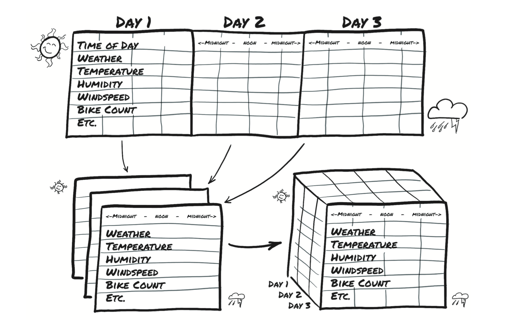

# 3.2 时间序列

在上一节中，我们介绍了如何表示已经在平面表格中组织好的数据。正如我们之前所说，表格中的每一行都独立于其他行，他们的顺序页没有任何关系。并且，没有提供有关行之前和行之后的列编码信息。

回到葡萄酒数据集，你可能有一个`Year`栏可以查看葡萄酒质量如何逐年变化。（很遗憾，我们手头没有此类数据，但我们正在努力逐瓶地手动收集数据样本。）

同时，我们切换到另一个有趣的数据集：华盛顿特区自行车共享系统中的数据，报告了2011年至2012年之间首都自行车共享系统中租用自行车的每小时计数以及相应的天气和季节性信息。

我们的目的是获取平面2D数据集并将其转换为3D数据集，如图3.2所示。

<div align=center>
  
</div>
<div align=center>图3.2 分割样本的日期和小时为独立的轴，将一维多通道数据集转换为二维多通道数据集</div>

在源数据中，每一行是单独一个小时的数据（图3.2显示该数据的转置版本以更好地适合打印页面。）我们想改变行-小时的组织方式，这样你就可以使一个轴以天的速度增加，而另一个轴代表一天中的小时（与日期无关）。第三个轴每一列数据不同（天气，温度等）。

加载数据，如以下代码：

```python
bikes_numpy = np.loadtxt("../data/p1ch4/bike-sharing-dataset/hour-fixed.csv",
                         dtype=np.float32,
                         delimiter=",",
                         skiprows=1,
                         converters={1: lambda x: float(x[8:10])})
bikes = torch.from_numpy(bikes_numpy) 
bikes
```

输出：

```python
tensor([[1.0000e+00, 1.0000e+00,  ..., 1.3000e+01, 1.6000e+01],         
        [2.0000e+00, 1.0000e+00,  ..., 3.2000e+01, 4.0000e+01],         
        ...,         
        [1.7378e+04, 3.1000e+01,  ..., 4.8000e+01, 6.1000e+01],         
        [1.7379e+04, 3.1000e+01,  ..., 3.7000e+01, 4.9000e+01]])
```

每个小时，数据集都会报告以下变量：

```
instant      # index of record #索引记录
day          # day of month #一个月中的某天
season       # season (1: spring, 2: summer, 3: fall, 4: winter) #季节（1：春天，2：夏天，3：秋天，4：冬天）
yr           # year (0: 2011, 1: 2012) #年份
mnth         # month (1 to 12) #月
hr           # hour (0 to 23) #小时
holiday      # holiday status #假期状态
weekday      # day of the week #一周的某天
workingday   # working day status #工作状态
weathersit   # weather situation #天气情况             
						 # (1: clear, 2:mist, 3: light rain/snow, 4: heavy rain/snow) #1：晴，2：薄雾，3：小雨/雪，4：大雨/雪
temp         # temperature in C #摄氏温度
atemp        # perceived temperature in C #感知温度（摄氏度）
hum          # humidity #湿度
windspeed    # windspeed #风速
casual       # number of causal users #因果用户数
registered   # number of registered users #注册用户数
cnt          # count of rental bikes #出租自行车数
```

在此类的时间序列数据集中，行表示连续的时间点：按其排序来制定维度。当然，你可以将每一行视为独立行，并尝试根据例如一天中的特定时间来预测循环的自行车数量，而不管之前发生的事情如何。

但是，这种排序使你有机会利用因果关系去跨越时间。例如，你可以根据先前下雨的情况来预测一次自行车的骑行次数。暂且将你的注意力放在学习如何将自行车共享数据集转化为你的神经网络可以以固定大小提取的数据块。

这个神经网络模型需要查看每种数据的值序列，例如乘车次数，一天中的时间，温度和天气状况，因此`N`个并行的大小为`C`的并行序列。`C`代表通道（`channel`），在神经网络中，它与此处所用的一维数据列（`column`）相同。 `N`维代表时间轴，这里是每小时输入一次。

你可能希望在更长的收集期内（例如天）拆分2年数据集。以这种方式，你将获得`N`个样本数（`number of samples`），样本由长度为`L`的`C`个序列的集合。换句话说，你的时间序列数据集是维度为3的张量，形状为`N x C xL`。`C`仍然是 17个通道，而`L`则是一天中的24个小时通道。没有必要特别说明为什么我们必须使用24小时这一时间段，尽管一般的日常的生活节奏可能会给我们提供可用于预测的模式。如果需要，我们可以改为使用7 * 24 = 168个小时块来按周划分数据集。

现在回到你的自行车共享数据集。第一列是索引（数据的全局顺序）；第二个是日期；第六个是一天中的时间点。你拥有可以创建行驶计数和其他变量等日常序列数据集所需的一切。一般情况下你的数据集已经排好序，但是如果一旦没有排序，你可以在其上使用`torch.sort`进行适当排序。

> 请注意：
>
> 你在此处使用的文件的版本`hour-fixed.csv`已经过一些处理，以包含原始数据集中缺少的行。 我们假设丢失的时间数据有零个自行车处于活动状态（通常是清晨的时间）。

要获取每日工作时间数据集，你要做的就是每隔24小时查看同一个张量。看看你的自行车（`bikes`）张量的形状和步幅：

```python
bikes.shape, bikes.stride()
```

输出:

```python
(torch.Size([17520, 17]), (17, 1))
```

这是17,520小时，共17列。现在将数据重新排列为具有三个轴（日期，小时，然后是17列）。

```python
daily_bikes = bikes.view(-1, 24, bikes.shape[1]) 
daily_bikes.shape, daily_bikes.stride()
```

输出：

```python
(torch.Size([730, 24, 17]), (408, 17, 1))
```

这里发生了什么？首先，`bikes.shape [1]`为`17`，它是自行车（`bikes`）张量中的列数。 但是代码的真正难点在于调用视图（`view`），这一点很重要：它改变了查看相同数据张量的方式。

在张量上调用视图方法（`view`）返回一个新的张量，该张量可以更改维数和步幅信息，而无需更改存储。结果，你可以以零成本重新布置张量因为根本没有数据被复制。你的视图（`view`）调用要求你为返回的张量提供新的形状。将`-1`用作占位符是为了“但是考虑到其他维度和元素的原始数量，还剩下很多索引”。

记住在这种情况下，存储（`Storage`）是连续的数字的线性容器——浮点数。你的自行车（`bikes`）张量在相应的存储中逐行存储，这一点已通过早期对`bikes.stride()`的调用输出确认。

对于`daily_bikes`，步幅告诉你沿小时维度（第二个）前进1个位置需要你将存储（或一组列）中的位置前进17个位置，而沿日期维度（第一个）前进则需要你在时间24小时中前进等于行长度的元素数（此处为408，即17 * 24）。

最右边的维度是原始数据集中的列数。在中间维度中，你将时间分为24个连续小时的块。换句话说，你现在每天有`C`个通道的`N`个`L`小时的序列。为了获得你所需的`NxCxL`顺序，你需要转置张量：

```python
daily_bikes = daily_bikes.transpose(1, 2) 
daily_bikes.shape, daily_bikes.stride()
```

输出：

```python
(torch.Size([730, 17, 24]), (408, 1, 17))
```

前面我们提到天气状况变量是有序数。实际上，它有4个等级：`1`表示最佳天气，而`4`表示最坏的天气。你可以将此变量视为分类变量，其级别解释为标签或者连续标签。如果你选择分类，则将变量转换为独热编码的向量，并将列与数据集连接起来。为了使你的数据渲染更容易，现在暂时限制为第一天。首先，初始化一个零填充矩阵，其行数等于一天中的小时数，列数等于天气等级的数:

```python
first_day = bikes[:24].long() 
weather_onehot = torch.zeros(first_day.shape[0], 4) 
first_day[:,9]
```

输出：

```python
tensor([1, 1, 1, 1, 1, 2, 1, 1, 1, 1, 1, 1, 1, 2, 2, 2, 2, 2, 3, 3, 2, 2, 2, 2])
```

然后根据每一行的相应的等级将它们分散到我们的矩阵中。请记住，在之前需要使用取消压缩（`unsqueeze`）来添加单例尺寸：

```python
weather_onehot.scatter_(
  dim=1,
  index=first_day[:,9].unsqueeze(1) - 1,
  value=1.0)
```

输出：

```python
tensor([[1., 0., 0., 0.],
        [1., 0., 0., 0.],
        ...,
        [0., 1., 0., 0.],
        [0., 1., 0., 0.]])
```

这一天从`1`级天气开始到`2`级天气结束，所以这似乎是正确的。

最后，使用`cat`函数将矩阵连接到原始数据集。看你的第一个结果：

```python
torch.cat((bikes[:24], weather_onehot), 1)[:1]
```

输出：

```python
tensor([[ 1.0000,  1.0000,  1.0000,  0.0000,  1.0000,  0.0000,  0.0000,  6.0000,
          0.0000,  1.0000,  0.2400,  0.2879,  0.8100,  0.0000,  3.0000, 13.0000,
          16.0000,  1.0000,  0.0000,  0.0000,  0.0000]])
```

在这里，你指定了原始自行车（`bikes`）数据集和独热编码的天气情况矩阵，这些矩阵将沿列维（例如`1`）连接在一起。换句话说，将两个数据集的列堆叠在一起，或者将新的独热编码列追加到原始数据集。为了使`cat`成功，张量必须与其他维度（行维度在这种情况也想通）有相同的大小。

请注意，你最后的新四列分别是`1,0,0,0`——这正是你所期望的天气等级`1`。

你也可以使用重新排列的`daily_bikes`张量完成相同的操作。请记住，它的形状为`（B,C,L）`，其中`L=24`。首先创建零张量，有相同的`B`和`L`，但增加的列数与`C`：

```python
daily_weather_onehot = torch.zeros(daily_bikes.shape[0], 4,
daily_bikes.shape[2]) 
daily_weather_onehot.shape
```

输出：

```python
torch.Size([730, 4, 24])
```

然后将独热编码散布到`C`维中的张量中。由于操作是在原地执行的，因此仅张量的内容会更改：

```python
daily_weather_onehot.scatter_(1, daily_bikes[:,9,:].long().unsqueeze(1) - 1,
															1.0) 
daily_weather_onehot.shape
```

输出：

```python
torch.Size([730, 4, 24])
```

沿`C`维度连接：

```python
daily_bikes = torch.cat((daily_bikes, daily_weather_onehot), dim=1)
```

我们之前提到过，这种方法并不是处理天气情况变量的唯一方法。实际上，其标签具有序数关系因此你可以暂时认为它们是连续变量的特殊值。你可以转换变量，使其从`0.0`到`1.0`运行：

```python
daily_bikes[:, 9, :] = (daily_bikes[:, 9, :] - 1.0) / 3.0
```

正如我们将会在第4.1节中提到，重新缩放变量为`[0.0,1.0]`区间或`[-1.0,1.0]`区间是你需要对所有的变量进行的操作，例如温度（`temperature`）（数据集中的第10列）。稍后你将会看到其原因；对于现在，我们说这对训练过程会很有帮助。

你有多种重新调整变量的方式。你可以将其范围映射到`[0.0,1.0]`。

```python
temp = daily_bikes[:, 10, :]
temp_min = torch.min(temp)
temp_max = torch.max(temp)
daily_bikes[:, 10, :] = (daily_bikes[:, 10, :] - temp_min) / (temp_max -
     temp_min)
```

或减去平均值并除以标准差：

```python
temp = daily_bikes[:, 10, :] 
daily_bikes[:, 10, :] = (daily_bikes[:, 10, :] - torch.mean(temp)) / 
     torch.std(temp)
```

在后一种情况下，变量的平均值为零并且标准差为零。如果取自高斯分布，则68％的样本将位于`[-1.0,1.0]`区间。

太棒了——你建立了另一个不错的数据集并且你以后将使用它。就目前而言，最重要的是你必须了解时间序列的布局方式以及如何将数据整理成网络可以读取的形式。

必须存在严格的排序其他类型的数据才可以看做时间序列。该类别中的前两名是文本和音频。