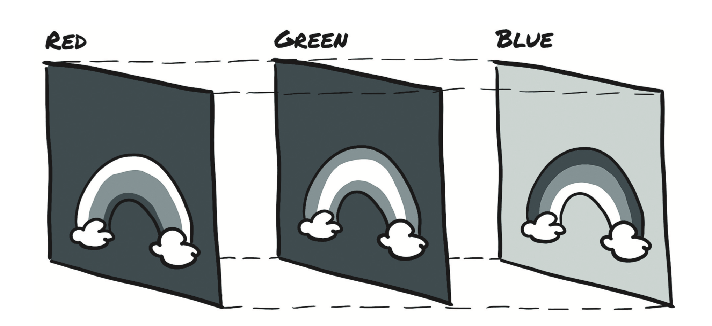

# 3.4 图像

卷积神经网络的引入彻底改变了计算机视觉，并且基于图像的系统此后获得了新的功能。通过使用成对的输入和期望的输出示例来训练端到端网络，需要高度优化算法块构建的复杂管道可以解决以前所未有的性能问题。为了参与到这场革命中，你需要能够从常见的图像格式中载入图像，然后将数据转换为张量表示，该张量以PyTorch所期望的方式排列图像的各个部分。

图像表示为按规则网格排列的标量集合，并且具有高度和宽度（以像素为单位）。每个网格点（像素）可能只有一个标量并且可以表示为灰度图像，或者每个网格点可能有多个标量，它们通常代表不同的颜色或不同的特征（`features`），例如深度相机的深度。

代表单个像素值的标量通常使用8位整数编码，例如在消费类相机中。在医学，科学和工业应用中，你一般不会发现具有较高数字精度的像素，例如12位和16位。如果像素对有关物理特性的信息例如骨密度、温度或深度进行编码，则此精度可提供更大的范围或更高的灵敏度。

你有几种用数字编码颜色的方法。最常见的是RGB，它定义一种具有三个数字的颜色，分别代表红色、绿色和蓝色的强度。你可以将颜色通道视为仅所讨论颜色的灰度强度图，类似于你通过一副纯红色太阳镜观察场景时所看到的情况。图3.3显示了一条彩虹，其中的每个RGB通道都捕获了光谱的特定部分。（该图被简化了，因为它对事物有所依赖。例如，橙色和黄色带表示为红色和绿色的组合。）

图像有好几种文件格式，但是幸运的是，你有很多方法可以在Python中加载图像。首先使用`imageio`模块加载PNG图像。在本章中，你将使用`imageio`方法，因为它通过统一的API处理不同的数据类型。现在加载图像，如以下所示。

```python
import imageio
img_arr = imageio.imread('../../data/chapter3/image-dog/bobby.jpg') 
img_arr.shape
```

输出：

```python
(720, 1280, 3)
```


<div align=center>
  
</div>
<div align=center>图3.3 将彩虹分成红色，绿色和蓝色的通道</div>

在这一点上，`img`是一个具有NumPy数组的对象，具有三个维度：两个空间维度（宽度和高度），以及第三个维度，分别对应于通道红色、绿色和蓝色。任何输出NumPy数组的库都这样做以获得PyTorch张量。唯一需要注意的是维度的布局。PyTorch模块处理图像数据需要将张量布置为`CxHxW`（分别为通道、高度和宽度）。

你可以使用转置（`transpose`）功能获得适当的布局。给定输入张量`WxHxC`，你可以通过交换第一个和最后一个通道来获得正确的布局：

```python
img = torch.from_numpy(img_arr) 
out = torch.transpose(img, 0, 2)
```

你之前已经看过此示例，但是请注意此操作不会复制张量数据。相反，`out`使用与`img`相同的基础存储，并在张量上使用尺寸和步幅信息。这种安排很方便，因为操作的代价很少，但是（当心）更改`img`中的像素会导致`out`变化。

还要注意其他深度学习框架使用不同的布局。最初，TensorFlow将通道尺寸保持在最后，从而形成`HxWxC`布局。（现在，它已经支持多种布局。）从较低等级的性能角度来看此策略具有优缺点，但只要适当地重塑张量它就不会对你有所影响。

到目前为止，你已经描述了一张图片。遵循与以前的数据类型相同的策略，创建包含多个图像的数据集以用作神经网络的输入，然后沿着第一维将这些图像按照批量存储，以获得`NxCxHxW` 张量。

作为替代使用堆栈（`stack`）构建张量的更有效方法，你可以预先分配适当尺寸的张量，并用从文件夹中加载图像填充它，

```python
batch_size = 100
batch = torch.zeros(100, 3, 256, 256, dtype=torch.uint8)
```

这表示你的批次将包含100个RGB图像，分别为256像素高度和256像素宽度。注意张量的类型：你所期望每种颜色都以8位整数表示，就像大多数标准消费相机照出的相片格式一样。现在你可以从输入的文件夹中加载所有的`png`图像并将其存储在张量中：

```python
import os
data_dir = '../../data/chapter3/image-cats/'
filenames = [name for name in os.listdir(data_dir) if os.path.splitext(name) == '.png']
for i, filename in enumerate(filenames):
  img_arr = imageio.imread(filename)
  batch[i] = torch.transpose(torch.from_numpy(img_arr), 0, 2)
```

如前所述，神经网络通常使用浮点张量作为输入。正如你将在接下来的章节中看到的那样，当输入数据的范围大约为`0`到`1`或`–1`到`1`时，神经网络表现出最佳的训练性能（影响来自于其构造的定义。）

你要做的经典事情是将张量转换为浮点并归一化像素值。强制转换为浮点数很容易，但是归一化比较麻烦，因为它取决于你决定输入的范围应该在`0`到`1`（或`–1`到`1`）之间。一种可能的操作是将像素的值除以255（8位无符号最大可表示的数字）：

```python
batch = batch.float()
batch /= 255.0
```

另一种可能的操作是计算输入数据的均值和标准偏差并对其进行缩放，以便于在每个通道上的均值和单位标准偏差输出为零：

```python
n_channels = batch.shape[1]
for c in range(n_channels):
  mean = torch.mean(batch[:, c])
  std = torch.std(batch[:, c])
  batch[:, c] = (batch[:, c] - mean) / std
```

你可以对输入执行其他几种操作，包括旋转、缩放和裁切之类的几何变换。这些操作可能有助于训练，或者可能需要进行这些操作以使任意输入符合网络的输入要求，例如图像的尺寸大小。你可能会偶而发现其中一些策略。现在，请记住你已经有可用的图像处理选项了。