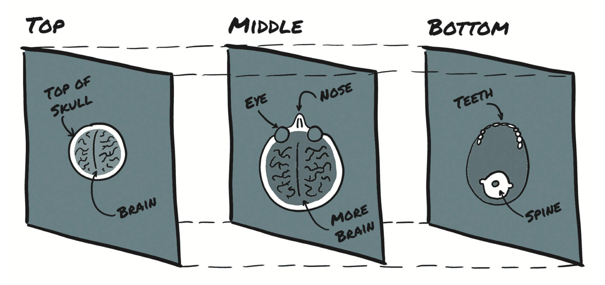

# 3.5 体积数据

你已经学习了如何加载和表示2D图像，这些图像有点类似使用相机拍摄的图像。在诸如涉及CT（计算机断层扫描）扫描等医学成像应用程序的情况下，通常需要处理从头到脚方向堆叠的图像序列，每个序列对应于整个身体的横切片。在CT扫描中，强度代表身体不同部位的密度：肺、脂肪、水、肌肉、骨骼，以密度递增的顺序排列，当在临床工作站上显示CT扫描时，会从黑色映射为明亮。根据穿过人体后到达检测器的X射线量计算每个点的密度，并使用一些复杂的数学运算将原始传感器数据反卷积为完整体积。

CT具有单个强度的通道，类似于灰度图像。通常在本地数据格式中，通道维度被忽略了，因此原始数据通常会具有三个维度。通过将单个2D切片堆叠到3D张量中，你可以构建表示对象的3D解剖结构的体积数据。与图3.3不同，图3.4中的额维度表示物理空间中的偏移量，而不是可见光谱的特定频带。

<div align=center>
  
</div>
<div align=center>图3.4 从头顶到颌骨的CT扫描切片</div>

我们将不在此处详细介绍医学成像数据格式。现在，足以说存储体积数据的张量和存储图像数据的张量之间不存在根本差异。在介绍通道（`channel`）的维度之后，你有一个额外的尺寸——深度（`depth`），导致5D张量为`NxCxDxHxW`。

使用`imageio`模块中的`volread`函数加载一个样本CT扫描，该函数以文件集作为参数，并将所有DICOM（数字图像通信和存储）文件组合成一系列NumPy 3D数组中，如下列表所示。

```python
import imageio
dir_path = "../../data/chapter3/volumetric-dicom/2-LUNG 3.0  B70f-04083" 
vol_arr = imageio.volread(dir_path, 'DICOM') 
vol_arr.shape
```

输出：

```python
Reading DICOM (examining files): 1/99 files (1.0%99/99 files (100.0%)   Found 1 correct series.
Reading DICOM (loading data): 87/99  (87.999/99  (100.0%)                                             
```

输出：

```python
(99, 512, 512)
```

同样在这种情况下，由于缺少通道信息，布局与PyTorch所期望的不同。你必须通过`unsqueeze`为通道（`channel`）维度腾出空间：

```python
vol = torch.from_numpy(vol_arr).float() 
vol = torch.transpose(vol, 0, 2) 
vol = torch.unsqueeze(vol, 0)
vol.shape
```

输出：

```python
torch.Size([1, 512, 512, 99])
```

此时，你可以像本章前面所述通过沿批处理（`batch`）方向堆叠多个体积数据来组装5D数据集。

# 结论

在本章中，你学到了很多基础知识。你学习了如何加载最常见的数据类型并对其进行重塑，以供神经网络使用。当然，未处理的数据格式比我们希望在单个体积数据中描述的更多。有些内容，例如医学史，过于复杂而无法涵盖。但是，对于感兴趣的读者，我们在代码存储库中确实提供了在Jupyter notebooks中创建音频和视频张量的简短示例。

## 练习

- - 用手机或其他数码相机拍摄几张红色、蓝色和绿色的照片。
  - 加载每个图像，并将其转换为张量。
  - 对于每个图像张量，请使用`.mean()`方法来获得图像的亮度参数。
  - 现在，取图像每个通道的均值。你能否仅从通道平均值中识别出红色，绿色和蓝色项目吗？

- - 选择一个包含Python源代码的相对较大的文件。
  - 建立源文件中所有单词的索引。（请随意使你的标记尽可能的简单或复杂；我们建议你先将`r"[^a-zA-Z0-9_]+”`替换为空格。
  - 将你的索引与为`Pride and Prejudice`制定的索引进行比较。哪个更大？
  - 为源代码文件创建独热编码。
  - 这种编码会丢失什么信息？该信息与`Pride and Prejudice`编码中丢失的信息相比如何？

## 总结

* 神经网络要求将数据表示为多维数张量，通常为32位浮点。
* 多亏了PyTorch库可以与Python标准库和周围的生态系统进行交互，因此可以方便地加载最常见的数据类型并将其转换为PyTorch张量。
* 通常，PyTorch期望根据模型架构（例如卷积与递归）沿特定维度布局数据。使用PyTorch张量API可以有效地实现数据重塑。
* 表格可以很容易地直接转换为张量。分类和常规值列的处理方式应不同于区间值列。
* 通过使用字典，文本或分类数据可以使用独热编码表示。
* 图像可以具有一个或多个通道。最常见的是典型数码照片的红色、绿色和蓝色通道。
* 单通道数据格式有时会忽略显式的通道维。
* 体积数据类似于2D图像数据，但增加了第三维：深度。
* 尽管12位和16位通道并不罕见，但是许多图像每格通道位数深度还是为8。这些位深度可以存储为32位浮点数但是并不会降低精度。