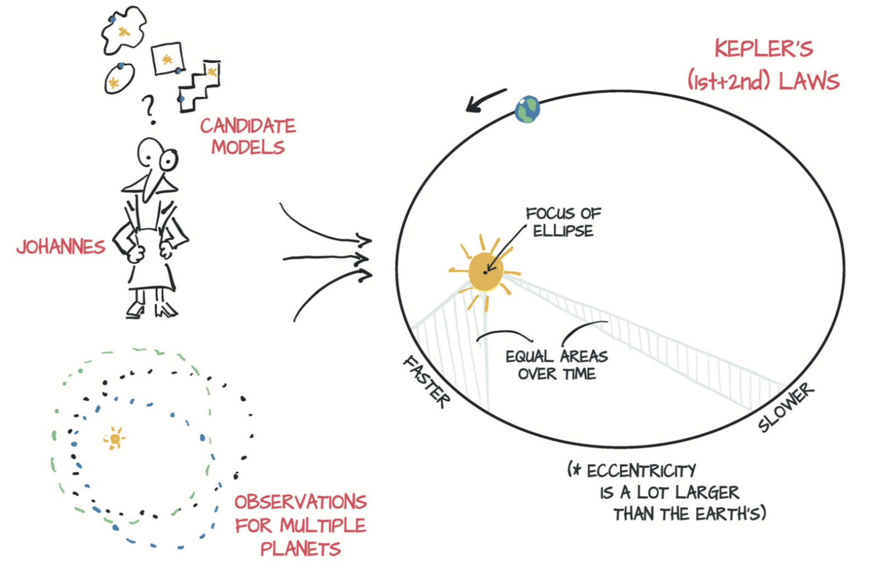

# 4 学习机制

本章将
* 理解算法如何从数据中学习
* 使用微分和梯度下降将学习重新构造为参数估计
* 从头开始学习一个简单的学习算法
* 了解PyTorch如何通过autograd支持学习

-------------------------

随着近十年来机器学习的蓬勃发展，从经验中学习的机器这一概念已成为技术和媒体界的主流。那么，机器到底是如何学习的？学习的机制或背后的算法是什么？从外部观察者的角度来看，学习算法就是将输入数据与所需输出配对。当学习完成后，该算法在输入与训练后的输入数据足够相似的新数据时，便能够产生正确的输出。借助深度学习，即使输入数据和所需的输出来自彼此不同的域（例如图像和描述它的句子）时，该过程也可以正常工作。

实际上，解释输入/输出关系的模型可以追溯到几个世纪之前。翰尼斯·开普勒（Johannes Kepler，1571-1630，德国数学天文学家）基于他的导师Tycho Brahe用肉眼（是的，一双眼和一张纸）观察的数据，在1600年代初弄清楚了他的三个行星运动定律。当时开普勒没有牛顿的万有引力定律可供使用（实际上，牛顿反倒利用开普勒的著作来解决问题），他只是推断出最简单的几何模型来拟合数据。值得一提的是，[根据Michael Fowler的描述]( http://galileoandeinstein.physics.virginia.edu/1995/lectures/morekepl.html)，他花了6年的时间盯着那些对他没有意义的数据来逐渐实现并制定这些定律。你可以在图4.1中看到这个过程。

第一条定律是：“每个行星的轨道都是椭圆形，太阳位于两个焦点之一。” 他不知道是什么原因使轨道成为椭圆形，但给定行星（或大行星的卫星，例如木星）的一组观测值，他可以估算出椭圆的形状（eccentricity，偏心率）和大小（semi-latus rectum，正半焦距）。利用从数据中计算出的这两个参数，他可以判断出行星在天空中可能位于何处。当他计算出第二定律（“一条连接行星和太阳的线在相等的时间间隔内扫出相等的区域”）时，他还可以根据给出的观测结果判断出行星何时到达空间中的特定点。

> 理解本章不需要了解开普勒定律的细节，你可以在[这里](https://en.wikipedia.org/wiki/Kepler%27s_laws_of_planetary_motion)找到关于开普勒定律的更多信息。

图4.1 开普勒考虑了可能适合手头数据的多个候选模型并最终选择了椭圆模型

开普勒如何在没有计算机、微型计算器甚至微积分（那时这些都还没被发明出来的）的情况下估算椭圆的偏心率和尺寸？ 你可以从开普勒自己在《新天文学》（New Astronomy）一书中的回忆，或者从J.V. Field的[《证明的起源》（The Origins of Proof）系列](https://plus.maths.org/content/origins-proof-ii-keplers-proofs)中找到答案：
> 本质上，开普勒必须使用一定数量的观测值来计算出曲线以尝试不同形状，然后使用计算出的曲线估计出更多位置，这是他拥有观测值的时间。然后检查这些计算出的位置是否与观测到的位置一致。

总结一下，开普勒在过去的六年里
1. 从他的朋友Brahe那里得到了很多好的数据（费了一些周折）。
2. 试图将这些数据可视化，因为他觉得有的（数据）有些可疑。
3. 选择有可能拟合数据的最简单的模型（椭圆）。
4. 划分数据，以便处理部分数据并保留独立的数据集用来验证。
5. 从试探性的偏心率和大小开始，然后进行迭代直到模型拟合观察结果为止。
6. 根据独立的数据集验证他的模型。
7. 难以置信地回顾。

这就是一本从1609走来的数据科学手册。

正如科学家们在几个世纪以来所学到的那样，科学的历史是建立在这七个步骤之上的，背离它们就是灾难的根源。（除非你是一个理论物理学家:D）

这些步骤正是你想从数据中学到东西所需的。在这里，说拟合（fit）数据和说让算法从数据中学习几乎没有区别。该过程始终涉及具有未知参数的函数，其参数是根据数据估算的，简称模型（model）。

你可以说“从数据中学习”假设了模型不是旨在解决特定问题（如开普勒工作中的椭圆问题）而是能够估计更广泛的函数簇。神经网络可以预测Tycho Brahe的轨迹而无需开普勒的独到见解来尝试将数据拟合到椭圆上。然而，牛顿从通用模型中得出万有引力定律将要困难得多。

你可能对后一种模型感兴趣：这些模型不是为解决特定任务而设计的，而是可以用输入输出对自动适应于解决许多类似任务，换句话说，就是经过在与手头任务相关的数据上训练的通用模型。具体来讲，PyTorch就是旨在简化创建模型的过程，对于该模型，拟合误差相对于参数的导数可以被解析地表达出来。如果你不理解最后一句话，请不要担心，4.1.1节会为你清除疑惑。

本章介绍如何自动进行通用函数拟合过程，这是使用深度学习所做的全部工作，而深度神经网络就是通用函数，PyTorch使此过程尽可能简单和透明。为了确保正确理解关键概念并让你从原理中了解学习算法的机制，我们将从比深度神经网络简单得多的模型开始。