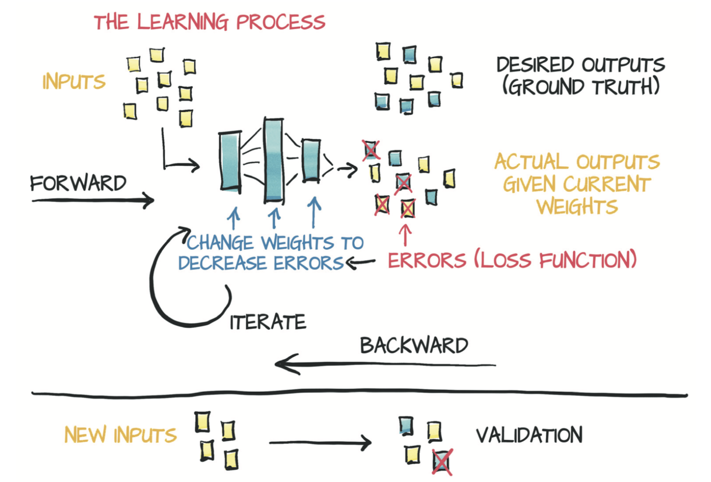

# 4.1 学习就是参数估计

在本节，你将学习如何获取数据，选择模型并估计模型的参数，以便对新数据给出良好的预测。为此，您将摆脱行星运动的复杂性，将注意力转移到物理学上第二困难的问题上：仪器校准。

图4.2简要概述了本章结束时你将要实现的内容。给定输入数据和相应的期望输出（ground truth）以及权重的初始值，模型输入数据（前向传播），然后通过把结果输出与ground truth进行比较来评估误差。为了优化模型的参数，其权重（即单位权重变化引起的误差变化，也即误差相对于参数的梯度）通过使用对复合函数求导的链式法则进行计算（反向传播）。然后，权重的值沿导致误差减小的方向更新。不断重复该过程直到在新数据上的评估误差降至可接受的水平以下。

图4.2 模型的学习过程
