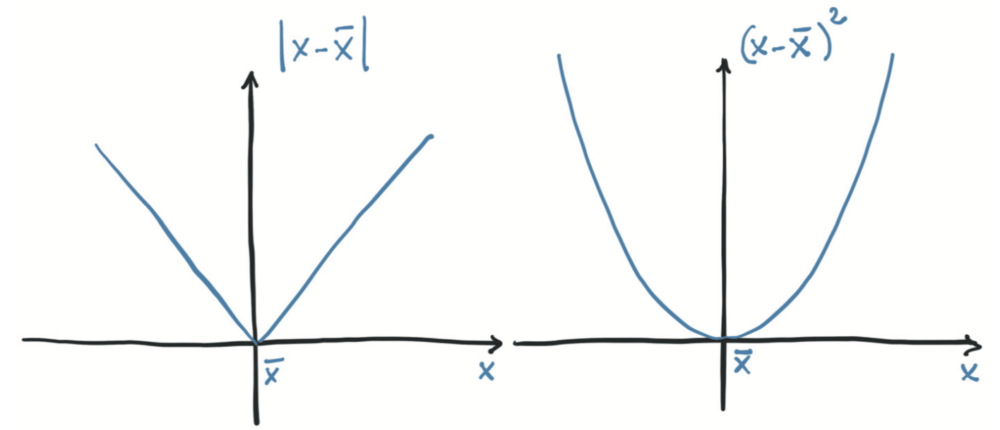
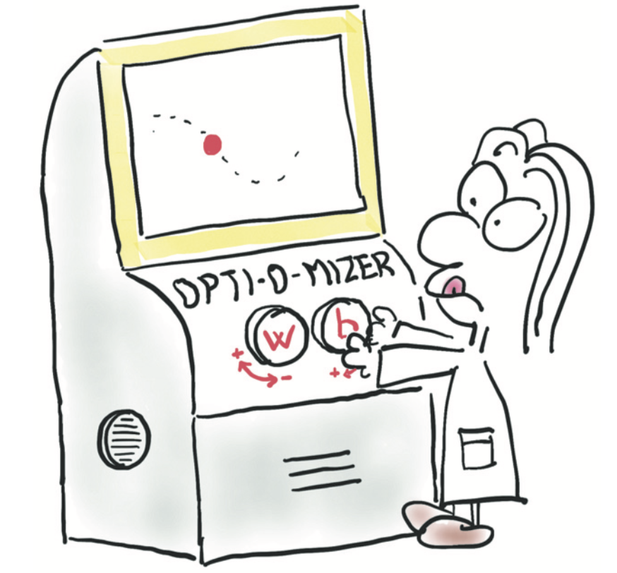
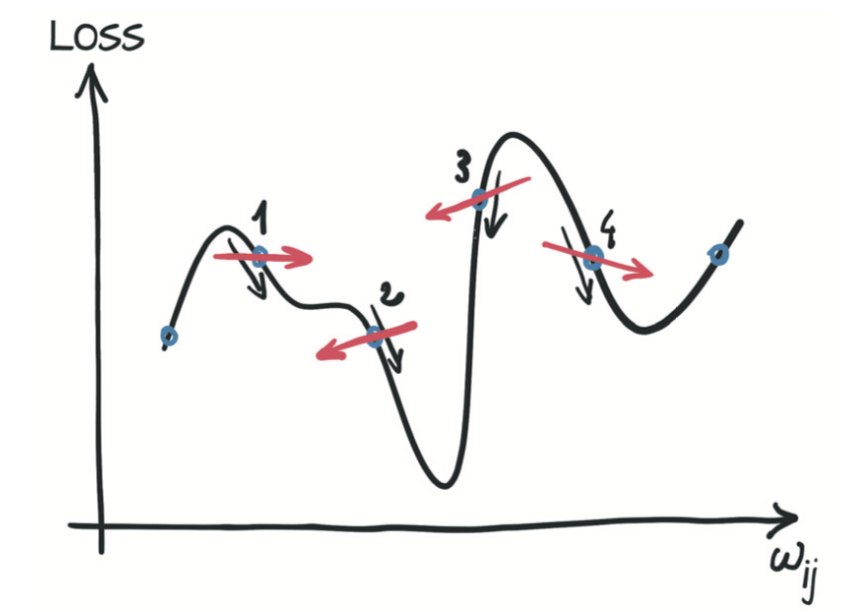
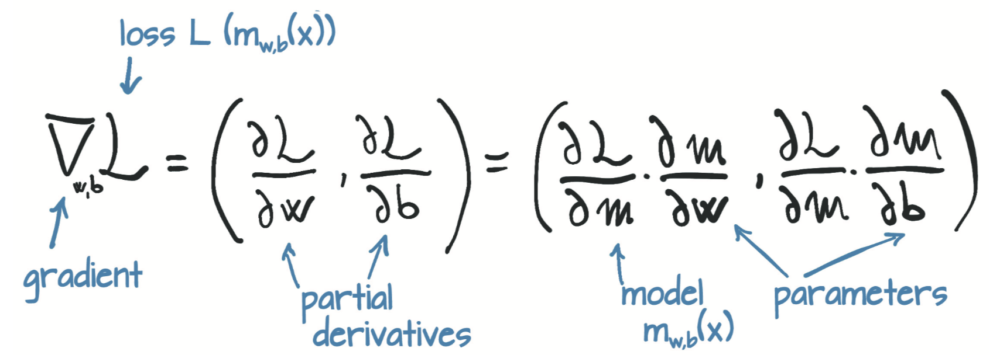
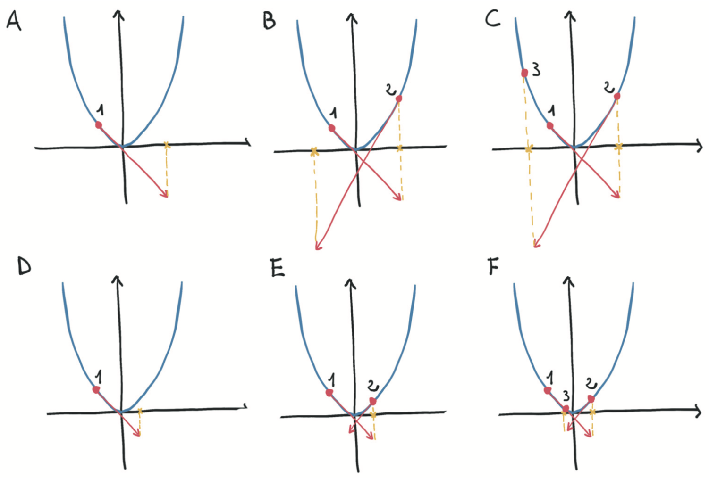
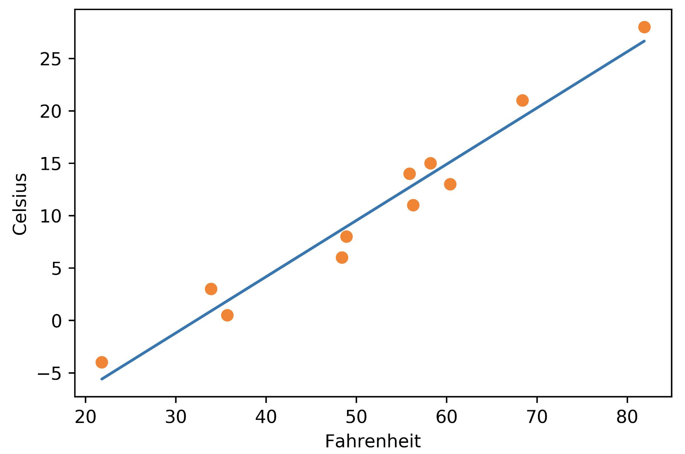

# 4.1 学习就是参数估计

在本节，你将学习如何获取数据，选择模型并估计模型的参数，以便对新数据给出良好的预测。为此，您将摆脱行星运动的复杂性，将注意力转移到物理学上第二困难的问题上：仪器校准。

图4.2简要概述了本章结束时你将要实现的内容。给定输入数据和相应的期望输出（ground truth）以及权重的初始值，模型输入数据（前向传播），然后通过把结果输出与ground truth进行比较来评估误差。为了优化模型的参数，其权重（即单位权重变化引起的误差变化，也即误差相对于参数的梯度）通过使用对复合函数求导的链式法则进行计算（反向传播）。然后，权重的值沿导致误差减小的方向更新。不断重复该过程直到在新数据上的评估误差降至可接受的水平以下。

上述内容你听起来可能有点晦涩难懂，我们将用整整一章进行阐释。待我们完成时，所有内容都将就位，到时你就能理解上一段的意义。

接下来，你要处理含噪声的数据集，建立模型并为其实现一个学习算法。你首先手动完成所有操作，但是到本章结束时，你就可以让PyTorch完成所有繁重的工作。到本章结束时，我们将涵盖训练深度神经网络的许多基本概念，即使示例很简单且其模型（还）不是神经网络。

<div align=center>

</div>
<div align=center>图4.2 模型的学习过程</div>

## 4.1.1 一个热门的问题

假设你去了一些鲜为人知的地方旅游，然后带回了一个花哨的壁挂式模拟温度计。这个温度计看起来很棒，非常适合你的客厅。唯一的缺点是它不显示单位。不用担心，你有一个计划。你用自己喜欢的单位建立一个读数和相应温度值的数据集，然后选择一个模型，并迭代调整单位的权重，直到误差的测量值足够低为止，最后你就可以在新温度计上进行准确读数了。

首先记录能正常工作的旧摄氏温度计的数据和你刚带回来的新温度计对应的测量值。几周后，你得到了一些数据:

``` python
t_c = [0.5,  14.0, 15.0, 28.0, 11.0,  8.0,  3.0, -4.0,  6.0, 13.0, 21.0]
t_u = [35.7, 55.9, 58.2, 81.9, 56.3, 48.9, 33.9, 21.8, 48.4, 60.4, 68.4]
t_c = torch.tensor(t_c)
t_u = torch.tensor(t_u)
```

`t_c`是摄氏度数，`t_u`是未知单位度数。你可以假设两种测量结果中的噪声均来自温度计本身以及读数误差。为了方便起见，我们将数据转换成张量，你将很快使用它。

## 4.1.2 选择线性模型作为首次尝试

在没有进一步知识的情况下，我们先假定一个用于在两组测量之间相互转换的最简单的可能模型，就像开普勒所做的那样。两组数据可能是线性相关的，也就是说，将`t_u`乘以一个因子并加上一个常数就得到了摄氏温度：
$$
t_c = w * t_u + b
$$

这个假设合理吗？很可能是合理的，你最后会看到最终模型的效果如何。（$w$ 和 $b$ 分别是权重weight和偏差bias，这是线性缩放的两个常用术语，你将经常遇到。）

> 注意：我们知道线性模型是正确的，因为问题和数据都是我们捏造的，但请原谅我们；因为该模型是一个有用的激励示例（motivating example），有助于你了解PyTorch的内部工作机制。

现在，你需要根据已有的数据估算模型中的参数 $w$ 和 $b$。 为了根据未知温度 $t_u$ 获得以摄氏度为单位的温度值 $t_c$，你必须对这两个参数进行估计。该过程听起来像是通过一组测量值来拟合一条直线，那正是你正在做的事情。当你使用PyTorch实现此简单示例时，应意识到训练神经网络本质上就是通过调整一些（可能很大量的）参数将模型更改为更为精确的模型。

为了再次具体化示例，设想你有一个带有一些未知参数的模型，并且需要估计这些参数，以使预测输出与测量值之间的误差尽可能小。你注意到仍然需定义如何度量这种误差。如果误差很大，那么这种度量（我们称为损失函数）应该很高，而完美匹配时的理想情况下应该尽可能低。因此，你的优化过程应以找到使损失函数处于最低水平的 $w$ 和 $b$ 为目标。

## 4.1.3 你所需的是减少损失

损失函数（或成本函数）是输出为单个数值的函数，在学习过程中我们试图最小化它。损失函数通常是计算训练样本的期望输出与模型接收这些样本所产生的实际输出之间的差异，在本例中，即是模型输出的预测温度 $t_p$ 与实际测量值之间的差异 $ t_p-t_c$。

你需要确保在 $t_p$ 高于和低于真实 $t_c$ 时，损失函数都会输出正值，因为目标是使损失函数最小。（将损失优化至负无穷是没有用的。）你有几种选择，最直接的是 $|t_p-t_c|$ 和 $ (t_p-t_c)^2 $。基于你所选择的数学表达式，你可以强调或消除某些损失。从概念上讲，损失函数是一种从训练样本中优先确定的要修复哪些错误的方法，这样，参数更新将导致对高权重样本的输出进行调整，而不是对损失较小的其他样本输出进行更改。

刚刚的两个示例损失函数都具有明显的最小零值，并且随着预测值在任一方向上远离真实值而单调递增。由于这个原因，两个函数都被认为是凸的（convex）。因为你的模型是线性的，所以得到的关于 $w$ 和 $b$ 的损失函数也是凸的。损失函数是模型参数的凸函数的情况通常比较好处理，因为你可以通过专门的算法以有效的方式找到最小值。深度神经网络的损失函数不保证是凸的，因此这些方法通常对你没有用。

对于损失函数 $| t_p-t_c |$ 和 $(t_p-t_c)^2$，如图4.3所示，需要注意的是后者在最小值附近表现得更好：当 $t_p$ 等于 $t_c$ 时，误差平方损失相对于 $t_p$ 的导数为零。相反，绝对误差损失函数在你想要收敛的位置具有不确定的导数。实际上这个问题并没有看起来那么重要，但是暂时坚持使用误差平方损失。

值得注意的是，误差平方损失还比绝对误差损失更严重地惩罚了错误的结果。通常，稍微出错的结果是要好于一些严重错误的结果的，误差平方损失有助于按需要对这些结果进行优先级排序。

<div align=center>

</div>
<div align=center>图4.3 绝对误差与平方误差</div>

## 4.1.4 从问题到PyTorch
你已经弄清楚了模型和损失函数，所以你已经弄清楚了高层图的一部分。现在你需要启动学习过程并提供实际数据。另外，数学符号已经讲得够多了，现在切换到PyTorch。毕竟，你是来这里玩的。

你已经创建了数据张量，因此将模型写为Python函数
``` python
def model(t_u, w, b):
    return w * t_u + b
```
其中你期望`t_u`、`w`和`b`分别为输入张量、权重参数和偏置参数。在你的模型中，参数是PyTorch标量（也称为零维张量），并且乘积运算将使用广播（broadcast）来产生返回的张量。 现在定义损失：
``` python
def loss_fn(t_p, t_c):
    squared_diffs = (t_p - t_c)**2
    return squared_diffs.mean()
```
请注意，你正在建立一个张量差，然后将它们按元素（elementwise）取平方，最后通过对所得张量中的所有元素求平均来得到标量损失函数。所以这个损失是平方误差损失。

现在你可以初始化参数，调用模型，
``` python
w = torch.ones(1)
b = torch.zeros(1)
t_p = model(t_u, w, b)
t_p
```
输出:
```
tensor([35.7000, 55.9000, 58.2000, 81.9000, 56.3000, 48.9000, 33.9000, 21.8000,
        48.4000, 60.4000, 68.4000])
```
然后计算损失函数的值：
``` python
loss = loss_fn(t_p, t_c)
loss
```
输出:
```
tensor(1763.8846)
```

在本小节中，你实现了模型和损失。本节的重点是如何估计`w`和`b`，以使损失达到最小值。首先你需要手工解决问题；然后你将学习如何利用PyTorch超级功能以更通用的现成方式解决这个问题。

## 4.1.5 沿梯度向下
在本节中，你将使用被称为的梯度下降（gradient descent）算法针对参数优化损失函数，并建立关于梯度下降工作原理的直观理解，这将在将来为你带来很多帮助。有多种方法可以更有效地解决此特定示例，但这些方法不适用于大多数深度学习任务。而梯度下降是一个简单但可以令人惊讶地很好地扩展到具有数百万个参数的大型神经网络模型的方法。

从图4.4开始，假设你在带有两个标有`w`和`b`的旋钮的机器前，你可以在屏幕上看到损失值，并被告知将损失值最小化。不知道旋钮对损失值的影响，你可能会开始摆弄它们，并确定每个旋钮使损失值减小的方向。你可能决定将两个旋钮朝着减小损失值的方向旋转。如果你距离最佳值较远，则可能会看到损失迅速减小，然后随着接近最小值而逐渐变慢。你会注意到，损失值有时会再次上升，因此你需要反转一个或两个旋钮的旋转方向。你还将学到当损耗变化缓慢时，最好更精细地调节旋钮，以避免到达损失值再次上升的位置。一段时间后，最终，你将把损失值收敛到最低值。

<div align=center>

</div>
<div align=center>图4.4 对优化过程的卡通化描述，图中一个人用带有w和b的旋钮向使损耗减小的方向进行搜索</div>

梯度下降没有太大不同，其想法是计算相对于每个参数的损失变化率，并沿损失减小的方向改变每个参数。当您摆弄旋钮时，可以通过对`w`和`b`进行很小的旋转来估计该变化率，以查看该邻域中的损失值变化了多少：

``` python
delta = 0.1
loss_rate_of_change_w = \
    (loss_fn(model(t_u, w + delta, b), t_c) -
     loss_fn(model(t_u, w - delta, b), t_c)) / (2.0 * delta)
```

这段代码说的是，在`w`和`b`的当前值附近很小的范围内，`w`的单位增加会导致损失的某些变化。如果变化为负，则需要增加`w`以使损失最小，而如果变化为正，则需要减小`w`。减小多少呢？对`w`施加与损失的变化率成比例的变化是一个好主意，尤其是在损失具有多个参数的情况下：将变化应用于对损失有重大变化的参数。通常，缓慢地更改参数也是明智的做法，因为损失变化率可能会与当前`w`值的距离相差很大。因此，你应该用一个较小的因子来缩小变化率。这个因子有很多名称，机器学习中称之为学习率（learning rate）。

``` python
learning_rate = 1e-2
w = w - learning_rate * loss_rate_of_change_w
```

对`b`进行同样的操作：
``` python
loss_rate_of_change_b = \
    (loss_fn(model(t_u, w, b + delta), t_c) -
     loss_fn(model(t_u, w, b - delta), t_c)) / (2.0 * delta)
b = b - learning_rate * loss_rate_of_change_b
```

此代码表示梯度下降的基本参数更新步骤。通过不断重复这个步骤（假设你选择的学习率足够低），你可以收敛到参数的最佳值，对于该参数，根据给定数据计算出的损失最小。我们将很快展示完整的迭代过程，但是这种计算变化率的方法相当粗糙，需要改进。在下一小节中，你将了解原因和方式。

## 4.1.6 进行分析

通过重复评估模型和损失以搜索`w`和`b`附近的损失函数的行为来计算变化率，并不能很好地适应具有许多参数的模型。此外，并不总是很清楚该邻域应该有多大。之前选择的`delta`等于0.1，但是一切都取决于损失函数的尺寸。如果损失与`delta`相比变化得太快，那么你将对下降后的位置一无所知。

如图4.5所示，如果你可以使邻域无限小呢？这就是当你分析得出损失相对于参数的导数时发生的情况。在具有两个或多个参数的模型中，你将计算损失相对于每个参数的导数，并将它们放在导数向量中，即梯度。

<div align=center>

</div>
<div align=center>图4.5 离散式与分析式位置估计下降方向时的差异</div>

要计算损失值相对于参数的导数，你可以应用链式规则，计算损失函数相对于其输入（即模型的输出）的导数乘以模型相对于参数的导数。 参数：

$$
\frac { \text{loss\_fn}} {\partial w} = 
\frac {\partial \text{loss\_fn}} {\partial t_p} 
\frac {\partial t_p} {\partial w} 
$$

回想一下，该模型是线性函数，损失函数是平方和。现在计算出导数的表达式，先重写损失的表达式：
``` python
def loss_fn(t_p, t_c):
    squared_diffs = (t_p - t_c)**2
    return squared_diffs.mean()
```
因为 $ \frac {d x^2} {d x} = 2x$，所以
``` python
def dloss_fn(t_p, t_c):
    dsq_diffs = 2 * (t_p - t_c)
    return dsq_diffs
```
然后我们重写模型的表达式：
``` python
def model(t_u, w, b):
    return w * t_u + b
```
因此我们得到导数为
``` python
def dmodel_dw(t_u, w, b):
    return t_u

def dmodel_db(t_u, w, b):
    return 1.0
```
将所有这些放在一起，返回损失相对于`w`和`b`的梯度的函数
``` python
def grad_fn(t_u, t_c, t_p, w, b):
    dloss_dw = dloss_fn(t_p, t_c) * dmodel_dw(t_u, w, b)
    dloss_db = dloss_fn(t_p, t_c) * dmodel_db(t_u, w, b)
    return torch.stack([dloss_dw.mean(), dloss_db.mean()])
```
用数学符号表示的上述过程如图4.6所示。
<div align=center>

</div>
<div align=center>图4.6 损失函数相对于模型参数的导数</div>

同样，你要对所有数据点求平均值（求和并然后除以一个常数）以得到损失的每个偏导数的标量值。

## 4.1.7 训练循环

现在，你已准备就绪，可以进行参数优化。从参数的暂定值开始，你可以迭代地对其应用更新以进行固定次数的迭代或者直到`w`和`b`停止改变为止。你可以使用多个停止条件，但是现在以固定迭代次数为例。

在讨论前，我们介绍另一个术语，在所有训练样本上的一次参数更新迭代称为一个epoch。

``` python
def training_loop(n_epochs, learning_rate, params, t_u, t_c, 
                    print_params = True, verbose=1):
    for epoch in range(1, n_epochs + 1):
        w, b = params
        
        t_p = model(t_u, w, b) # 前向传播
        loss = loss_fn(t_p, t_c)
        grad = grad_fn(t_u, t_c, t_p, w, b) # 反向传播
        
        params = params - learning_rate * grad
        
        if epoch % verbose == 0:
            print('Epoch %d, Loss %f' % (epoch, float(loss)))
            if print_params:
                print('    Params: ', params)
                print('    Grad  : ', grad)
    return params
```

然后调用上述训练循环函数：

``` python
training_loop(
            n_epochs = 10,
            learning_rate = 1e-2,
            params = torch.tensor([1.0, 0.0]),
            t_u = t_u,
            t_c = t_c)
```
输出:
```
Epoch 1, Loss 1763.884644
    Params:  tensor([-44.1730,  -0.8260])
    Grad  :  tensor([4517.2964,   82.6000])
Epoch 2, Loss 5802484.500000
    Params:  tensor([2568.4011,   45.1637])
    Grad  :  tensor([-261257.4062,   -4598.9707])
Epoch 3, Loss 19408031744.000000
    Params:  tensor([-148527.7344,   -2616.3933])
    Grad  :  tensor([15109615.0000,   266155.7188])

...

Epoch 10, Loss 90901075478458130961171361977860096.000000
    Params:  tensor([3.2144e+17, 5.6621e+15])
    Grad  :  tensor([-3.2700e+19, -5.7600e+17])
tensor([3.2144e+17, 5.6621e+15])
```

等等，发生什么了？训练过程崩溃了，导致损失变成了无穷大。这个结果清楚地展现了参数`params`的更新太大；它们的值在每次更新过头时开始来回摆动，而下次更新则摆动更剧烈。优化过程不稳定，它发散了而不是收敛到最小值。你希望看到越来越小的参数更新，而不是越来越大，如图4.7所示。

<div align=center>

</div>
<div align=center>图4.7 Top: 由于步长较大，对凸函数（抛物线）进行了发散优化。Bottom: 用小步长收敛优化。</div>

如何限制`learning_rate * grad`的大小？好吧，这个过程看起来很简单。你可以选择一个较小的`learning_rate`。通常你会按数量级更改学习率，因此可以尝试`1e-3`或`1e-4`，这将使更新量降低几个数量级。这里用`1e-4`看看其工作结果：

``` python
training_loop(
            n_epochs = 10,
            learning_rate = 1e-4,
            params = torch.tensor([1.0, 0.0]),
            t_u = t_u,
            t_c = t_c)
```
输出:
```
Epoch 1, Loss 1763.884644
    Params:  tensor([-44.1730,  -0.8260])
    Grad  :  tensor([4517.2964,   82.6000])
Epoch 2, Loss 5802484.500000
    Params:  tensor([2568.4011,   45.1637])
    Grad  :  tensor([-261257.4062,   -4598.9707])
Epoch 3, Loss 19408031744.000000
    Params:  tensor([-148527.7344,   -2616.3933])
    Grad  :  tensor([15109615.0000,   266155.7188])

...

Epoch 8, Loss 29.113848
    Params:  tensor([ 0.2329, -0.0159])
    Grad  :  tensor([8.9964, 3.1869])
Epoch 9, Loss 29.107145
    Params:  tensor([ 0.2325, -0.0162])
    Grad  :  tensor([3.6721, 3.0930])
Epoch 10, Loss 29.105242
    Params:  tensor([ 0.2324, -0.0166])
    Grad  :  tensor([1.4803, 3.0544])
tensor([3.2144e+17, 5.6621e+15])
```
漂亮，现在优化过程是稳定的了。但是还有另一个问题：参数的更新很小，因此损失会缓慢下降并最终停滞。你可以通过动态调整`learning_rate`来解决此问题，即根据更新的大小对学习率进行更改。为此，可以使用多种优化方案，你会在本章末尾的“优化器”小节看到一个。

在更新过程中另一个潜在的麻烦是：梯度本身。观察优化过程中第1个epoch的梯度`grad`值，此时权重`w`的梯度大约是偏差`b`梯度的50倍，因此权重和偏差存在于不同比例的空间中。在这种情况下，足够大的学习率足以有意义地更新一个，但对于另一个不稳定，或者适合第二个学习者的学习率不足以有意义地更新第一个。此时除非你更改问题的描述，否则你将无法更新参数。你可以为每个参数设置单独的学习率，但是对于具有许多参数的模型，此方法将非常麻烦。

可以采用一种更简单的方法：更改输入使梯度差别不要太大。粗略地说，你可以确保输入不要与范围-1.0到1.0相差过大。在本例中，你可以通过将`t_u`乘以0.1来达到此效果：

``` python
t_un = 0.1 * t_u
```
在这里，通过添加下标`n`来表示`t_u`的规范化（normalization）版本。此时，你可以在规范化输入上运行训练循环：

``` python
training_loop(
    n_epochs = 10,
    learning_rate = 1e-2,
    params = torch.tensor([1.0, 0.0]),
    t_u = t_un, # 规范化后的输入
    t_c = t_c)
```
输出:
```
Epoch 1, Loss 80.364342
    Params:  tensor([1.7761, 0.1064])
    Grad  :  tensor([-77.6140, -10.6400])
Epoch 2, Loss 37.574917
    Params:  tensor([2.0848, 0.1303])
    Grad  :  tensor([-30.8623,  -2.3864])
Epoch 3, Loss 30.871077
    Params:  tensor([2.2094, 0.1217])
    Grad  :  tensor([-12.4631,   0.8587])

...

Epoch 9, Loss 29.119417
    Params:  tensor([ 2.3178, -0.0417])
    Grad  :  tensor([-0.5633,  2.9298])
Epoch 10, Loss 29.030487
    Params:  tensor([ 2.3232, -0.0710])
    Grad  :  tensor([-0.5355,  2.9295])
tensor([ 2.3232, -0.0710])
```

即使学习率被设置为`1e-2`，在迭代更新过程中参数也不会发散。现在注意梯度值，它们的大小相似，因此对两个参数使用单个`learning_rate`效果也还不错。你可能会有比将输入缩小十倍更好的规范化方法，但由于这样做足以满足需求，所以我们就这样做。

> 注：这里的规范化可以帮助训练网络，但是你可以说这并不是优化参数必须的。确实是这样的！这个例子很简单，你有很多其他方法可以解决这个问题。但是，对于更复杂的问题，规范化是一种用于改善模型收敛性的简便有效的（即使不是至关重要的）工具。

接下来，运行循环进行足够的迭代次数以查看参数的变化。
将n_epochs更改为5000：

``` python
params = training_loop(
    n_epochs = 5000,
    learning_rate = 1e-2,
    params = torch.tensor([1.0, 0.0]),
    t_u = t_un,
    t_c = t_c,
    print_params = False,
    verbose=500)
```
输出:
```
Epoch 500, Loss 7.860116
Epoch 1000, Loss 3.828538
Epoch 1500, Loss 3.092191
Epoch 2000, Loss 2.957697
Epoch 2500, Loss 2.933134
Epoch 3000, Loss 2.928648
Epoch 3500, Loss 2.927831
Epoch 4000, Loss 2.927680
Epoch 4500, Loss 2.927651
Epoch 5000, Loss 2.927648

tensor([  5.3671, -17.3012])
```

不错。在沿梯度下降方向更改参数时，损耗逐渐减小。但损失不会为零，这可能意味着迭代次数不足，或者数据点本身就不在一条直线上。就如预期的那样，测量结果并非完美准确或者读数中包含噪声。

但请注意：`w`和`b`的值看起来非常像将摄氏度转换为华氏度所需要的参数（考虑了将输入乘以0.1之后）。精确值为`w= 5.5556`和`b = -17.7778`。你的温度计一直在显示华氏温度，这并不是什么大发现，但可以证明梯度下降优化过程是有效的。

接下来，做一件一开始就应该做的事情：数据绘图。为了达到令人惊讶的效果，我们直到现在才引入这件事。但是认真地讲，任何从事数据科学工作的人都应该做的第一件事就是数据绘图。

``` python
%matplotlib inline
from matplotlib import pyplot as plt

t_p = model(t_un, *params) # 记住你是在规范后数据上训练的

fig = plt.figure(dpi=600)
plt.xlabel("Fahrenheit")
plt.ylabel("Celsius")

plt.plot(t_u.numpy(), t_p.detach().numpy()) # 在原数据上作图
plt.plot(t_u.numpy(), t_c.numpy(), 'o')
```
上述代码的输出如图4.8所示。

<div align=center>

</div>
<div align=center>图4.8 线性拟合模型（实线）与输入数据（圆圈）</div>

线性模型对当前数据来说似乎是不错的模型。从图4.8也能看出测量值似乎有些不稳定。你应该打电话给验光师换一副新眼镜，或者考虑退还你的温度计。