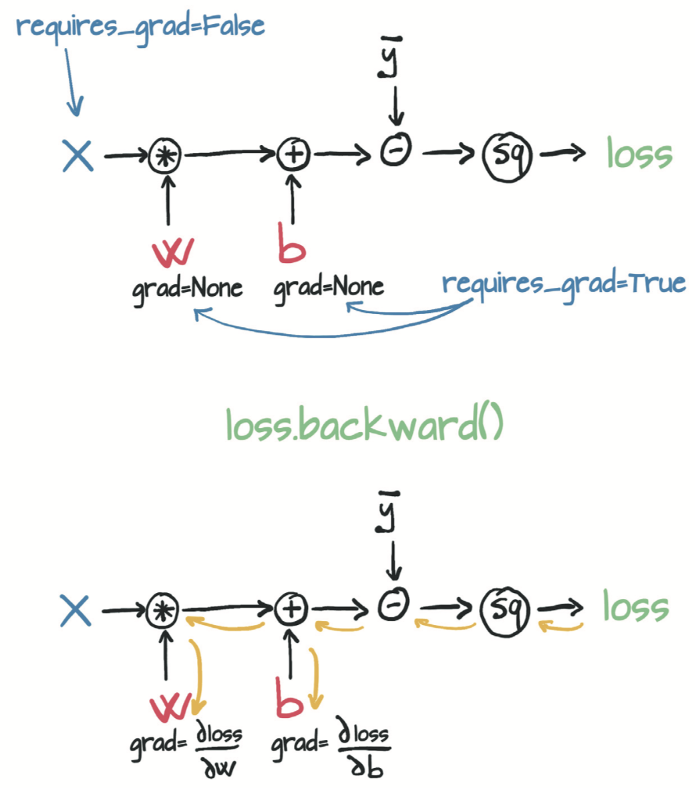

# 4.2 PyTorch自动求导

到目前为止，你已经了解了一个反向传播的简单示例。通过链式法则向后传播导数，可以计算复合函数（模型函数和损失函数）相对于它们的最内层参数`w`和`b`的梯度。基本的要求是涉及到的函数都是可微分的。在这种情况下，你可以通过一次扫描得到梯度（之前称为“损失变化率”）值。

如果你有一个具有数百万个参数的复杂模型，只要模型是可微的，损失函数相对于参数的梯度的计算就相当于编写导数的解析表达式并对其进行一次评估（evaluation）。当然，为由线性和非线性函数组成的复杂函数的导数编写解析表达式并不是一件很有趣的事情，也不是一件很容易的事情。

这个问题可以通过一个名为`autograd`的PyTorch模块来解决。PyTorch张量可以记住它们来自什么运算以及其起源的父张量，并且提供相对于输入的导数链。你无需手动对模型求导：不管如何嵌套，只要你给出前向传播表达式，PyTorch都会自动提供该表达式相对于其输入参数的梯度。

本例中，我们先重写温度计校准代码，这次使用`autograd`，然后看会发生什么。首先，定义模型和损失函数，如下所示。
``` python
def model(t_u, w, b):
    return w * t_u + b

def loss_fn(t_p, t_c):
    squared_diffs = (t_p - t_c)**2
    return squared_diffs.mean()
```

然后初始化参数张量：
``` python
params = torch.tensor([1.0, 0.0], requires_grad=True)
```
注意到了张量构造函数的`require_grad = True`吗?这个参数告诉PyTorch需要追踪在`params`上进行运算而产生的所有张量。换句话说，任何以`params`为祖先的张量都可以访问从`params`到该张量所调用的函数链。如果这些函数是可微的（大多数PyTorch张量运算都是可微的），则导数的值将自动存储在参数张量的`grad`属性中。

一般来讲，所有PyTorch张量都有一个初始为空的名为`grad`的属性：

``` python
params.grad is None # True
```

你需要做的就是从将`require_grad`设置为True开始，然后调用模型，计算损失值，然后对损失张量`loss`调用`backward`：

``` python
loss = loss_fn(model(t_u, *params), t_c)
loss.backward()
params.grad
```
输出:
```
tensor([4517.2969,   82.6000])
```

本例中，`params`的`grad`属性包含损失关于`params`的每个元素的导数（图4.9）。

<div align=center>

</div>
<div align=center>图4.9 用autograd计算的模型的前向传播图和反向传播图</div>

你可以将包含任意数量的张量的`require_grad`设置为`True`以及组合任何函数。在这种情况下，PyTorch会在沿着整个函数链（即计算图）计算损失的导数，并在这些张量（即计算图的叶节点）的`grad`属性中将这些导数值累积（accumulate）起来。

警告：PyTorch的新手（以及很多经验丰富的人）经常忽视的事情：是积累（accumulate）而不是存储（store）。

> 警告：调用`backward`会导致导数值在叶节点处累积。所以将其用于参数更新后，需要将梯度显式清零。

重复调用`backward`会导致导数在叶节点处累积。因此，如果提前调用了`backward`，然后再次计算损失并再次调用`backward`（如在训练循环中一样），那么在每个叶节点上的梯度会被累积（即求和）在前一次迭代计算出的那个叶节点上，导致梯度值不正确。

为防止这种情况发生，你需要在每次迭代时将梯度显式清零。可以使用就地方法`zero_`轻松地做到这一点：
``` python
if params.grad is not None:
    params.grad.zero_()
```

> 注：你可能会很好奇为什么在每次调用`backward`后将梯度清零是必需的步骤而不是自动进行的步骤。原因是为复杂模型中的梯度提供更大的灵活性和可控制性。

牢牢记住这个提醒，现在从头到尾看看启用了`autograd`的训练代码的样子：

``` python
def training_loop(n_epochs, learning_rate, params, t_u, t_c):
    for epoch in range(1, n_epochs + 1):
        if params.grad is not None: 
            params.grad.zero_() # 这可以在调用backward之前在循环中的任何时候完成
        t_p = model(t_u, *params)
        loss = loss_fn(t_p, t_c)
        loss.backward()
        params = (params - learning_rate * params.grad).detach().requires_grad_()
        if epoch % 500 == 0:
            print('Epoch %d, Loss %f' % (epoch, float(loss)))
    return params
```

请注意，更新参数时，你还执行了奇怪的`.detach().requires_grad_()`。要了解原因，请考虑一下你构建的计算图。为了避免重复使用变量名，我们重构`params`参数更新行：`p1 = (p0 * lr * p0.grad)`。这里`p0`是用于初始化模型的随机权重，`p0.grad`是通过损失函数根据`p0`和训练数据计算出来的。

到目前为止，一切都很好。现在，你需要进行第二次迭代：`p2 = (p1 * lr * p1.grad)`。如你所见，`p1`的计算图会追踪到`p0`，这是有问题的，因为(a)你需要将`p0`保留在内存中（直到训练完成），并且(b)在反向传播时不知道应该如何分配误差。

相反，应该通过调用`.detatch()`将新的`params`张量从与其更新表达式关联的计算图中分离出来。这样，`params`就会丢失关于生成它的相关运算的记忆。然后，你可以调用`.requires_grad_()`，这是一个就地（in place）操作（注意下标“_”），以重新启用张量的自动求导。现在，你可以释放旧版本`params`所占用的内存，并且只需通过当前权重进行反向传播。

``` python
t_un = 0.1 * t_u
training_loop(
    n_epochs = 5000,
    learning_rate = 1e-2,
    params = torch.tensor([1.0, 0.0], requires_grad=True),
    t_u = t_un,
    t_c = t_c)
```
输出:
```
Epoch 500, Loss 7.860116
Epoch 1000, Loss 3.828538
Epoch 1500, Loss 3.092191
Epoch 2000, Loss 2.957697
Epoch 2500, Loss 2.933134
Epoch 3000, Loss 2.928648
Epoch 3500, Loss 2.927830
Epoch 4000, Loss 2.927679
Epoch 4500, Loss 2.927652
Epoch 5000, Loss 2.927647
tensor([  5.3671, -17.3012], requires_grad=True)
```

你将获得与之前相同的结果。不错！尽管你可以手动计算导数，但这并不再必须。
