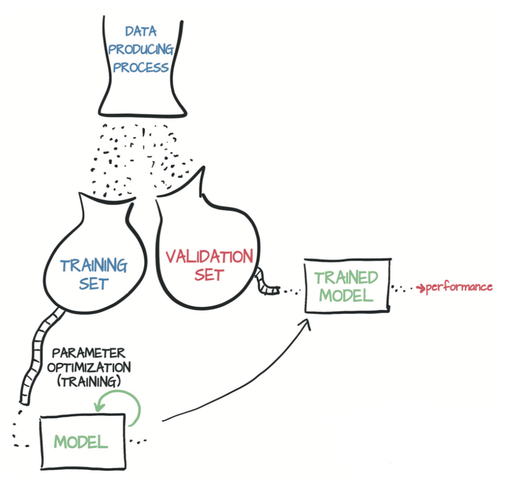
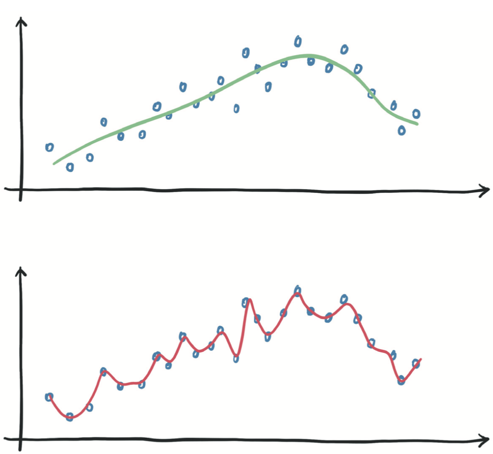
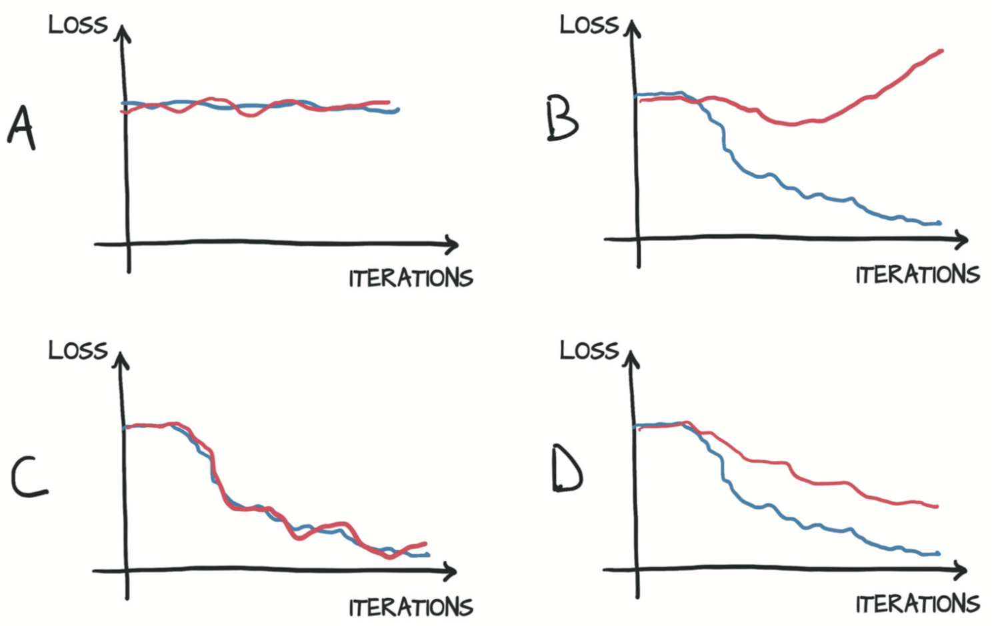
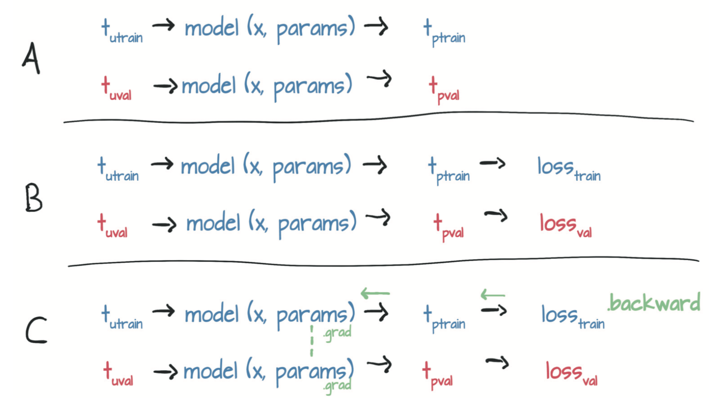

# 4.2 PyTorch自动求导

到目前为止，你已经了解了一个反向传播的简单示例。通过链式法则向后传播导数，可以计算复合函数（模型函数和损失函数）相对于它们的最内层参数`w`和`b`的梯度。基本的要求是涉及到的函数都是可微分的。在这种情况下，你可以通过一次扫描得到梯度（之前称为“损失变化率”）值。

如果你有一个具有数百万个参数的复杂模型，只要模型是可微的，损失函数相对于参数的梯度的计算就相当于编写导数的解析表达式并对其进行一次评估（evaluation）。当然，为由线性和非线性函数组成的复杂函数的导数编写解析表达式并不是一件很有趣的事情，也不是一件很容易的事情。

这个问题可以通过一个名为`autograd`的PyTorch模块来解决。PyTorch张量可以记住它们来自什么运算以及其起源的父张量，并且提供相对于输入的导数链。你无需手动对模型求导：不管如何嵌套，只要你给出前向传播表达式，PyTorch都会自动提供该表达式相对于其输入参数的梯度。

本例中，我们先重写温度计校准代码，这次使用`autograd`，然后看会发生什么。首先，定义模型和损失函数，如下所示。
``` python
def model(t_u, w, b):
    return w * t_u + b

def loss_fn(t_p, t_c):
    squared_diffs = (t_p - t_c)**2
    return squared_diffs.mean()
```

然后初始化参数张量：
``` python
params = torch.tensor([1.0, 0.0], requires_grad=True)
```
注意到了张量构造函数的`require_grad = True`吗?这个参数告诉PyTorch需要追踪在`params`上进行运算而产生的所有张量。换句话说，任何以`params`为祖先的张量都可以访问从`params`到该张量所调用的函数链。如果这些函数是可微的（大多数PyTorch张量运算都是可微的），则导数的值将自动存储在参数张量的`grad`属性中。

一般来讲，所有PyTorch张量都有一个初始为空的名为`grad`的属性：

``` python
params.grad is None # True
```

你需要做的就是从将`require_grad`设置为True开始，然后调用模型，计算损失值，然后对损失张量`loss`调用`backward`：

``` python
loss = loss_fn(model(t_u, *params), t_c)
loss.backward()
params.grad
```
输出:
```
tensor([4517.2969,   82.6000])
```

本例中，`params`的`grad`属性包含损失关于`params`的每个元素的导数（图4.9）。

<div align=center>

</div>
<div align=center>图4.9 用autograd计算的模型的前向传播图和反向传播图</div>

你可以将包含任意数量的张量的`require_grad`设置为`True`以及组合任何函数。在这种情况下，PyTorch会在沿着整个函数链（即计算图）计算损失的导数，并在这些张量（即计算图的叶节点）的`grad`属性中将这些导数值累积（accumulate）起来。

警告：PyTorch的新手（以及很多经验丰富的人）经常忽视的事情：是积累（accumulate）而不是存储（store）。

> 警告：调用`backward`会导致导数值在叶节点处累积。所以将其用于参数更新后，需要将梯度显式清零。

重复调用`backward`会导致导数在叶节点处累积。因此，如果提前调用了`backward`，然后再次计算损失并再次调用`backward`（如在训练循环中一样），那么在每个叶节点上的梯度会被累积（即求和）在前一次迭代计算出的那个叶节点上，导致梯度值不正确。

为防止这种情况发生，你需要在每次迭代时将梯度显式清零。可以使用就地方法`zero_`轻松地做到这一点：
``` python
if params.grad is not None:
    params.grad.zero_()
```

> 注：你可能会很好奇为什么在每次调用`backward`后将梯度清零是必需的步骤而不是自动进行的步骤。原因是为复杂模型中的梯度提供更大的灵活性和可控制性。

牢牢记住这个提醒，现在从头到尾看看启用了`autograd`的训练代码的样子：

``` python
def training_loop(n_epochs, learning_rate, params, t_u, t_c):
    for epoch in range(1, n_epochs + 1):
        if params.grad is not None: 
            params.grad.zero_() # 这可以在调用backward之前在循环中的任何时候完成
        t_p = model(t_u, *params)
        loss = loss_fn(t_p, t_c)
        loss.backward()
        params = (params - learning_rate * params.grad).detach().requires_grad_()
        if epoch % 500 == 0:
            print('Epoch %d, Loss %f' % (epoch, float(loss)))
    return params
```

请注意，更新参数时，你还执行了奇怪的`.detach().requires_grad_()`。要了解原因，请考虑一下你构建的计算图。为了避免重复使用变量名，我们重构`params`参数更新行：`p1 = (p0 * lr * p0.grad)`。这里`p0`是用于初始化模型的随机权重，`p0.grad`是通过损失函数根据`p0`和训练数据计算出来的。

到目前为止，一切都很好。现在，你需要进行第二次迭代：`p2 = (p1 * lr * p1.grad)`。如你所见，`p1`的计算图会追踪到`p0`，这是有问题的，因为(a)你需要将`p0`保留在内存中（直到训练完成），并且(b)在反向传播时不知道应该如何分配误差。

相反，应该通过调用`.detatch()`将新的`params`张量从与其更新表达式关联的计算图中分离出来。这样，`params`就会丢失关于生成它的相关运算的记忆。然后，你可以调用`.requires_grad_()`，这是一个就地（in place）操作（注意下标“_”），以重新启用张量的自动求导。现在，你可以释放旧版本`params`所占用的内存，并且只需通过当前权重进行反向传播。

``` python
t_un = 0.1 * t_u
training_loop(
    n_epochs = 5000,
    learning_rate = 1e-2,
    params = torch.tensor([1.0, 0.0], requires_grad=True),
    t_u = t_un,
    t_c = t_c)
```
输出:
```
Epoch 500, Loss 7.860116
Epoch 1000, Loss 3.828538
Epoch 1500, Loss 3.092191
Epoch 2000, Loss 2.957697
Epoch 2500, Loss 2.933134
Epoch 3000, Loss 2.928648
Epoch 3500, Loss 2.927830
Epoch 4000, Loss 2.927679
Epoch 4500, Loss 2.927652
Epoch 5000, Loss 2.927647
tensor([  5.3671, -17.3012], requires_grad=True)
```

你将获得与之前相同的结果。不错！尽管你可以手动计算导数，但这并不再必须。

## 4.2.1 优化器

此代码使用最基础的梯度下降进行优化，这在简单情况下效果很好。你可能已经猜到，存在几种优化策略和技巧可以帮助收敛，特别是当模型变得复杂时。

现在是时候介绍PyTorch从用户代码（例如训练循环）中抽象出来的优化策略了，以使你免于繁琐地更新模型中的每个参数。`torch`模块有一个`optim`子模块，你可以在其中找到实现不同优化算法的类。这里有一个简短的清单：

``` python
import torch.optim as optim
dir(optim)
```
输出:
```
['ASGD',
 'Adadelta',
 'Adagrad',
 'Adam',
 'AdamW',
 'Adamax',
 'LBFGS',
 'Optimizer',
 'RMSprop',
 'Rprop',
 'SGD',
 'SparseAdam',
 ...
]
```

每个优化器构造函数都将参数（通常是将`require_grad`设置为True的PyTorch张量）作为第一个输入。传递给优化器的所有参数都保留在优化器对象内，以便优化器可以更新其值并访问其`grad`属性，如图4.10所示。

<div align=center>

</div>
<div align=center>图4.10 （A）优化器对参数的引用的概念表示，然后（B）根据输入计算损失，（C）对backward的调用会将grad填充到参数内。此时，（D）优化器可以访问grad并计算参数更新。</div>

每个优化器都有两个方法：`zero_grad`和`step`。前者将构造时传递给优化器的所有参数的`grad`属性归零；后者根据特定优化器实施的优化策略更新这些参数的值。
现在创建参数并实例化一个梯度下降优化器：

``` python
params = torch.tensor([1.0, 0.0], requires_grad=True)
learning_rate = 1e-5
optimizer = optim.SGD([params], lr=learning_rate)
```

这里，SGD代表随机梯度下降（Stochastic Gradient Descent）。这里的优化器采用原始（vanilla）的梯度下降（只要动量`momentum`设置为默认值0.0）。术语“随机”（stochastic）来自以下事实：通常是通过平均输入样本的随机子集（称为minibatch）产生的梯度来获得最终梯度。然而，优化器本身并不知道是对所有样本（vanilla）还是对其随机子集（stochastic）进行了损失评估，因此两种情况下的算法相同。

无论如何，下面来尝试使用新的优化器：

``` python
t_p = model(t_u, *params)
loss = loss_fn(t_p, t_c)
loss.backward()
optimizer.step()
params
```
输出:
```
tensor([ 9.5483e-01, -8.2600e-04], requires_grad=True)
```

调用`step`后`params`的值就会更新，无需亲自更新它！调用`step`发生的事情是：优化器通过将`params`减去`learning_rate`与`grad`的乘积来更新的`params`，这与之前手动编写的更新过程完全相同。

准备好将此代码放在训练循环中了吗？不！需要注意一个大陷阱：不要忘了将梯度清零。如果你在循环中调用了前面的代码，则在每次调用`backward`时，梯度都会在叶节点中累积且会传播得到处都是！

以下就是准备循环的代码，需要在正确的位置（在调用`backward`之前）插入额外的`zero_grad`：

``` python
params = torch.tensor([1.0, 0.0], requires_grad=True)
learning_rate = 1e-2
optimizer = optim.SGD([params], lr=learning_rate)
t_p = model(t_un, *params)
loss = loss_fn(t_p, t_c)
optimizer.zero_grad() # 此调用可以在循环中更早的位置
loss.backward()
optimizer.step()
params
```
输出:
```
tensor([1.7761, 0.1064], requires_grad=True)
```

完美！这就是`optim`模块如何抽象出特定的优化方法。你所要做的就是为其提供一个参数的列表（根据深度神经网络模型的需要，该列表可能很长），然后忽略所有细节。

因此训练循环代码如下：

``` python
def training_loop(n_epochs, optimizer, params, t_u, t_c):
    for epoch in range(1, n_epochs + 1):
        t_p = model(t_u, *params)
        loss = loss_fn(t_p, t_c)
        optimizer.zero_grad()
        loss.backward()
        optimizer.step()
        if epoch % 500 == 0:
            print('Epoch %d, Loss %f' % (epoch, float(loss)))
    return params

params = torch.tensor([1.0, 0.0], requires_grad=True)
learning_rate = 1e-2
optimizer = optim.SGD([params], lr=learning_rate)

training_loop(
    n_epochs = 5000,
    optimizer = optimizer,
    params = params,
    t_u = t_un,
    t_c = t_c)
```
输出:
```
Epoch 500, Loss 7.860116
Epoch 1000, Loss 3.828538
Epoch 1500, Loss 3.092191
Epoch 2000, Loss 2.957697
Epoch 2500, Loss 2.933134
Epoch 3000, Loss 2.928648
Epoch 3500, Loss 2.927830
Epoch 4000, Loss 2.927679
Epoch 4500, Loss 2.927652
Epoch 5000, Loss 2.927647
tensor([  5.3671, -17.3012], requires_grad=True)
```

你再次得到了与以前相同的结果。不错。你进一步确认了你知道如何手动进行梯度下降！为了测试更多优化器，你只需要实例化一个不同的优化器，例如Adam而不是SGD，其余代码保持原样就可以了。所以这个模块很方便。

这里不会详细介绍Adam，你现在只需要知道它自适应地设置学习率，是一种更加复杂的优化器。此外，它对参数缩放的敏感度很低，以至于你可以使用原始（非标准化）输入`t_u`甚至将学习率提高到1e-1：

``` python
params = torch.tensor([1.0, 0.0], requires_grad=True)
learning_rate = 1e-1
optimizer = optim.Adam([params], lr=learning_rate)

training_loop(
    n_epochs = 2000,
    optimizer = optimizer,
    params = params,
    t_u = t_u,
    t_c = t_c)
```
输出:
```
Epoch 500, Loss 7.612901
Epoch 1000, Loss 3.086700
Epoch 1500, Loss 2.928578
Epoch 2000, Loss 2.927646
tensor([  0.5367, -17.3021], requires_grad=True)
```

优化器并不是训练循环中唯一灵活的部分。现在将注意力转移到模型上。为了在相同的数据上使用相同的损失训练神经网络，你只需更改函数`model`即可。不过在当前例子中，这样做是没有意义的，因为我们已经知道将摄氏温度转换为华氏温度就是线性变换。神经网络可以去除你关于近似函数的任意假设。即使内在的映射过程是高度非线性的（例如，用句子描述图像），神经网络也会设法进行训练。

我们已经接触了许多基本概念，使你可以在训练复杂的深度学习模型的同时了解内在情况：反向传播以估计梯度，自动求导以及通过使用梯度下降或其他优化器优化模型的权重。我们要讲的没有多少了，剩余要讲的大部分填补了空白区，无论它有多广泛。

接下来，我们讨论如何划分样本，从而为学习更好地控制自动求导建立了一个完美的例子。

## 4.2.2 训练、验证和过拟合

开普勒（Johannes Kepler）将部分数据保留在一边，以便他可以在独立的观察结果上验证他的模型，这是一件至关重要的事情，尤其是当你采用的模型可以拟合任何形状的函数时，例如在神经网络中。换句话说，适应性强的模型倾向于使用其许多参数来确保在训练数据上的损失最小，但是你无法保证该模型在远离训练数据或在训练数据之间的数据上表现良好。

你让优化器做的是：最大程度地减少训练数据上的损失。果然，如果你有独立于训练之外而不是用来评估损失或进行梯度下降的数据，那么你很快就会发现，在这些独立的数据上评估会产生高于预期的损失。我们之前已经提到过这种现象，我们将其称为过拟合（overfitting）。

你防止过拟合的第一步是认识到过拟合可能会发生。为此，正如开普勒（Kepler）在1600年指出的那样，你必须从数据集中划分出一些数据（验证集），然后将模型在其他数据（训练集）上进行拟合，如图4.11所示。然后，在拟合模型时，你可以在训练集评估一次损失，然后在验证集上评估一次损失（但不进行参数更新）。当你尝试确定是否已将模型很好地拟合数据时，请务必查看每个数据集！

<div align=center>

</div>
<div align=center>图4.11 数据产生过程以及训练数据和独立验证数据的收集和使用示意图</div>

训练损失告诉模型是否完全适合训练集，换句话说，模型是否具有足够的能力来处理训练数据中的相关信息。如果你的温度计设法通过使用对数刻度来测量温度，那么糟糕的线性模型将没有机会拟合这些测量值所以无法正确地转换为摄氏度。在这种情况下，你的训练损失（训练循环中打印的损失）将在接近零之前停止下降。

深度神经网络可以近似复杂的函数，前提是神经元的数量（即参数量）足够高。参数越少，网络能够近似的函数越简单。因此，这里有一条规律：如果训练损失没有减少，则该模型对于数据来说太简单了。另一种可能性是训练数据中不包含有意义的信息以用于预测输出。如果店家卖给你的是气压计而不是温度计，那么即使你使用[Quebec](https://www.umontreal.ca/en/artificialintelligence)的最新神经网络架构，仅凭气压也无法预测摄氏温度。

在验证集上的损失呢？好吧，如果在验证集中评估的损失没有随训练集一起减少，则你的模型正在改善其在训练过程中看到的样本的拟合度，但并没有将其泛化（generalize）到训练集之外的样本，当你在新的（训练时没见过的）数据上评估模型时，损失值就很高。这是第二条规律：如果训练损失和验证损失分道扬镳（diverge）了，则说明模型过拟合了。

这里我们以温度计为例来深入研究这种现象。你可能已经决定使用更复杂的函数（例如分段多项式函数或大型神经网络）来拟合数据。如图4.12所示，该函数可以产生一个蜿蜒穿过数据点的模型，因为这样损失会逼近于零。由于函数远离数据点的行为不会使损失降低，因此不能使模型远离训练数据点。

<div align=center>

</div>
<div align=center>图4.12 严重过拟合的例子</div>


有什么办法防止过拟合？好问题。过拟合似乎是这样一个问题：确保模型在数据点之间的行为对于你尝试近似的过程是明智的（原句：Overfitting looks like a problem of making sure that the behavior of the model in between data points is sensible for the process you’re trying approximate.）。首先，你应确保为该过程获取了足够多的数据。如果你以很低频率从正弦过程中采样来收集数据，那么你很难让模型拟合这些数据。

假设你有足够多的数据，则应确保能够拟合训练数据的模型在数据点之间尽可能正则化（regular）。你有几种方法可以实现此目标：一种方法是在损失函数中添加所谓的惩罚项，以使模型的行为更平稳，变化更慢（到一定程度）；另一种方法是向输入样本添加噪声，在训练数据样本之间人为地创建新的数据，并迫使模型也尝试拟合它们。还有几种与这两种方法有些相关的方式。不过你可以为自己做的最大努力，至少作为第一步，就是简化你的模型。从直观的角度来看，较为简单的模型可能无法像较复杂的模型那样完美地拟合训练数据而是在训练数据上表现得更加正则。

这里有一些不错的权衡。一方面，你需要模型对训练集具有足够的拟合能力。另一方面，你需要模型避免过拟合。因此，选择正确大小（就参数而言）的神经网络模型基于两个步骤：增大模型大小直到成功拟合数据，然后逐渐缩小直到不再过拟合。

你应该做的就是在拟合和过拟合之间的平衡。你可以通过以相同的方式对`t_u`和`t_c`进行打乱，然后将生成的数据随机分为两部分从而得到训练集和验证集。

对张量的元素进行打乱等价于重新排列其索引。`randperm`函数完成了这个操作：

``` python
n_samples = t_u.shape[0]
n_val = int(0.2 * n_samples)

shuffled_indices = torch.randperm(n_samples)
train_indices = shuffled_indices[:-n_val]
val_indices = shuffled_indices[-n_val:]

train_indices, val_indices # 划分结果是随机的
```
输出:
```
(tensor([ 3,  5,  9,  4,  8, 10,  2,  7,  0]), tensor([1, 6]))
```

你获得了可用于从数据张量构建训练集和验证集的索引：

``` python
train_t_u = t_u[train_indices]
train_t_c = t_c[train_indices]

val_t_u = t_u[val_indices]
val_t_c = t_c[val_indices]

train_t_un = 0.1 * train_t_u
val_t_un = 0.1 * val_t_u
```

训练循环代码和之前一样，额外添加了评估每个epoch的验证损失以便查看是否过度拟合：

``` python
def training_loop(n_epochs, optimizer, params, 
                  train_t_u, val_t_u, train_t_c, val_t_c):
    for epoch in range(1, n_epochs + 1):
        train_t_p = model(train_t_u, *params)
        train_loss = loss_fn(train_t_p, train_t_c)
        
        val_t_p = model(val_t_u, *params)
        val_loss = loss_fn(val_t_p, val_t_c)
        
        optimizer.zero_grad()
        train_loss.backward() # 注意没有val_loss.backward因为不能在验证集上训练模型
        optimizer.step()
    
        if epoch <= 3 or epoch % 500 == 0:
            print('Epoch %d, Training loss %.2f, Validation loss %.2f' % (
                    epoch, float(train_loss), float(val_loss)))
    return params

params = torch.tensor([1.0, 0.0], requires_grad=True)
learning_rate = 1e-2
optimizer = optim.SGD([params], lr=learning_rate)

training_loop(
    n_epochs = 3000,
    optimizer = optimizer,
    params = params,
    train_t_u = train_t_un,
    val_t_u = val_t_un,
    train_t_c = train_t_c,
    val_t_c = val_t_c)
```
输出:
```
Epoch 1, Training loss 90.35, Validation loss 35.44
Epoch 2, Training loss 40.74, Validation loss 12.04
Epoch 3, Training loss 34.30, Validation loss 11.50
Epoch 500, Training loss 8.27, Validation loss 1.01
Epoch 1000, Training loss 3.70, Validation loss 2.06
Epoch 1500, Training loss 2.87, Validation loss 3.63
Epoch 2000, Training loss 2.72, Validation loss 4.50
Epoch 2500, Training loss 2.70, Validation loss 4.90
Epoch 3000, Training loss 2.69, Validation loss 5.08
tensor([  5.5010, -18.3851], requires_grad=True)
```

这里，我们对模型并不完全公平，因为验证集很小，所以验证损失仅在一定程度上有意义。无论如何请注意，验证损失最后比训练损失高，尽管幅度不大。由于模型参数是由训练集决定的，可以预见模型在训练集上表现更好这个事实，不过你的主要目标是同时减少训练损失和验证损失。尽管在理想情况下两个损失应该大致相等，即验证损失与训练损失很接近，但是（当两个损失没有大致相等时）模型（也可能）正在继续学习有关数据的一般化知识。在图4.13中，情况C是理想的，而情况D是可接受的。在情况A中，模型根本没有学习，而在情况B中，出现了过拟合。

<div align=center>

</div>
<div align=center>图4.13 训练（蓝色）和验证（红色）损失曲线图。（A）训练和验证损失没有下降；由于数据中没有信息或模型拟合能力不足，该模型无法学习。（B）训练损失下降而验证损失增加（过拟合）。（C）训练和验证损失同步减少；由于模型并非处于过拟合的极限，因此性能可能会进一步提高。（D）训练和验证损失具有不同的绝对值但趋势相似；过拟合在可控之内。</div>


## 4.2.3 不需要时关闭`autograd`

从训练循环中，你注意到只能在`train_loss`上调用`backward`。因此，误差只会根据训练集来进行反向传播。验证集用于在未用于训练的数据上对模型输出的准确性进行独立的评估。

好奇的读者此时可能会有一个问题。我们对模型进行了两次评估（一次在`train_t_u`上，一次在`val_t_u`上），然后调用一次`backward`。这不会使`autograd`变得混乱吗？验证集评估过程中生成的值不会影响`backward`吗？

幸运的是，事实并非如此。训练循环中的第一行在`train_t_u`上对模型进行评估以产生`train_t_p`。然后用`train_t_p`计算`train_loss`，创建一个链接从`train_t_u`到`train_t_p`再到`train_loss`的计算图。当在`val_t_u`上再次评估模型然后生成`val_t_p`和`val_loss`时，将创建一个单独的计算图，该图链接从`val_t_u`到`val_t_p`再到`val_loss`。单独的张量通过相同的函数`model`和`loss_fn`运行，生成了单独的计算图，如图4.14所示。

<div align=center>

</div>
<div align=center>图4.14 本图显示了如果计算图有两个损失，对其中一个调用`.backward`时梯度如何在计算图中传播</div>

这两个图唯一的共同点是参数。当在`train_loss`上调用`backward`时，`backward`函数将在第一个图上运行。换句话说，你是基于`train_t_u`来累积`train_loss`相对于参数的导数的。

如果你还（错误地）对`val_loss`调用了`backward`，那么你将在相同叶节点上累积`val_loss`相对于参数的导数值。还记得`zero_grad`吗，除非你明确地将梯度清零，否则每次调用`backward`时，梯度都会进行累积？这里就会发生类似的事情：对`val_loss`调用`backward`会导致梯度累积在`trainsloss.backward()`执行期间生成的梯度之上。此时，你将在整个数据集（训练集加上验证集）上有效地训练模型，因为梯度将取决于两者。真是有趣。

还有一个点需要讨论：因为你永远不会对`val_loss`调用`backward`，所以为什么要构建图形？实际上，此时你完全可以将`model`和`loss_fn`当作普通函数而无需追踪计算历史。无论经过怎样的优化，追踪计算历史都会带来额外的代价，所以你应该在验证过程中避免这些代价，尤其是当模型具有数百万个参数时。

为了解决这个问题，PyTorch允许你通过使用`torch.no_grad`上下文管理器在不需要时关闭`autograd`。虽然就小规模问题而言，在速度或内存消耗方面没有任何有意义的优势。但是对于较大的问题，差别可能会很明显。你可以通过检查`val_loss`张量上`require_grad`属性的值来确保此上下文管理器正常工作：

``` python
def training_loop(n_epochs, optimizer, params, 
                  train_t_u, val_t_u, train_t_c, val_t_c):
    for epoch in range(1, n_epochs + 1):
        train_t_p = model(train_t_u, *params)
        train_loss = loss_fn(train_t_p, train_t_c)
        
        with torch.no_grad():
            val_t_p = model(val_t_u, *params)
            val_loss = loss_fn(val_t_p, val_t_c)
            assert val_loss.requires_grad == False
        
        optimizer.zero_grad()
        train_loss.backward()
        optimizer.step()
```

使用相关的`set_grad_enabled`上下文管理器，你还可以根据布尔表达式（通常表示在训练还是在推理中）来调节代码在启用或禁用`autograd`的情况下运行。你可以定义一个`calc_forward`函数，该函数接受输入中的数据，并根据布尔值`is_train`参数运行带或不带`autograd`的`model`和`loss_fn`：

``` python
def calc_forward(t_u, t_c, is_train):
    with torch.set_grad_enabled(is_train):
        t_p = model(t_u, *params)
        loss = loss_fn(t_p, t_c)
    return loss
```


## 小结

本章从一个大问题开始：机器如何从示例中学习？我们在本章的其余部分中描述了优化模型以拟合数据的机制。我们选择坚持使用简单的模型来显示所有必须的部件而去掉不必要的复杂性。

## 练习
* 将模型重新定义为 $w_2 t^2_u+w_1 t_u + b$：
    * 必须更改训练循环的哪些部分等以适应此重新定义？哪些部分是与模型无关的？
    * 训练后的损失值变得更高还是更低？结果更好还是更差？

## 总结
* 线性模型是用于拟合数据的合理的最简单的模型；
* 凸优化技术可以用于线性模型，但不能推广到神经网络，因此本章重点介绍参数估计。
* 深度学习可用于通用模型，这些通用模型不是为解决特定任务而设计的，而是可以自动调整以专门解决眼前的问题。
* 学习算法等于根据观察结果优化模型的参数。损失函数是对执行任务中的错误的一种度量，例如预测输出值和测量值之间的误差。目标就是使损失函数值尽可能低。
* 损失函数关于模型参数的变化率可用于在减少损失的方向上更新该参数。
* PyTorch中的`optim`模块提供了一组现成的优化器，用于更新参数和最小化损失函数。
* 优化器使用PyTorch的`autograd`来计算每个参数的梯度，而梯度具体取决于该参数对最终输出的贡献程度。`autograd`允许用户在复杂的前向通过过程中依赖于动态计算图。
* 诸如`torch.no_grad()`的上下文管理器可用于控制是否需要自动求导。
* 数据通常划分为独立的训练集和验证集，从而可以在未训练的数据（即验证集）上进行模型评估。
* 当模型的性能在训练集上继续提高但在验证集上下降时，模型就发生了过拟合。这种情况通常发生在模型无法泛化（到训练集之外的数据）而是记住了训练集所需的输出时。
