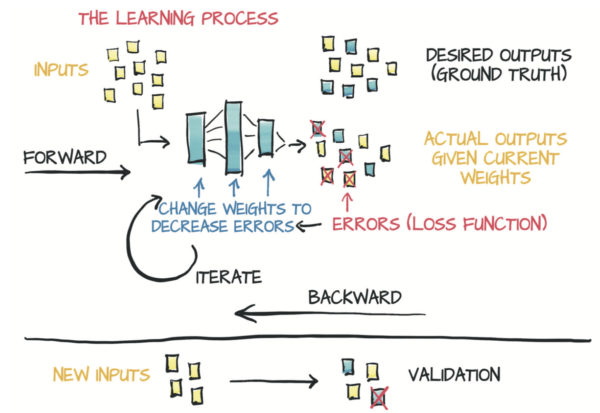

# 5 使用神经网络拟合数据

本章将
* 使用非线性激活函数作为与线性模型的关键区别
* 介绍常用的激活函数
* 介绍包含神经网络构件的PyTorch的nn模块
* 用神经网络解决简单的线性拟合问题

你已经仔细研究了线性模型的学习方法以及如何在PyTorch中实现线性模型：重点关注一个简单的回归问题，该问题需要一个具有输入和输出的线性模型。这个简单的示例使你可以剖析学习模型的机制，而且不会因模型本身的实现而过度分散注意力。不管具体模型是什么，参数的更新方式都是一样的：反向传播误差然后通过计算损失关于参数的梯度来更新这些参数（图5.1）。

图5.1 学习过程的抽象模型

在本章中，你将更改模型架构，实现一个完整的人工神经网络来解决问题。

之前的温度转换例子中的训练循环代码和样本划分（训练集和验证集）都将保持不变。现在开始使用二次模型，将模型重写为其输入的二次函数（例如 $y = a x^2 + b x + c$）。因为这个模型是可微的，所以PyTorch能够自动计算梯度，训练循环代码将照常工作。不过，这对你来说并不太有趣，因为我们仍在固定函数的形状。

在本章中，你将开始了解如何使用PyTorch中处理项目经常使用的一些功能。你将了解PyTorch API内部的原理，而避免认为它是多么神奇。

不过，在开始实现新模型之前，我们将解释人工神经网络的含义。
