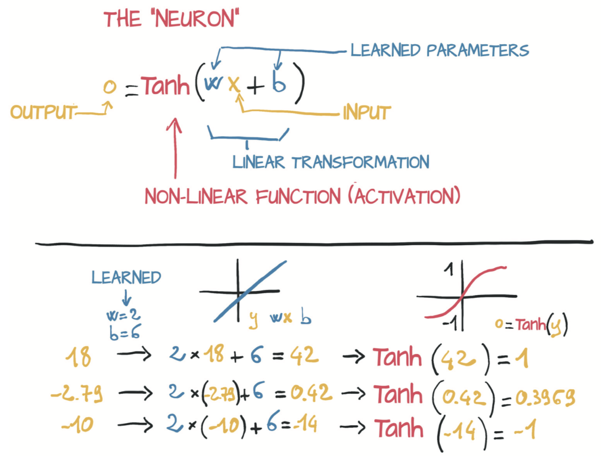
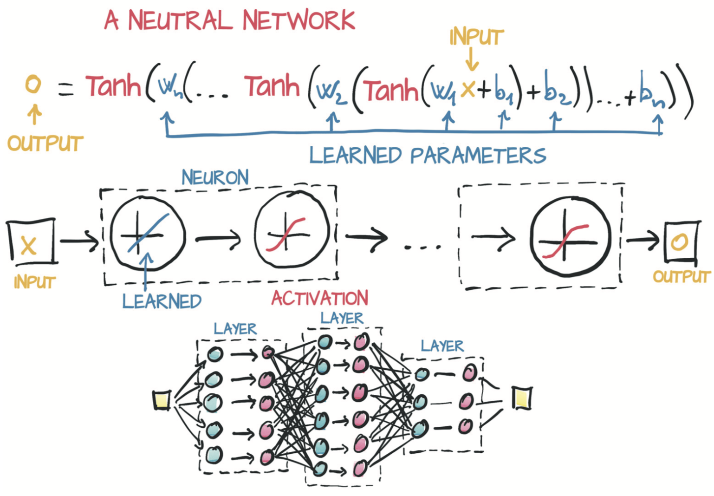
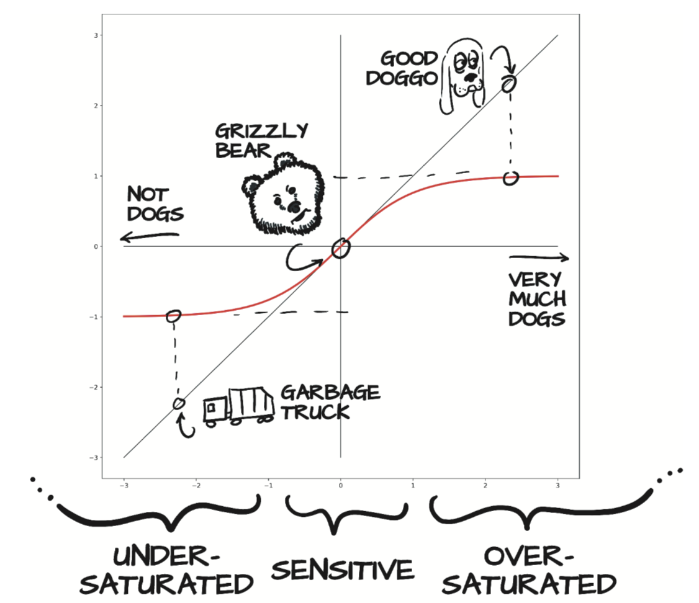
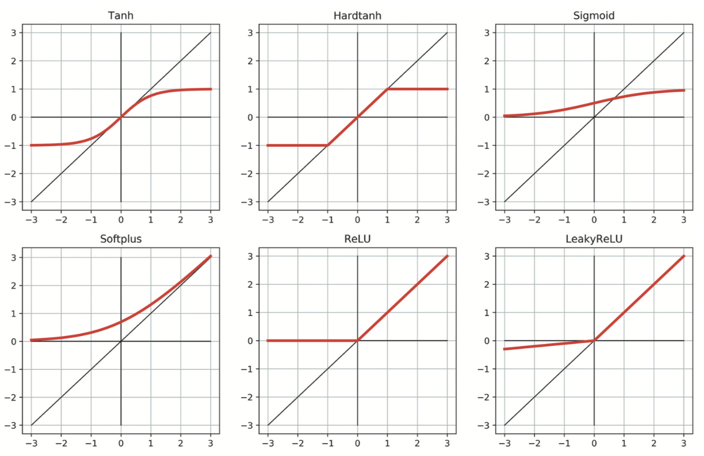

# 5.1 神经元

深度学习的核心是神经网络，即能够通过简单函数的组合来表示复杂函数的数学实体。神经网络这个词显然暗示了与人脑工作方式的联系。事实上，尽管[最初的神经网络模型是受神经科学启发的](http://psycnet.apa.org/doiLanding?doi=10.1037%2Fh0042519)，但现代人工神经网络与大脑中神经元的机制仅有略微的相似之处。人工和生理（physiological）神经网络似乎使用的是略微相似的数学策略来近似复杂的函数，因为这种策略很有效。

> 注：从现在开始，我们将省略“人工”并简称为神经网络。

这些复杂函数的基本组成单元是神经元，如图5.2所示。从本质上讲，神经元不过是输入的线性变换（例如，输入乘以一个数[weight，权重]，再加上一个常数[偏置，bias]），然后再经过一个固定的非线性函数（称为激活函数）。

<div align=center>

</div>
<div align=center>图5.2 神经元：线性变换后再经过一个非线性函数</div>

数学上，你可以将其写为 $o = f(wx + b)$，其中 $x$ 为输入，$w$ 为权重或缩放因子，$b$ 为偏置或偏移。$f$ 是激活函数，在此处设置为双曲正切（ tanh）函数。通常，$x$ 以及 $o$ 可以是简单的标量，也可以是向量（包含许多标量值）。类似地，$w$ 可以是单个标量或矩阵，而 $b$ 是标量或向量（输入和权重的维度必须匹配）。在后一种情况下，该表达式被称为神经元层，因为它通过多维度的权重和偏差表示许多神经元。

如图5.3所示的多层神经网络例子由下面的函数组成：

$$
x_1 = f(w_0  x + b_0) \\
x_2 = f(w_1  x_1 + b_1) \\
... \\
y = f(w_n  x_n + b_n) \\
$$

其中神经元层的输出将用作下一层的输入。请记住，这里的 $w_0$ 是一个矩阵，而 $x$ 是一个向量！在此使用向量可使 $w_0$ 容纳整个神经元层，而不仅仅是单个权重。

<div align=center>

</div>
<div align=center>图5.3 一个三层的神经网络</div>

之前的线性模型与你将要使用的深度学习模型之间的重要区别是误差函数的形状。线性模型和误差平方损失函数具有凸的具有明确定义的最小值的误差曲线。如果你要使用其他方法（译者注：即非梯度下降的方法），则可以自动地求出这个明确的最小值。而（译者注：使用梯度下降）参数更新则试图尽可能地估计出这个最小值。

即使使用相同的误差平方损失函数，神经网络也不具有凸误差曲面这个属性。你尝试优化的每个参数都没有一个明确正确的答案。相反，你尝试优化所有协同工作的参数以产生有用的输出。由于有用的输出只会逼近真实值，因此会有一定程度的不完美。这种不完美在何处以及如何表现是任意的，引起这种不完美的控制输出的参数在某种程度上也是任意的。从机械角度来看，神经网络训练的输出结果看起来很像参数估计，但是请记住，理论基础是完全不同的。

神经网络具有非凸误差曲面主要是因为激活函数。组合神经元来逼近各种复杂函数的能力取决于每个神经元固有的线性和非线性行为的组合。

## 5.1.1 你所需的只是激活函数

（深度）神经网络中最简单的单元是线性运算（缩放+偏移）然后紧跟一个激活函数。在你的上一个模型中有一个线性运算，而这个线性运算就是整个模型。激活函数的作用是将先前线性运算的输出聚集到给定范围内。

假设你正在为图片是否是“狗”打分。猎犬和西班牙猎狗的照片应该评分很高；飞机和垃圾车的图像应得分较低。熊的图片也应具有较低的分数，尽管比垃圾车的分数高。

问题是你必须定义何为高分。因为可以使用float32的全部范围，所以高分可以达到很高。即使你说“这是10分制”，有时模型也会在 $11/10$ 分。请记住，在模型内部，这都是 $w x + b$ 矩阵乘法的求和结果，所以自然不会将自己限制在特定的输出范围内。

你需要做的就是将线性操作的输出严格限制在特定范围内，以便该模型输出的使用者不必处理（得分为） $12/10$ 的幼犬，$-10$ 的熊以及 $-1000$ 的垃圾车。

一种可能的解决办法是截断输出值。小于0的任何值都将设置为0，而10以上的任何值都将设置为10。你可以使用一个简单的激活函数[`torch.nn.Hardtanh`](https://pytorch.org/docs/stable/nn.html#hardtanh)，它默认将输出值截断在 $[-1,1]$ 内。

另一个运作良好的函数族是`torch.nn.Sigmoid`（即 $1 / (1 + e ^ {-x})$），`torch.tanh`和稍后会看到的其他函数。这些函数的曲线随着 $x$ 趋于负无穷大而渐近地接近 $0$ 或 $-1$，随着 $x$ 的增加而接近 $1$，并且在 $x = 0$ 时具有大致恒定的斜率。从概念上讲，以这种方式形成的函数可以很好地工作，因为这意味着神经元（即线性函数紧跟着激活函数）将对线性函数输出中间的区域敏感，而其区域都集中在边界值旁边。如图5.4所示，垃圾车的得分为-0.97，而熊、狐狸和狼的得分可能在-0.3到0.3之间。

<div align=center>

</div>
<div align=center>图5.4 通过tanh激活函数将狗、熊和垃圾车映射为“像狗”（的分数）</div>

垃圾车被标记为“不是狗”，好狗映射为“显然是狗”，而熊最终停在中间。在代码中，你将看到确切的值：

``` python
>>> import math
>>> math.tanh(-2.2) # 垃圾车
-0.9757431300314515
>>> math.tanh(0.1)  # 熊
0.09966799462495582
>>> math.tanh(2.5)  # 狗
0.9866142981514303
```

熊处于敏感范围内，因此熊的微小变化会导致结果发生明显变化。你可以从灰熊换成北极熊（北极熊的脸庞似地更像传统犬），此时当你向“very much a dog”滑动时当看到Y轴上的跳跃。相反，考拉熊会减少与狗的相似度，然后激活输出就会下降。不过，你很难对垃圾车做些改变使其更像狗，即使你对其做出了了巨大的改变，你也可能只会看到从-0.97提升到-0.8左右。

存在许多激活函数，其中一些如图5.5所示。在第一列中，你将看到连续函数`Tanh`和`Softplus`。第二列是它左侧激活函数的“硬”版本，即`Hardtanh`和`ReLU`。`ReLU`（Rectified Linear Unit，线性整流单元）值得特别注意，因为它被认为是性能最好的常用激活函数之一，因为许多最新的结果都使用了它。`Sigmoid`激活函数（也称为逻辑函数）在早期的深度学习工作中得到了广泛的使用，但已不常用。最后，`LeakyReLU`函数将标准`ReLU`修改为在负输入时具有小的正斜率（该斜率通常为0.01，但为清楚起见，此处显示的斜率为0.1）而不是严格为零。

<div align=center>

</div>
<div align=center>图5.5 常用以及不是很常用的激活函数</div>

激活函数很好奇，因为我们使用了如此众多成功的激活函数（比图5.5中展示的多得多），很明显我们对激活函数几乎没有严格的要求。因此，我们将讨论有关激活函数的一些一般性，这些一般性不是总是正确的。也就是说，根据定义，激活函数

* 是非线性的。在没有激活函数的情况下重复应用 $w x + b$ 会产生多项式。非线性的激活函数允许整个网络能近似更复杂的函数。
* 是可微的。激活函数是可微的这样就可以计算穿过它们的梯度。不可微的离散点是无伤大雅的，例如`Hardtanh`和`ReLU`。

> [当然上述陈述不总是正确的。](https://openai.com/blog/nonlinear-computation-in-linear-networks/)

如果没有上述两个要求，网络要么退回到复杂的多项式，要么变得难以训练。

激活函数还通常（尽管并非总是如此）

* 具有至少一个敏感范围，其中输入的轻微变化会导致输出中相应的变化。
* 具有至少一个不敏感（或饱和）范围，其中输入的变化导致输出的变化很小甚至没有变化。

举例来说，由于结合了具有不同权重和输入偏差的敏感范围，因此`Hardtanh`函数可以轻松地用于函数的分段线性近似。

通常（但并非普遍如此），激活函数至少具有以下特点之一：
* 当输入变为负无穷大时接近（或达到）下限
* 当输入变为正无穷大时接近（或达到）上限

思考一下反向传播的工作原理，你可以发现，当输入处于响应范围内时，误差将通过激活更有效地向后传播，而误差不会严重影响输入饱和的神经元（因为由于输出周围区域很平坦，梯度将接近零）。

综上所述，此机制非常强大。我们要说的是，在由线性+激活单元构成的网络中，当向网络提供不同的输入时，(a)不同的单元对于相同的输入会在不同的范围内做出响应，并且(b)与这些输入相关的误差将主要影响在敏感范围内运行的神经元，而其他单元或多或少不受学习过程的影响。此外，由于激活函数相对于其输入的导数通常在敏感范围内接近1，因此通过梯度下降在该范围内估计线性变换的参数看起来很像线性拟合。

你开始对如何将多个线性+激活函数并行连接并一个接一个地堆叠到一个能够近似复杂函数的数学对象上有了更深入的了解。不同的组合会响应不同范围内的输入，并且对于这些参数，通过梯度下降相对容易优化，因为学习过程将非常类似于线性拟合，直到输出饱和为止。

## 5.1.2 对神经网络来说学习的意义

从一系列线性变换紧跟可微激活函数中可以构建出能近似高度非线性过程的模型，且可以通过梯度下降很好地估计出其参数。即使处理的是具有数百万个参数的模型，这一事实仍然成立。使用深度神经网络之所以如此吸引人，是因为它使你不必担心表示数据的确切函数（无论是二次多项式，分段多项式还是其他函数）。使用深度神经网络模型，你将获得通用的估计器和估算其参数的方法。根据模型容量及其对复杂的输入/输出关系进行建模的能力，通过组装简单的构建模块，你可以定制这个估计器。图5.6显示了一些示例。

<div align=center>

</div>
<div align=center>图5.6 组合多个线性单元和tanh激活函数以产生非线性输出</div>

左上方的四个图显示了四个神经元A、B、C和D，每个都有自己的（任意选择的）权重和偏差。每个神经元都使用Tanh激活函数，其输出最小为-1，最大为1。不同的权重和偏差会移动中心点，并改变从最小值到最大值过渡的剧烈程度，但是显然它们的形状都是大致相同的。右边的一列显示了合在一起的两对神经元（A+B和C+D）。这里，你开始看到一些模仿单层神经元的有趣属性。A+B显示出一条轻微的S曲线，其极值趋近于零，但正负都在中间。相反，C+D仅具有较大的正凸点，其峰值比单神经元最大值1高。

在第三行中，你开始组合神经元，就像它们在两层网络中一样。C(A+B)和D(A+B)都具有与A+B相同的正负凸点，但是正峰值更加微弱。C(A+B)+D(A+B)的成分显示出一个新特性：两个清晰的负凸点，以及在主要关注区域左侧可能还有一个细微的第二个正峰。所有这一切发生在两层中只有四个神经元的情况下！

再此提一下，选择这些神经元的参数只是为了产生视觉上有趣的结果。训练包括找到这些权重和偏差的可接受值，以使所得网络正确执行一项任务，例如根据给定的地理坐标和一年中的时间预测可能的温度。成功地执行任务的意思是在未见过的数据上获得正确的输出，这些未见过的数据的产生过程与训练数据是相同的。一个成功训练后的网络，通过其权重和偏差的值，能够捕获表示成有意义数字的数据的内在结构，这些数字表示形式对刚刚说的未见过的数据也适用。

这是你实现学习机制的又一步：深度神经网络可让你近似高度非线性的过程，而无需为它们建立明确的模型。 相反，从未经训练的通用模型开始，你可以通过为它提供一组输入和输出以及一个从中进行反向传播的损失函数，将其专门用于某个任务。通过训练样本将通用模型专门用于某个任务就是我们所谓的学习，因为模型并不是在考虑特定任务的情况下构建的；模型中没有编码描述该任务如何工作的规则。

根据之前温度计的经验，你假设两个温度计都是线性测量温度的。这个假设就是我们为任务隐式编码的地方：我们对输入/输出函数的形状进行了硬编码；我们无法近似除了围绕一条线的数据点外的数据。随着问题的维数增长（许多输入到许多输出）以及输入/输出关系变得复杂，假设输入/输出函数的形状变得不太可能。物理学家或应用数学家的工作通常是根据理论原理对现象进行函数描述，以便可以通过测量来估算未知参数并获得准确的模型。而另一方面，深度神经网络是一系列函数，可以近似各种输入/输出关系，而不必要求提供一种现象的解释模型。在某种程度上，你需要放弃可解释性来解决日益复杂的问题。换句话说，有时您缺乏能力、信息或者计算资源来为你遇到的问题建立显式模型，因此数据驱动方法是你前进的唯一方法。


