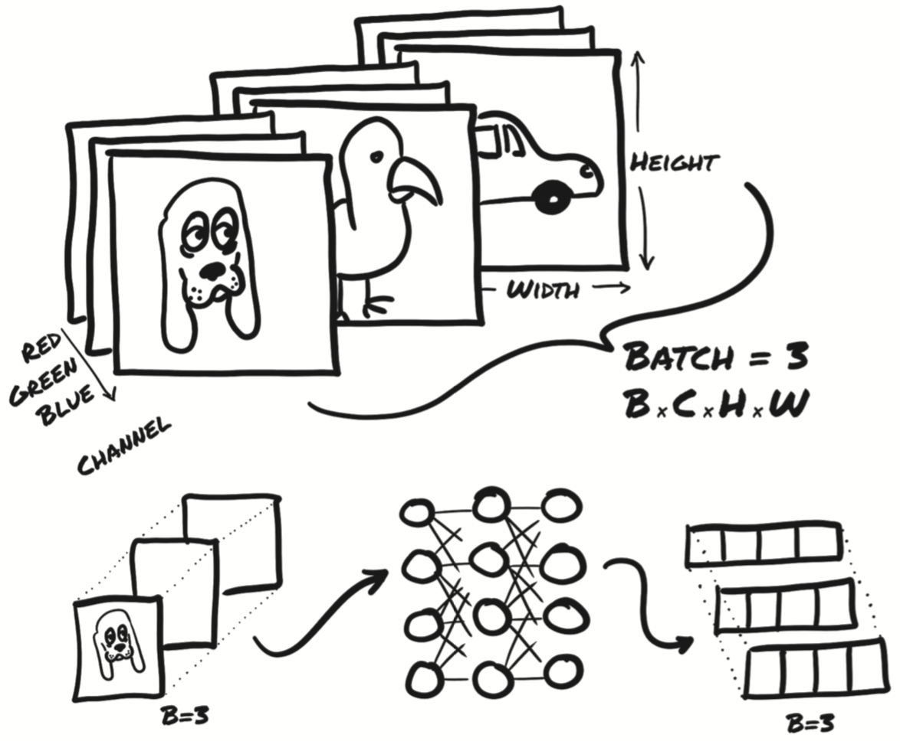
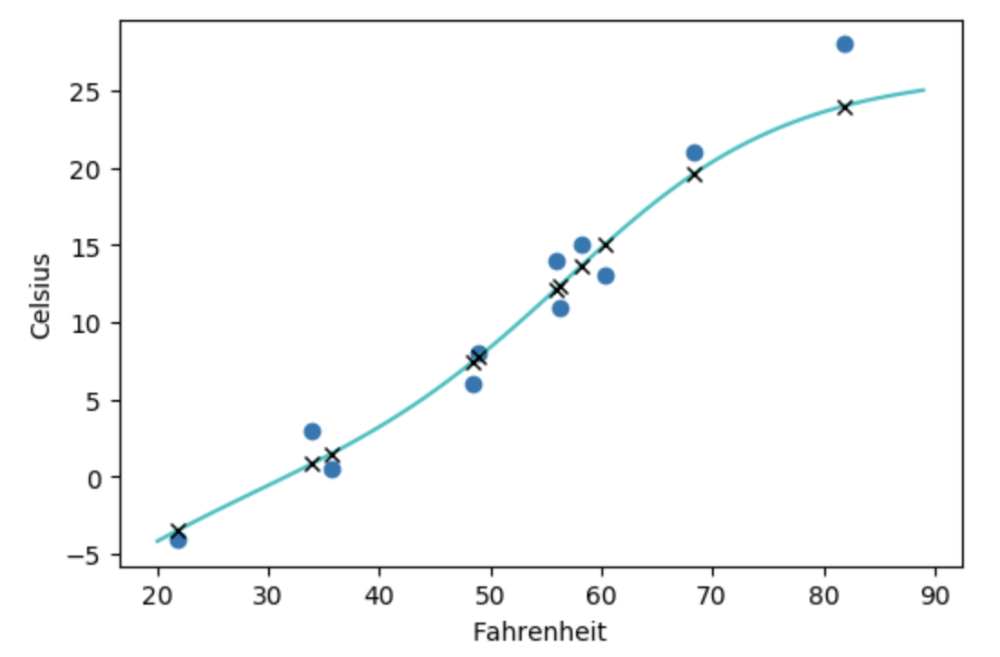

# 5.2 PyTorch的nn模块

之前这些关于神经网络的讨论可能会让你对使用PyTorch从头开始构建一个神经网络感到好奇。第一步是用神经网络模型替换之前的线性模型。从正确性的角度来看，此步骤是一个毫无用处的步骤，因为你已经验证了本任务只需要线性函数，但是对于从一个很简单的问题开始然后进行扩展来说仍然是有用的。

PyTorch有一个专门用于神经网络的完整子模块：`torch.nn`。该子模块包含创建各种神经网络体系结构所需的构建块。这些构建块在PyTorch术语中称为module（模块），在其他框架中称为layer（层）。

PyTorch模块都是从基类`nn.Module`继承而来的Python类。模块可以具有一个或多个参数（`Parameter`）实例作为属性，这些参数就是在训练过程中需要优化的张量（在之前的线性模型中即w和b）。模块还可以具有一个或多个子模块（`nn.Module`的子类）属性，并且也可以追踪其参数。

> 注：子模块必须是顶级属性（top-level attributes），而不能包含在list或dict实例中！否则，优化器将无法找到子模块（及其参数）。对于需要子模块列表或字典的情况，PyTorch提供有`nn.ModuleList`和`nn.ModuleDict`。

你可以毫不奇怪地可以找到一个名为`nn.Linear`的`nn.Module`子类，它对其输入进行仿射变换（通过参数属性weight和bias）；它就相当于之前在温度计实验中实现的方法。现在，从上次中断的地方开始，将之前的代码转换为使用`nn`的形式。

所有PyTorch提供的`nn.Module`子类都定义了其调用方法，使你可以实例化`nn.Linear`并将其像一个函数一样进行调用，如下面的代码所示：

``` python
import torch.nn as nn

linear_model = nn.Linear(1, 1) # 参数: input size, output size, bias(默认True)
linear_model(t_un_val)
```
输出:
```
tensor([[1.2665],
        [1.0006]], grad_fn=<AddmmBackward>)
```

使用一组参数调用`nn.Module`实例最终会调用带有相同参数的名为`forward`的方法，`forward`方法会执行前向传播计算；不过在调用之前和之后还会执行其他相当重要的操作。因此，虽然从技术上讲直接调用`forward`是可行的，并且它产生的结果与调用`nn.Module`实例相同，但用户不应该这样做：
``` python
>>> y = model(x)
>>> y = model.forward(x) # 不要这样做!!!
```

以下代码显示了`Module.call`的实现（为清楚起见进行了一些简化）:
``` python
def __call__(self, *input, **kwargs):
    for hook in self._forward_pre_hooks.values():
        hook(self, input)
    result = self.forward(*input, **kwargs)
    for hook in self._forward_hooks.values():
        hook_result = hook(self, input, result)
        # ...
    for hook in self._backward_hooks.values():
        # ...
    return result
```

如上所示，如果直接使用`.forward（...）`，很多`hook`将无法正确调用。

现在回到线性模型。`nn.Linear`的构造函数接受三个参数：输入特征的数量，输出特征的数量以及线性模型是否包含偏差（此处默认为True）。

这里特征的数量是指输入和输出张量的尺寸，因此本例是1和1。例如，如果在输入中同时使用了温度和气压，则在其中输入具有两个特征输入和而输出只有一个特征。如你所见，对于具有多个中间模块的更复杂的模型，模型的容量与特征的数量有关。

现在你有一个具有一个输入和一个输出特征的`nn.Linear`实例，它需要一个权重

``` python
linear_model.weight
```
输出:
```
Parameter containing:
tensor([[0.0806]], requires_grad=True)
```
和一个偏差
``` python
linear_model.bias
```
输出:
```
Parameter containing:
tensor([0.6065], requires_grad=True)
```

你可以用一些输入来调用这个模块：

``` python
x = torch.ones(1)
linear_model(x)
```
输出:
```
tensor([0.6871], grad_fn=<AddBackward0>)
```

在上面的代码中，你没有提供正确尺寸的输入（尽管还是产生了输出）。你有一个可以接受一个输入并产生一个输出的模型，但是PyTorch的`nn.Module`及其子类被设计为可以同时处理多个样本。为了容纳多个样本，模型希望输入的第0维为这个批次中的样本数目。

`nn`中的任何模块都被编写成同时产生一个批次（即多个输入）的输出。 因此，假设你需要对10个样本运行`nn.Linear`，则可以创建大小为 B x Nin 的输入张量，其中 B 是批次的大小，而 Nin 是输入特征的数量，然后在模型中同时运行：

``` python
x = torch.ones(10, 1)
linear_model(x)
```
输出:
```
tensor([[0.6871],
        [0.6871],
        [0.6871],
        [0.6871],
        [0.6871],
        [0.6871],
        [0.6871],
        [0.6871],
        [0.6871],
        [0.6871]], grad_fn=<AddmmBackward>)
```

图5.7显示了批处理图像数据的类似的情况。输入尺寸为 BxCxHxW，其中批处理大小（batch size）B为3（狗、鸟和汽车的图像），每张图像通道数C为3（红色，绿色和蓝色），高度 H 和宽度 W 的像素数未指定。

正如你所看到的，输出是大小为 B x Nout 的张量，其中 Nout 是输出特征的数量——在此例中为四个。

<div align=center>

</div>
<div align=center>图5.7 将三个RGB图像组成一批然后输入到神经网络中。输出是三个大小为4的向量。</div>

我们要进行此批处理的原因是多方面的。一个主要动机是确保我们所需的计算量足够大，以使我们充分利用执行计算的计算资源。特别地，GPU是高度并行化的，因此在小型模型上的单个输入将使大多数计算单元处于空闲状态。通过提供成批的输入，可以将计算分散到其他闲置的计算单元上，这意味着成批的结果就像单个结果一样能够很快地返回。另一个好处是，某些高级模型将使用整个批次的统计信息，而当批次大小较大时那些统计数据将变得更准确。

现在回到温度计数据。`t_u`和`t_c`是两个大小为B的一维张量。由于广播机制，你可以将线性模型写为 $w x + b$，其中 $w$ 和 $b$ 是两个标量参数。该模型之所以有效，是因为你具有一个输入特征；如果你有两个，则需要添加额外的尺寸以将该1D张量转变为矩阵，该矩阵每一行代表每个样本，每列代表所有样本的某个特征。

这就是你要切换到使用`nn.Linear`所要做的。你需要将尺寸为 B 的输入reshape为 B x Nin，其中Nin为1。你可以使用`unsqueeze`轻松地做到这一点：

``` python
t_c = [0.5,  14.0, 15.0, 28.0, 11.0,  8.0,  3.0, -4.0,  6.0, 13.0, 21.0]
t_u = [35.7, 55.9, 58.2, 81.9, 56.3, 48.9, 33.9, 21.8, 48.4, 60.4, 68.4]
t_c = torch.tensor(t_c).unsqueeze(1) # <1>
t_u = torch.tensor(t_u).unsqueeze(1) # <1>

t_u.shape
```
输出:
```
torch.Size([11, 1])
```

你完成了。现在更新原来的训练代码。首先，将之前的手工模型替换为`nn.Linear(1,1)`，然后将线性模型参数传递给优化器：
``` python
linear_model = nn.Linear(1, 1)
optimizer = optim.SGD(
    linear_model.parameters(),
    lr=1e-2)
```

之前，你需要自己创建参数并将其作为第一个参数传递给`optim.SGD`。现在，你可以使用`parameters`方法获取任何`nn.Module`或其子模块的参数列表：

```python
linear_model.parameters()
```
```
<generator object Module.parameters at 0x11796cca8>
```
``` python
list(linear_model.parameters())
```
```
[Parameter containing:
 tensor([[0.5563]], requires_grad=True), Parameter containing:
 tensor([-0.0067], requires_grad=True)]
```

此调用递归调用到模块的`init`构造函数中定义的子模块中，并返回遇到的所有参数的列表，因此你可以像之前一样方便地将其传递给优化器构造函数。

你现在已经可以指出训练循环中会发生什么了。我们为优化器提供了一个`require_grad = True`张量列表。所有参数都是用这种方式定义的，因为它们需要通过梯度下降进行优化。调用`raining_loss.backward()`时，`grad`将累积在图的叶节点上，这些节点正是传递给优化器的参数。

此时，SGD优化器已具有所需的一切。调用`optimizer.step()`时，它将循环访问每个参数，并按与存储在其grad属性中的值成比例的量对其进行更改。

现在我们来看看训练循环：
``` python
def training_loop(n_epochs, optimizer, model, loss_fn, 
                  t_u_train, t_u_val, t_c_train, t_c_val):
    for epoch in range(1, n_epochs + 1):
        t_p_train = model(t_un_train)
        loss_train = loss_fn(t_p_train, t_c_train)
        
        t_p_val = model(t_un_val)
        loss_val = loss_fn(t_p_val, t_c_val)
        
        optimizer.zero_grad()
        loss_train.backward()
        optimizer.step()
        
        if epoch == 1 or epoch % 1000 == 0:
            print('Epoch %d, Training loss %.4f, Validation loss %.4f' % (
                    epoch, float(loss_train), float(loss_val)))
```

训练循环几乎没有改变，除了现在你不再明确地将`params`传递给`model`，因为`model`本身在内部保存有`Parameters`。

你还可以使用`torch.nn`的最后一部分：损失函数。实际上，`nn`具有几个常见的损失函数，其中`nn.MSELoss`（MSE代表均方误差）正是先前`loss_fn`的定义。`nn`中的损失函数仍然是`nn.Module`的子类，因此我们可以创建一个实例并将其作为函数调用。在本例中，你将摆脱手动定义的`loss_fn`并替换它：

``` python
linear_model = nn.Linear(1, 1)
optimizer = optim.SGD(linear_model.parameters(), lr=1e-2)

training_loop(
    n_epochs = 3000,
    optimizer = optimizer,
    model = linear_model,
    loss_fn = nn.MSELoss(), # 不再使用自己定义的loss
    t_u_train = t_un_train,
    t_u_val = t_un_val,
    t_c_train = t_c_train,
    t_c_val = t_c_val)

print()
print(linear_model.weight)
print(linear_model.bias)
```
输出:
```
Epoch 1, Training loss 66.0145, Validation loss 239.8421
Epoch 1000, Training loss 4.1785, Validation loss 9.3629
Epoch 2000, Training loss 3.2060, Validation loss 3.8825
Epoch 3000, Training loss 3.1601, Validation loss 3.0151

Parameter containing:
tensor([[5.0940]], requires_grad=True)
Parameter containing:
tensor([-16.0012], requires_grad=True)
```

输入到我们训练循环中的其他所有内容都保持不变。甚至我们的结果也和之前一样。当然，获得相同的结果只是我们所期望的，差异暗示了bug存在于这两种实现之一。

这是一段漫长的旅程，需要要对这二十多行代码进行很多探索。我们希望到现在为止魔术消失了而该工程师登场了。在本章中学习的内容将使你可以拥有自己编写的代码，而不是在事情变得更加复杂只能戳一戳黑匣子。

还差最后一个步骤：用神经网络代替线性模型作为近似函数。正如我们之前所说，使用神经网络不会产生更高质量的模型，因为我们这个温度校准问题背后的过程本质上是线性的。但是，从线性网络到神经网络的跨越是值得的，这样你以后就不会感到迷失了。

接下来我们将重新定义模型，并将所有其他内容（包括损失函数）保持不变。还是构建最简单的神经网络：一个线性模块然后是一个激活函数，最后将输入喂入另一个线性模块。由于历史原因，第一个 线性+激活层 通常称为隐藏层，因为它的输出不会直接观察到，而是会送到输出层。尽管模型的输入和输出均为大小1（一个输入和一个输出特征），但第一个线性模块的输出大小通常大于1。回顾前面关于激活作用的解释，这会使不同的单位对输入的不同范围做出响应，从而增加模型的容量。最后一个线性层获取激活函数的输出，并将它们线性组合以产生输出值。

`nn`提供了一种通过`nn.Sequential`容器串联模块的简单方法：

``` python
seq_model = nn.Sequential(
            nn.Linear(1, 13),
            nn.Tanh(),
            nn.Linear(13, 1))
seq_model
```
输出:
```
Sequential(
  (0): Linear(in_features=1, out_features=13, bias=True)
  (1): Tanh()
  (2): Linear(in_features=13, out_features=1, bias=True)
)
```

得到的模型的输入是作为`nn.Sequential`的参数的第一个模块所指定的输入，然后将中间输出传递给后续模块，并输出最后一个模块返回的输出。该模型将1个输入特征散开为13个隐藏特征，然后将通过`tanh`激活函数，最后将得到的13个数字线性组合为1个输出特征。

调用`model.parameters()`可以得到第一线性模块和第二线性模块中的权重和偏差。在本例中，我们可以通过打印形状来检查参数：
``` python
[param.shape for param in seq_model.parameters()]
```
输出:
```
[torch.Size([13, 1]), torch.Size([13]), torch.Size([1, 13]), torch.Size([1])]
```

这些都是优化器所需的参数张量。同样，在调用`model.backward()`之后，所有参数都将被计算其`grad`，然后优化器会在调用`optimizer.step()`期间更新参数的值，这与之前的线性模型没有太大不同。毕竟这两个模型都是可微分的模型，可以通过梯度下降进行训练。

有关`nn.Modules`参数的一些注意事项：当你检查由几个子模块组成的模型的参数时，可以方便地通过其名称识别参数。这个方法叫做`named_parameters`：

``` python
for name, param in seq_model.named_parameters():
    print(name, param.shape)
```
输出:
```
0.weight torch.Size([13, 1])
0.bias torch.Size([13])
2.weight torch.Size([1, 13])
2.bias torch.Size([1])
```

实际上，`Sequential`中每个模块的名称都是该模块在参数中出现的顺序。有趣的是，`Sequential`还可以接受`OrderedDict`作为参数，这样就可以给`Sequential`的每个模块命名：

> 并非所有版本的Python都明确指定`dict`的迭代顺序，因此我们在这里使用`OrderedDict`来明确层的顺序并强调这个顺序的重要性。

``` python
from collections import OrderedDict

seq_model = nn.Sequential(OrderedDict([
    ('hidden_linear', nn.Linear(1, 8)),
    ('hidden_activation', nn.Tanh()),
    ('output_linear', nn.Linear(8, 1))
]))

seq_model
```
输出:
```
Sequential(
  (hidden_linear): Linear(in_features=1, out_features=8, bias=True)
  (hidden_activation): Tanh()
  (output_linear): Linear(in_features=8, out_features=1, bias=True)
)
```
此代码使你可以允许子模块有更加具有解释性的名称：

``` python
for name, param in seq_model.named_parameters():
    print(name, param.shape)
```
输出:
```
hidden_linear.weight torch.Size([8, 1])
hidden_linear.bias torch.Size([8])
output_linear.weight torch.Size([1, 8])
output_linear.bias torch.Size([1])
```

你还可以通过访问子模块来访问特定的参数，就像它们是属性一样：

``` python
seq_model.output_linear.bias
```
输出:
```
Parameter containing:
tensor([-0.1786], requires_grad=True)
```

与本章开始时一样，该代码对于检查参数或其梯度（例如在训练期间监视梯度）很有用。假设你要打印出隐藏层线性部分的权重的梯度，你可以为新的神经网络模型运行训练循环，然后在最后一个epoch之后查看结果梯度：

``` python
optimizer = optim.SGD(seq_model.parameters(), lr=1e-3) # 为了稳定性调小了梯度

training_loop(
    n_epochs = 5000,
    optimizer = optimizer,
    model = seq_model,
    loss_fn = nn.MSELoss(),
    t_u_train = t_un_train,
    t_u_val = t_un_val,
    t_c_train = t_c_train,
    t_c_val = t_c_val)

print('output', seq_model(t_un_val))
print('answer', t_c_val)
print('hidden', seq_model.hidden_linear.weight.grad)
```
输出:
```
Epoch 1, Training loss 142.5878, Validation loss 439.7242
Epoch 1000, Training loss 4.9129, Validation loss 46.7108
Epoch 2000, Training loss 3.4471, Validation loss 25.7202
Epoch 3000, Training loss 2.8642, Validation loss 16.3709
Epoch 4000, Training loss 2.5688, Validation loss 11.2405
Epoch 5000, Training loss 2.3860, Validation loss 8.0017
output tensor([[24.0087],
        [ 7.7348]], grad_fn=<AddmmBackward>)
answer tensor([[28.],
        [ 8.]])
hidden tensor([[ 0.0207],
        [ 0.0272],
        [-0.0065],
        [ 0.1072],
        [ 0.0060],
        [ 0.0142],
        [ 0.0004],
        [-0.0004]])
```

你还可以在整个数据上评估模型以查看与线性关系之间的差异：

``` python
from matplotlib import pyplot as plt

t_range = torch.arange(20., 90.).unsqueeze(1)

fig = plt.figure(dpi=100)
plt.xlabel("Fahrenheit")
plt.ylabel("Celsius")
plt.plot(t_u.numpy(), t_c.numpy(), 'o')
plt.plot(t_range.numpy(), seq_model(0.1 * t_range).detach().numpy(), 'c-')
plt.plot(t_u.numpy(), seq_model(0.1 * t_u).detach().numpy(), 'kx')
plt.show()
```
上述代码将会输出图5.8。

<div align=center>

</div>
<div align=center>图5.8 神经网络模型图示：输入数据（圆形），期望输出（叉号）和显示样本之间行为的连续曲线</div>

你可能会意识到神经网络有过拟合的趋势，因为它试图拟合包括噪声在内的测量值。不过总体上神经网络表现还不错。

